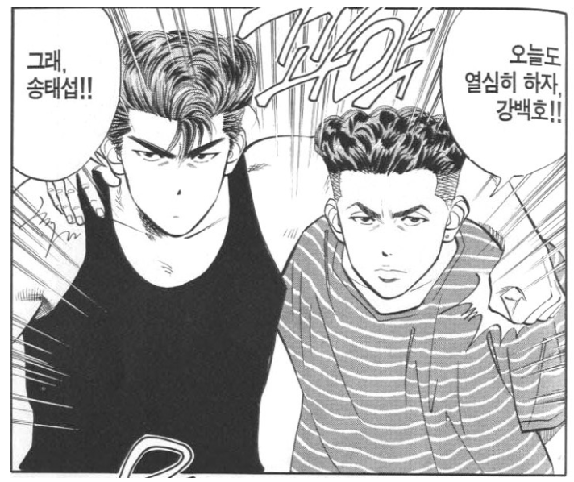

2019년에 블로그를 시작하고 글을 쓰기 시작하면서 제 인생에서 처음으로 하는 회고이다.

다른 개발자분들의 회고를 보고 문득 나의 한 해를 돌아보게 되었고 내가 느낀 이 감정을 글로 남기고 싶었다. 2019년을 돌아보며 내가 느낀 것은 무엇이고, 무엇이 부족했고, 내년에는 무엇을 해야 할지 정리를 해보려고 한다.

---

### 📃. 이직을 했다.

개발자 인생을 시작한 지 1년 6개월, 짧은 기간을 일하고 기존 회사를 버티지 못하고 도망쳐 나왔다. SI 솔루션 회사에서 일하면서 다른 누군가가 이미 오래전에 만든 것을 살짝살짝(?) 고치면서 개발을 하고 있었다. 다른 분들의 블로그에 올라와 있는 개발에 관련된 글들을 읽다 보면 내가 모르는 것들이 너무 많았고 지금 닷넷으로 윈폼을 개발하는 내가 뒤쳐지는 것 같았고 무엇보다 재미가 있지 않았다.

그러다가 닷넷으로 윈폼만 개발하던 내가 닷넷으로 웹을 개발할 수 있는 기회를 잡았고 웹을 개발하면서 대학생 때 느꼈던 개발의 재미를 느꼈다. 그리고 윈폼보다는 웹이 재밌었던 나는 큰 결심을 하고 2019년 1월에 이직을 하게 된다.

지금은 ASP.NET MVC와 ASP.NET Core로 솔루션을 개발하는 회사에 다니고 있다. 내가 이 회사에 와서 가장 좋았던 것은 좋은 인연을 만난 것이다. 개발에 대해서 허심탄회하게 이야기할 수 있는 분을 만났다.

그분은 내 사수분이었는데 나를 처음 보고 '혹시 블로그나 개발한 것 정리 같은 거 하나요?'라고 물어보셨고, 나보다 나이가 한참 많으신 시니어 개발자분이 항상 열심히 정리를 하는 것을 보고 내가 TIL과 블로그를 시작하게 되는 결정적인 계기가 되었다.

사수분은 내가 질문하는 것을 친절하게 가르쳐 주시거나, 답을 유도해주시는 질문을 역으로 해주셨던 것 같다. 기술의 최신 트렌드에 관심도 많으셨고 내 개발자 커리어에 대해서 진심으로 걱정을 해주셨던 분인 것 같다. (지금 그분은 퇴사하셨다😭)

### 📃. 약 1년간의 TIL

나는 원래 전에 다니던 회사에서는 메모장을 이용해서 내가 오늘 한 일들과 배운 점들을 짤막하게 메모를 하곤 했다. 하지만 자세하게 메모하지 않았고 정리가 잘 되어있지 않아서 나중에 찾아볼 때 어려움을 겪었다.

이직을 한 회사에서의 사수 분께서는 직접 개발하신 솔루션으로 메모를 하고 계셨다. 그래서 나는 어떻게 관리를 해야 할까? 고민을 하던 중에 [milooy 님의 TIL](https://github.com/milooy/TIL)을 보게 되었고 메모가 아닌 나도 TIL을 시작해서 GitHub로 보기 좋게 정리하면 나중에 찾아볼 때 괜찮을 것 같았다.

1년간 TIL을 하면서 가장 마음에 든 기능은 이거다. 내 기억력에 한계가 와서 '어 이거 내가 분명히 해결했었던 것인데 어떻게 했지?' 할 때, 이 GitHub에서의 검색 기능이 정말 편리했다.

내가 하고 있는 지금의 TIL은 조금의 변천사가 있는데 처음에는 그날그날 배우고 느낀점들을 적는 형식의 메모장처럼 이용을 하고 있었다.

코드를 적기도 했고, 오류에 대한 해결법을 적기도 했고, 서버를 어떻게 세팅을 하고 기억하기 조금이라도 힘든 것들은 메모를 했던 것 같다.

Daily로 관리를 하다가 [Integerous 님의 TIL](https://github.com/Integerous/TIL)을 보고 Repository의 README.md로 관리하면 좀 더 깔끔하고 내가 필요할 때 들어가서 찾기에도 편해 보였다. 그래서 지금까지 메모한 내용들을 정리해서 지금의 TIL을 만들었다.

회사에서 새로운 것들을 하면서 나는 계속해서 배우고 성장하고 있는 것 같다. 혼자서 여러 가지를 실험해보고 도전하고 그리고 배운 것들을 TIL에 적는다.

TIL을 적으면서 공유하고 싶은 것들은 블로그를 통해서 공유한다. TIL을 1월에 시작했기 때문에 시작한지 1년이 다되어가는데 정말로 도움이 많이 된 것 같다.

[JHyeok/TIL](https://github.com/JHyeok/TIL)

### 📃. 블로그를 시작했다

블로그를 시작해야겠다고 마음을 먹고 가장 고민이 되었던 것은 어떤 플랫폼으로 시작을 해야 할까? 였다. 개발자분들이 많이 애용하는 티스토리도 있었고, 미디엄이나 브런치도 있었다.

Google에 막연하게 `개발자 블로그 시작`이라고 검색을 하고 많은 글들을 참고했던 것 같다. 그러다가 Jekyll, Hexo, Hugo, Gatsby와 같은 정적 사이트 생성기들을 알게 되었다. 그래서 평소에 React와 GraphQL에 관심이 있었던 나는 Gatsby를 선택했다.

Gatsby에서는 다양한 블로그 테마들이 있었지만 가장 기본의 템플릿으로 내가 조립해서 나만의 블로그 템플릿을 만들어보고 싶다는 욕구가 강하게 있었다.

그래서 gatsbyjs에서 제공하는 [gatsby-starter-blog](https://github.com/gatsbyjs/gatsby-starter-blog)를 이용해서 블로그를 시작하기로 했다. 그리고 지금까지도 계속해서 나의 스타일에 맞게 블로그를 바꾸어 나가고 있다.

전체적인 느낌은 gatsby-starter-blog의 감성이 너무 마음에 들었기 때문에 어느 정도 틀을 유지한 채 바꾸어 주고 있다. 글을 읽는데 걸리는 시간, 태그, 댓글(아무도 남겨주지는 않지만😂) 기능 등을 넣은 것 같다. 이 기능들을 한 번에 추가하진 않았고 필요할 때마다 추가를 하였다.

[JHyeok/JHyeok.com](https://github.com/JHyeok/JHyeok.com)

블로그에 글을 올리는 과정은 TIL에 이미 정리한 글을 올리려고 한다. 하지만 TIL에서 이미 한 번 적었던 글을 블로그에 공개하기까지 다듬는 데는 시간이 조금 걸렸다. 그래서 요즘은 TIL에도 성의 있는 메모를 하려고 한다.

처음 블로그에 올렸던 글은 성의 없고 간단했지만 지금은 좋은 글을 쓰려고 노력하고 있다. 글을 쓰는 과정에서 다른 분들의 블로그를 많이 참고하고 이 분들이 블로그에 글을 올리시는데 어떠한 과정이 있고 어떠한 노력을 하셨을지 조금은 알 것만 같았다.

블로그를 시작하면서 좋은 습관이 생겼다. 사람들에게 내 글을 보여주는 것이기 때문에 한글 맞춤법에 신경을 쓰게 됐다. 최대한 틀리지 않으려고 노력을 하고있다.

글을 올리기 전 항상 체크한다!

이 습관 때문인지는 몰라도 업무용 메일을 보낼 때나 글을 쓰게 되면 항상 맞춤법 검사를 하는 것 같다.

2020년에는 좀 더 좋은 글을 쓰고 싶다. 당장은 이번에 Nuxt.js로 개발을 하면서 느낀 경험들과 Flask로 REST API를 개발한 경험기를 공유하고 싶다.

### 📃. 개발자 행사

2019년에 처음으로 개발자 행사를 참여했다. 처음 시작은 [태오닷넷](http://taeyo.net/)에서 진행한 신년세미나였다. 2018년에는 가야지, 가야지 하면서 시간을 핑계로 가지 않았다.

개발자 행사를 가서 발표하시는 분의 내용을 듣는다고 실력이 늘거나 하지는 않는다. 하지만 이런 것도 있었구나, 또는 아 저분은 저런식으로 생각을 하시는구나 등 많은 것을 생각하게 되고 이 생각들이 나에게 도움이 되는 것 같다.

태오닷넷 신년세미나\
.NET Conf 2019 @ Seoul\
GDG DevFest Seoul 2019

이렇게 적고보니 2019년에는 많이 참여하진 못했다. DEVIEW 2019를 가고 싶었지만😂 너무 늦었다. 다들 개발자분들은 행사에 대한 정보를 어디서 얻는지 궁금하기도 하다. 현재 나는 [Okky](https://okky.kr/)와 [Festa](https://festa.io/)를 통해서 정보를 얻고 있다.

그리고 행사에 참여해서 발표자분들이 말씀하신 내용도 제대로 정리를 하지 못한 것 같다. 정리의 중요성을 뒤늦게 알아서 GDG DevFest Seoul 2019에서는 조금 정리를 한 것 같다.

[GDG DevFest Seoul 2019 후기](https://jhyeok.com/gdg-devfest-seoul-2019.md/)

매년 정기적으로 열리는 행사의 정보들을 알게 되었으니 2020년에는 더 많은 행사에 참여하고 후기를 잘 정리해서 블로그에 공유하고 싶다.

### 📃. 닷넷 개발 말고 다른 거!

최근 C#과 닷넷이 아닌 다른 언어 또는 프레임워크를 이용해서 개발을 하고 있다. 팀을 옮기면서 Python을 접하게 되었고 회사에서 지원을 해주어서 관련 교육을 듣기도 하였다.

2019년도 하반기에는 Nuxt.js, Express, Flask를 이용해서 개발을 하였는데 Visual Studio를 사용하지 않고 Visual Studio Code를 사용해서 개발을 하다 보니 새삼 Visual Studio가 엄청 무거운 툴이었다는 것을 느꼈다.

최근 3개월간은 닷넷으로 개발을 하지 않았다. 인수인계 문서를 만들고 주석을 추가하기 위한 커밋만을 했다. 2019년 12월에는 내 개발자 커리어에 있어서 많은 생각을 하였다. 이대로 계속 닷넷 개발자를 해야 하는 것인지, 국내에서 서비스 회사에 취업해서 개발을 하려면 닷넷은 힘들지 않을까 라는 생각들을 하였다.

Nuxt.js로 개발을 한 것도 닷넷으로 개발을 할 수 있었지만 선택권이 왔을 때, 계속 닷넷을 고수해서 개발을 하다 보면 다른 언어로의 점프가 힘들 것 같아서 용기 내서 선택했다. Flask는 tensorflow로 학습된 모델을 활용한 API를 만들기 위해서 사용하였다. 개인적인 생각으로는 머신러닝 관련된 API들은 Python으로 만드는 것이 좋을 듯싶다.

혼자서 하는 개발이다 보니 TDD를 한 번 시도했다가 프로젝트를 시간 내에 끝내지 못하면 어떻게 하지?라는 두려움 때문에 얼른 개발을 끝내고 남는 시간에 테스트 코드를 작성해보는 것으로 아쉬움을 달랬다.

[주니어 개발자의 Nuxt.js에서 테스트 코드 짜기](https://jhyeok.com/nuxtjs-api-test/)\
[Visual Studio Code에서 Python 가상환경 설정 및 Lint 사용](https://jhyeok.com/python-with-vscode/)\
[PM2, Nginx 사용해서 Nuxt.js 애플리케이션 배포](https://jhyeok.com/nuxtjs-pm2-nginx/)

블로그 초창기에는 닷넷 개발과 관련된 글들이 많았지만 이제는 닷넷이 아닌 다른 언어 또는 프레임워크에 대한 글들을 쓰기 시작했다. 2020년에는 닷넷이 아닌 다른 언어로의 백엔드 개발자로의 이직을 위해 열심히 노력해야겠다.

### 마치며

2019년 한 해를 보내면서 내가 가장 기억에 남는 문구가 있다. `컴퓨터가 이해할 수 있는 코드는 어느 바보나 다 짤 수 있다. 좋은 프로그래머는 사람이 이해할 수 있는 코드를 짠다.`

클린 코드와 리팩토링에 대해서 공부를 하다가 본 마틴 파울러의 명언인데 이 문구는 정말 대단한 것 같다. 이 좋은 문구를 왜 이렇게 늦게 알았나 하면서 후회하고 있다.

2017년 중순 내가 개발자를 처음 시작했을 때 개발에 조금 더 관심을 갖고 노력했다면 조금 더 나은 개발자로서의 시간을 보냈을까 하고 후회한다. 늦었지만 2019년부터 개발에 관심을 가지면서 의미 있는 한 해를 보낸 것 같다. 2019년은 정말 재미있었다.

첫 회고를 작성하다 보니 내 글쓰기 실력이 너무 처참하게만 느껴졌다. 내년에는 더 많은 글을 쓰고 읽으면서 다음 회고를 작성할 때에는 나 자신이 만족했으면 좋겠다.

> 2020년은 2019년보다 더 열심히!

