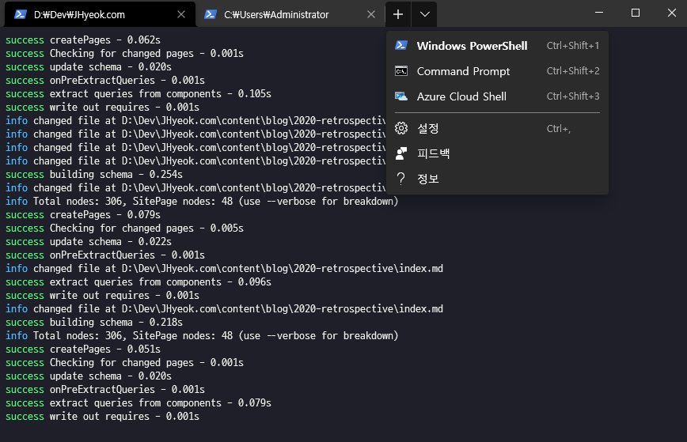

2020년을 되돌아보며 회고합니다. COVID-19로 모두가 힘들었던 2020년이었습니다. 항상 몸조심하시기 바랍니다🙏.

## 📃. 사이드 프로젝트 JaeBook

2020년 1월부터 사이드 프로젝트를 진행했다.

게시판과 익명 채팅의 기능을 가진 사이트였는데 백엔드와 프론트엔트를 분리해서 Node.js 프레임워크들을 이용해서 개발을 하고 싶은 욕심이 있었다. 그래서 백엔드는 Express.js, 프론트엔드는 한 번 개발에 사용해본 Nuxt.js로 진행을 하였다. 회사에서도 작은 프로젝트의 프론트엔드를 Nuxt.js로 진행했었는데 당시에는 선택한 이유는 Vue.js가 상대적으로 러닝 커브가 적다고 알려져 있었고 Nuxt.js는 Vue.js 애플리케이션 개발을 더 쉽게 만들어주는 프레임워크라고 해서 선택했었다.

사이드 프로젝트에서는 프론트엔드보다는 백엔드에 비중을 더 두고 싶었고 이 당시에는 포트폴리오에 백엔드의 API만 만들어져 있는 것은 허전해 보였고 Nuxt.js의 경험이 있었기 때문에 Nuxt.js로 화면을 빠르게 만들고 백엔드에 집중하려고 했었다.

위와 같은 이유로 백엔드와 프론트엔드 개발을 같이 진행했다.

[JaeBook의 백엔드](https://github.com/JHyeok/jaebook-server)

백엔드에서는 Docker, GitHub Actions, E2E 테스트, 단위 테스트 등 회사에서 해보지 못한 것들을 시도해보았다. 백엔드를 개발하면서 경험한 기술들을 소개하는 형태의 글인 [Node.js 계층 구조 설계 및 환경 변수 관리](https://jhyeok.com/node-backend-structure/)를 작성하였다. 최근에는 NestJS의 매력에 빠져서 템플릿을 만들어보면서 공부하기도 하고 [NestJS에서 단위 테스트 작성하기](https://jhyeok.com/nestjs-unit-test/)를 작성했다.

[JaeBook의 프론트엔드](https://github.com/JHyeok/jaebook-client)

당시에 회사에서 진행했던 프로젝트에서는 JavaScript만 사용했기 때문에 TypeScript를 사용해서 프로젝트를 진행해보고 싶어서 TypeScript를 사용했다. 개발 당시에 최신 버전의 Nuxt.js에서 TypeScript를 적용하는 방법이 이전 버전과 변경되었고 그 경험을 공유하고자 [TypeScript로 Nuxt 개발하기 시리즈](https://jhyeok.com/nuxt-with-typescript)를 작성했다.

회사를 다니면서 퇴근 시간에 사이드 프로젝트를 진행하다 보니 개발 속도가 늦었고 퇴근 후 몸이 힘들면 쉬고 싶다는 욕망 때문에 정말 힘들었다. 하지만 새로운 환경에서 백엔드 개발을 하고 싶다는 목표가 있었기 때문에 사이드 프로젝트를 무사히 끝마칠 수 있었던 것 같다.

## 📃. macOS

2019년 회고에서 2020년에는 백엔드 개발자로 이직을 하고 싶다고 했었는데 이직에 성공했다. 새로운 회사에서 맥북을 받았는데, 3년을 Windows 개발환경에서 개발을 하다가 macOS로 개발을 하려다 보니 어색했다.

초창기에는 Windows 환경의 에디터에서 사용하는 단축키와 가상 데스크탑과 같이 Windows에서 즐겨 쓰던 기능들이 안되다 보니 스스로 macOS에서 코드를 작성하는데 시간이 느리다고 생각하였고, macOS에서 WebStorm으로 주석을 한글로 작성하다 보면 문장의 끝 부분이 잘려서 사라지는 문제, 맥북 프로 16인치에 연결한 보조 모니터의 디스플레이 피벗 설정이 시간이 오래 지나면 간헐적으로 풀리는 문제들도 적응하는데 방해가 되었다.

단축키가 다른 문제는 Karabiner-Elements를 사용해서 macOS의 한영 전환키를 Windows의 한영키 처럼 오른쪽 Command키로 변경하는 것으로 타협했다. 다른 키는 변경하지 않았다.

인간은 적응의 동물이라고 몇 개월을 macOS를 사용하다 보니 이제는 macOS 환경이 익숙해진 것 같다.

macOS에서 개발을 하다가 집에서 Windows 환경에서 개발을 하다 보면 Windows의 Command Prompt가 너무 초라하게 느껴졌다. 그래서 해결 방법을 찾다 보니 Windows의 Windows Terminal를 알게 되었고 Windows Terminal로 macOS의 Terminal 환경과 비슷하도록 oh-my-posh를 적용해보았다. oh-my-posh는 macOS와 Linux에서 유행하는 oh-my-zsh의 Windows PowerShell 버전이라고 소개하는데 Command Prompt와 Windows PowerShell에서 부족하다고 느꼈던 점들을 보완해주는 것 같았다.

Windows Terminal은 Command Prompt와 PowerShell을 선택할 수 있다.

## 📃. COVID-19😷

2020년은 COVID-19로 인해서 힘든 시기였다. 대부분을 마스크를 쓰고 생활한 것 같은데 정말 답답하고 힘들었다. 이 시기에 조금은 반강제적인 이직을 하게 되었고 3개월간의 공백 기간도 생겼다. 이직하려는 회사가 재택근무를 하고 있어서 입사 시기가 늦춰지는 경험도 했다.

COVID-19로 인해서 마스크를 쓰지 않고 살았던 삶이 얼마나 소중했는지를 항상 느끼고 있다. COVID-19 이전의 삶으로 빨리 돌아가고 싶다.

## 📃. 재택근무

재택근무를 하게 된 것은 이번이 처음이었는데 전 회사와 지금 다니는 회사 모두 재택근무를 경험했다. 전 회사에서는 짧게 재택근무를 경험했었는데, 이직을 한 이후에 2020년 11월부터 COVID-19 확진자가 급격하게 늘면서 지금까지도 재택근무를 하고 있다.

출퇴근 시간이 간소화되어서 정말로 만족하고 있다. 사실 재택근무를 하면서 장점밖에 느끼지 못했다. 단점을 굳이 생각해낸다면 직접 얼굴을 대면하고 소통을 하는 것이 아니라 메신저로 소통을 하다 보니 소통에 오류가 있을 수 있는데 화상 회의를 적극적으로 활용하면 이 문제도 단점이 아닌 것 같다.

## 마치며

2020년에 가장 인상 깊게 읽었던 글은 React의 메인 컨트리뷰터인 Dan Abramov가 작성한 [Goodbye, Clean Code](https://overreacted.io/ko/goodbye-clean-code/)이다. 한국어 번역이 되어 있으며 정말 좋은 글이었다.

블로그 글을 꾸준히 작성하고자 하였는데 쉽지 않았다. 내가 알고 있는 것을 다른 사람에게 말로 설명하거나 글로 설명하는 것은 아직은 어렵고 주제 선정도 쉽지 않다. 앞으로 계속 풀어야 할 숙제 같다.
