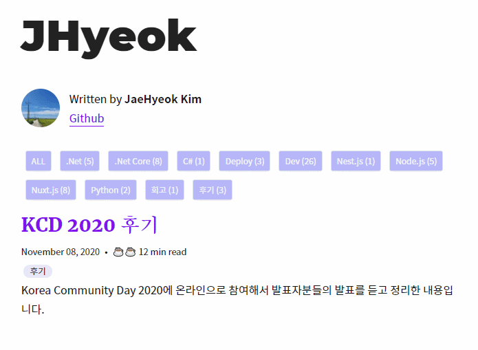
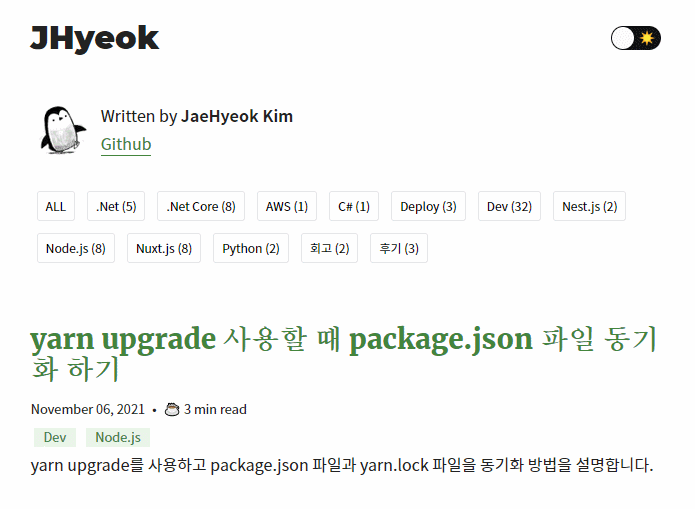
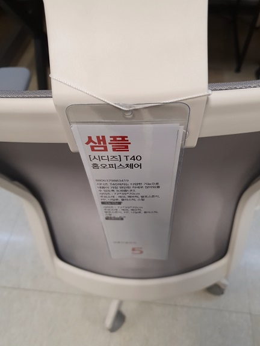
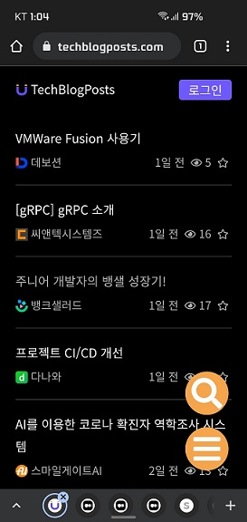
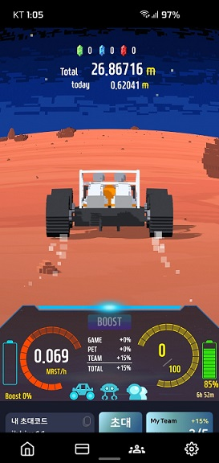

2021년의 회고를 작성한다.

## 블로그를 개편했다

블로그가 다크 모드를 지원하지 않는 게 항상 아쉬웠다. 그래서 10월에 다크 모드를 지원하도록 수정했다. Gatsby를 사용하는 많은 블로그들이 다크 모드를 지원하고 있어서 참고해서 기능을 추가하는 것은 어렵지 않았다.

다크 모드를 지원하도록 수정하면서 당연하게도 블로그의 색상 테마도 고민하게 되었다. 블로그를 처음 만들었을 당시에는 C#을 사용하는 개발자여서 블로그의 테마를 닷넷 개발자로 하고 싶었다. 그래서 .NET Core의 로고에서 사용하는 색을 메인으로 해서 만들었다.

이제는 Node.js와 TypeScript를 메인으로 사용하기 때문에 [Node.js 공식 웹페이지](https://nodejs.org/en/)를 많이 참고했다.

의존성들도 대부분 최신 버전으로 변경했다. Gatsby를 v3에서 v4로 변경하고, Node 버전도 16으로 올려주었다. gatsby-image가 deprecated가 되어서 가이드를 보고 gatsby-plugin-image로 마이그레이션 했다.

## 미니멀한 재택근무 환경편

2021년의 약 2개월은 사무실 출근을 하고, 그 이외에는 전부 재택근무를 했다. 재택근무를 길게 하다가 중간중간 사무실 출근을 해서 정확한 시간은 모르겠다.

넷플릭스에서 `미니멀리즘: 오늘도 비우는 사람들`이라는 다큐멘터리를 재밌게 봤다. 그 영향이 있었던 건지 재택근무를 하면서 장비 욕심이 없었다.
노트북 하나만 있어도 개발하는데 문제가 없는데 굳이 필요해? 라는 생각이 있었다.

하지만 결국 노트북을 책상에 올려놓고 코딩을 하다 보면 화면을 볼 때 목이 아파서 이케아에서 받침대를 샀다.

오랜 시간 의자에 앉아있다 보니 기존에 사용하던 의자가 낡기도 했고 불편해서 의자도 교체했다. 매장에 가서 여러 의자를 앉았는데 시디즈의 T40이 나한테는 가장 편해서 T40 시리즈의 의자를 구매했다.

## 미니멀한 재택근무 업무편

재택근무를 하면서 다행이라고 생각한 게 있다. 회사에서 신규 feature를 추가하면서 특정 시간대에 평소의 몇 십배가 넘는 트래픽이 항상 들어오는 구조의 서비스가 되었다. 그래서 오픈 초기에는 7시에 재택근무가 끝나고 씻고 밥 먹고 그 시간대가 되었을 때 장애에 대처하려고 항상 모니터링을 했다.

모니터링을 하면서 트래픽으로 인해서 발생하는 문제에 대해 자유로운 의견을 슬랙 채널에 올렸는데 나뿐만 아니라 다른 팀원들도 그렇게 했다. 지금은 트래픽을 잘 받아내고 있다. 만약 재택근무가 아니었다면 퇴근 시간 이후였기 때문에 나도 팀원들도 힘들었을 것 같다.

지금 회사에서는 1년이 넘는 장기 프로젝트를 하고 있는데 22년도에는 끝이 보일 것 같다. 이 프로젝트에서는 비즈니스 로직 위주로만 하다 보니 기술적인 도전은 많이 하지 못한 것 같아서 아쉬운 점도 있다.

재택근무를 하면서 Slack의 Huddle, Google Meet, JetBrains의 CodeWithMe를 사용하는데 이러한 도구들이 재택근무의 단점들을 잘 커버해주는 것 같다.

## 올해 가장 만족한 사이트

IT 기술 블로그들의 최신 포스트들을 모아서 보여주는 [TechBlogPosts](https://techblogposts.com/)이 있다.

모바일로 보기 간편해서 이동하는 시간이나 자투리 시간에 많이 보고 있다.

지금까지 이직을 2번 하면서 느낀 거지만 팀의 프로젝트에는 사용 중인 구조가 있고 컨벤션에 맞게 코드를 작성했다. 이 구조는 전임자가 만들어놓고 간 레거시일 수도 있고 팀의 시니어 개발자가 리드해서 만들어진 구조일 수 있다.

지금 회사의 프로젝트 구조에는 매우 만족하지만 만약 내가 새로운 환경에서 리드를 해서 프로젝트의 아키텍처를 설계한다면 어떻게 만들어야 할지 고민을 한적도 있다. 그래서 아래의 포스트들을 인상 깊게 읽었을 수도 있다.

> 인상 깊게 읽은 포스트
- [스포카 기술 블로그 - 도메인 주도 개발 전환 이야기](https://spoqa.github.io/2021/09/13/domain-driven-development-transition-story.html)
- [29CM 기술 블로그 - 선물하기 서비스 개발기](https://medium.com/29cm/%EC%84%A0%EB%AC%BC%ED%95%98%EA%B8%B0-%EC%84%9C%EB%B9%84%EC%8A%A4-%EA%B0%9C%EB%B0%9C%EA%B8%B0-c5cdca816269)
- [29CM 기술 블로그 - 유저 주문 취소 기능 Java 전환기](https://medium.com/29cm/%EC%9C%A0%EC%A0%80-%EC%A3%BC%EB%AC%B8-%EC%B7%A8%EC%86%8C-%EA%B8%B0%EB%8A%A5-java-%EC%A0%84%ED%99%98%EA%B8%B0-d218e5ecb874)

다른 팀들의 컨벤션을 정하는 과정과 어떻게 설계를 하고 개발을 하는지 볼 수 있어서 재밌다.

인상 깊은 포스트들은 아카이빙을 했는데 개인 프라이빗 깃허브에 저장을 해놓다 보니 잘 정리가 되지 않는 느낌이다. 다른 방법을 찾아야 할 것 같다.

## Vim

개발 관련 유튜브를 보다가 Vim에 대한 주제의 재밌는 영상을 봤다. 그래서 나도 Vim을 사용해보기로 마음먹었는데 결론부터 말하면 하루도 되지 않아서 돌아갔다.
IDE의 편리한 환경을 버릴 수는 없어서 IDE에 Vim 플러그인을 설치해서 사용을 했다. 

Vim을 익힐 수 있는 게임도 있었고 잘 만들어진 Vim 가이드도 찾았지만 설치하고 환경을 구성하는데 시간을 많이 투자해야 해서 피로감이 들었다.
그래서 간편하게 환경을 구성했는데 하루 사용을 해보니 익숙해지지 않아서 Vim 플러그인을 삭제했다.

Vim에 익숙해지면 편리하고 좋아 보였는데 나에게는 맞지 않았던 것 같다. 웃픈 경험이었다.

## 채굴을 하다

더마르스 마이닝앱을 시작했다. 12월에 동생의 추천으로 시작했다. 돈이 들지 않았고 혹시 모르는 기대감으로 시작했다. 친구도 꼬셔서 팀을 만들어서 같이 채굴을 하고 있다.

시작한 지 얼마 되지 않아서 얼마나 오래 갈지는 모르겠지만 재미로 시작한 것이기도 하고 꾸준히 채굴하다 보면 이 코인으로 점심 한 번은 사서 먹을 수 있지 않을까? 하는 기대를 하고 있다.

## 마치며

처음 회사일을 시작했을 때에는 어떤 일을 하였고, 어떤 것을 느꼈고, 해야 할 일 등을 기록하였는데 지금은 맥북의 메모 앱으로 TODO 정리만 하고 있다. 회고를 쓰면서 느낀 건데 1년간 무엇을 했는지 생각 정리가 되지 않아서 아쉬웠다. 2022년에는 다시 개인 기록을 꾸준히 해야겠다.
