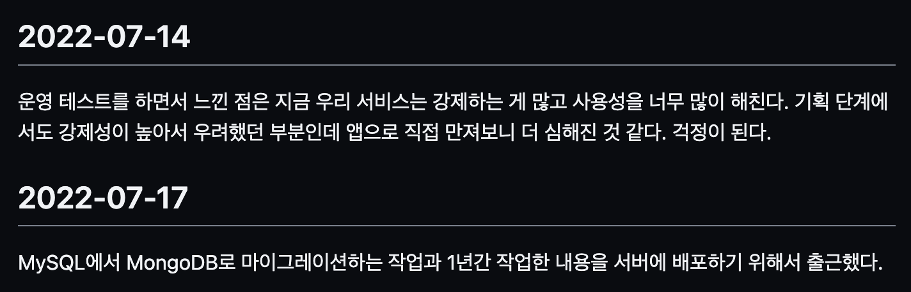

늦은 회고를 작성합니다.

## 메모

작년 회고에서 2022년에는 개인 기록(메모)을 꾸준히 하겠다고 했었고 wiki에 나름 잘 작성한 것 같다.

모든 날짜의 메모를 하지 못했지만 그래도 틈틈이 작성했는데 메모를 작성할 때는 꼭 필요하다고 생각되는 내용들을 위주로 작성을 해서 그 당시에 어떤 생각을 가졌는지 알 수 있었다.

8월 11일에는 메모를 작성하는 방법에 대해서 고민을 하기도 했다.

`매일 작성하는 것이 어렵기 때문에 한 달 단위로 작성하는 것이 좋아 보였다. 1년마다 회고를 작성할 때 기억할 수 있도록 필요한 내용들만 적기 위해서 이 메모 작성을 시작했는데 한 달 단위로 적는 것이 그 목적에는 적합해 보였다. 지금 포맷을 바꾸기에는 어려울 것 같았고 내가 작성하는 패턴을 잘 고려해서 결정을 해야 할 듯싶다.`

아직까지는 나에게 어떤 방법이 좋은지 모르겠다.

2022년 메모들이 회고를 작성할 때 도움이 되었다. 아쉬운 점은 중간에 빠진 날짜들이 많아서 정말 기록할 게 없었던 건지 깜빡한 건지 모르겠다.

메모를 작성할 때 아이폰의 기본 메모앱을 사용하고 있는데 이것을 노션으로 변경하려고 했는데 기본 메모앱이 맥북과 아이폰에서 연동성이 너무 훌륭하고 내가 노션을 잘 사용하지 못하기도 해서 그냥 기본 메모앱을 사용하고 있다.

메모를 작성하다가 내용이 어느 정도 모이면 wiki에 올리고 있다.

## 커밋 50/72 규칙

커밋 메시지를 작성할 때 [50/72 규칙](https://tbaggery.com/2008/04/19/a-note-about-git-commit-messages.html)을 지켜서 작성하려고 노력했다. 그런데 우리가 작성을 할 때 이 규칙이 제대로 지켜지는지 글자수를 일일이 세는 것은 생산성을 떨어뜨리는 일이다. 그래서 Visual Studio Code에서 눈금자를 보여주도록 설정하고 커밋 메시지를 작성해서 작성한 내용을 IDE에 붙여넣기 해서 커밋을 하고 있다.

이 규칙과 상관없이 커밋에는 메시지에 해당하는 작업들의 내용만 커밋하려고 노력하고 있다. 이렇게 하면 다음에 나 또는 동료가 변경 사항을 추적할 때 편리하게 확인할 수 있다. 한 번에 작업한 변경 사항이 많더라도 IDE에서 커밋할 때 원하는 코드 라인만 선택해서 할 수 있기 때문에 어렵지 않다.

## 아이폰

안드로이드만 사용하다가 이번에 처음으로 IOS를 사용하게 되었다. 손이 작아서 작은 스마트폰을 원했는데 안드로이드 진영에서 성능도 나쁘진 않고 작은 제품이 없기도 했고 아이폰이 궁금하기도 했다.

아이폰 14 미니가 나오지 않는 것이 확실시되고 아이폰 13 미니를 구매했다. 연동성과 디자인, 성능에서 전부 만족했는데 뒤로가기가 조금 불편했다. 갤럭시는 뒤로가기를 하단 버튼으로 하거나 제스처로 설정이 가능했고 이 뒤로가기가 모든 앱에서 동일하게 작동했지만 아이폰은 앱에 따라서 `X` 표시를 눌러야 하거나 제스처를 위에서 아래로 내리는 경우가 있어서 처음에는 이것 때문에 불평을 했는데 인간은 적응의 동물이라고 벌써 적응을 해서 이제는 크게 불편하지 않다.

애플 제품 뽑기 운이 안 좋은 건지 어느 날 아침에 알림이 울리지 않았는데 아이폰이 갑자기 검은 화면으로 먹통이 되어서 전원이 안 켜지는 문제가 있었다. 다행히 애플 서포트 페이지에 비슷한 문제에 대한 해결 방법이 있어서 그걸 보고 해결했다.

M1 Pro 맥북을 사용했을 때에도 맥세이프 충전 문제로 고생 좀 하고 뽑기 운이 안 좋은 듯하다. 결국 맥세이프 충전 문제는 macOS 업데이트로 해결됐다. 단점도 있지만 맥북과 아이폰의 연동성 때문에 매우 만족 중이다.

## 키보드

원래 키보드에 욕심이 없었는데 팀원분의 리얼포스 키보드를 쳐보고 마음에 들어서 구매했다.

처음에는 팀원과 같은 모델을 구매하려는 생각이었는데 해외 직구도 재고가 없다고 취소를 몇 번 당해서 차라리 다음 세대의 모델을 구매하자는 생각도 들었고 키보드는 회사일을 하면서 계속 사용하는 물건인데 실물을 보지도 않고 구매하면 후회할 것 같아서 매장에 가서 타건을 해보고 구매했다.

3개의 매장에서 여러 키보드를 타건 해보고 결국은 [Realforce R3TLM BT 블랙 저소음 APC 45g 균등 영문] 키보드를 구매했다.

리얼포스 키보드의 마감이 가격 대비 많이 아쉽다. 마감이 너무 안 좋아서 국내 정식 수입업체인 레오폴드에 문의도 남겼다.

키보드를 구매한다면 직접 타건을 해보고 구매를 하는 것을 추천한다.

## 회사

2022년 7월에 장기 프로젝트를 운영 환경에 배포했다. 전날에 출근을 해서 새벽에 배포를 하고 감기 기운이 살짝 있어서 병원을 갔는데 코로나 확진 판정을 받아서 기억에 남는다.

업데이트가 사용자분들에게 좋은 반응을 얻지 못했지만 배우고 느낀 점이 많다. 기술적인 부분보다는 협업과 서비스(제품) 관련이다.

개발자는 개발 이외에도 신경을 써야 한다고 생각한다. 서비스를 만들어가는데 함께 참여해야 한다. 예를 들어 기획서를 받았을 때 기획 단계에서 놓친 엣지 케이스를 찾아내고 논의해서 더 좋은 제품을 만들어 나가는 것도 개발자의 업무라고 생각한다.

이상함을 느꼈을 때 바로 공유하고 같이 고쳐나가려고 노력했다면 달라졌지 않을까 생각한다.

주어진 문제의 우선순위를 잘 선정해야 하고 문서화를 잘해서 팀 전체의 생산성을 올려야 한다는 내용을 머리로만 이해하다가 실제로 겪어보니 확실히 와닿았다.

그리고 문제가 발생했을 때 방관자의 자세로 'A문제 때문에 B탓이야', 'A문제 때문에 우리는 어쩔 수 없어' 등을 싫어한다. 우리 모두의 책임이고 재발을 방지할 수 있는 시스템을 구축해야 한다.

MySQL에서 MongoDB로의 마이그레이션을 했는데 이 과정을 [회사 기술 블로그](https://techblog.tabling.co.kr/mysql%EC%97%90%EC%84%9C-mongodb%EB%A1%9C-%EB%A7%88%EC%9D%B4%EA%B7%B8%EB%A0%88%EC%9D%B4%EC%85%98-c3c6624d235f)에 작성했다.

## 예측과 측정

과거에는 개발 과정에서 예측을 많이 했다. 이렇게 하면 성능에 문제가 없을 거야, 이렇게 해도 ~될 거야 식으로 관련 자료들을 보고 맹신하고 개발했다. 참고는 할 수 있지만 상황에 따라서 맹신을 해서는 안 되는 것 같다.

회사 서비스의 인프라가 ECS Fargate를 주로 사용하고 서버로는 Express, NestJS를 사용하고 있다. 스펙이 vCPU가 1이었지만 `require('os').cpus().length`로 개수를 출력하니 2가 나온 적이 있다. 아마도 ECS Fargate가 하이퍼스레딩(Hyper-Threading)을 지원하기 때문인 것 같았는데 처음에는 Node.js의 [클러스터](https://nodejs.org/api/cluster.html)를 사용하면 당연히 성능이 더 좋을 것 같았다. 하지만 실제로 부하 테스트로 측정을 해보니 기대했던 결과와 다르게 나왔다. 단순한 API에서는 크게 차이가 나지 않았고 I/O가 많고 복잡한 작업이 있는 API에서는 오히려 클러스터를 사용하지 않았을 때 성능이 더 좋게 측정되었다.

내가 겪은 경험이고 실수한 내용이다. 다행히 예측한 내용을 테스트도 없이 운영에는 반영하지 않았고 테스트를 진행했기 때문에 크게 문제가 되진 않았지만 내 감만 믿고 반영했다면 좋지 않은 결과를 얻었을 것이다.

> 위의 경험은 상황에 따라 결과가 다르게 나올 수 있습니다. 소제목처럼 직접 측정하세요.

## 마치며

2022년 1월에 왓챠에서 '일의 기쁨과 슬픔'이라는 드라마를 봤다. 중고거래 어플을 만드는 스타트업 이야기의 짧은 에피소드의 드라마였다.

주인공이 케빈이라는 소통이 되지 않는 개발자에게 하는 말이 인상 깊었다. 코드를 멀리서 보는 것이 어떻냐고 물었고, 자기가 짠 코드랑 자기를 동일시하지 말라는 말이었다. 나는 케빈처럼 행동하지 않았는지 걱정이 되었다.

`버그는 그냥 버그죠, 버그가 케빈을 갉아먹는 건 아니니까`라는 대사도 있었는데 사실 이건 머리로는 공감하고 싶었는데 마음은 공감하지 못했다. (ㅋㅋ)

이번 회고의 마무리는 [ChatGPT](https://chat.openai.com)에게 재미로 해본 질문이다.

