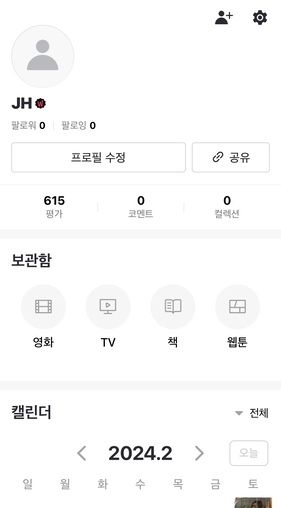
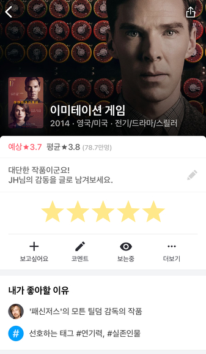
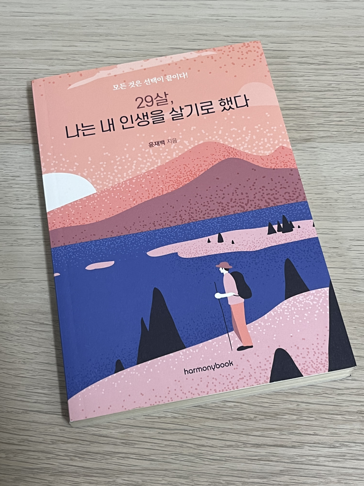
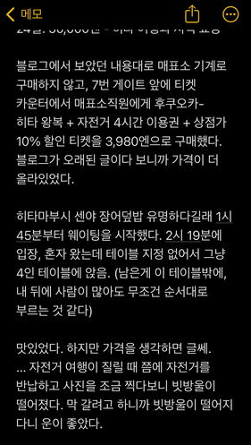

## 회사

### 개발 환경의 변화

팀 내에서 리뷰 문화가 정착되었다.

과거에는 리뷰가 필요한 경우에만 [Upsource를 사용해서 리뷰](https://techblog.tabling.co.kr/%EC%9E%AC%ED%83%9D%EA%B7%BC%EB%AC%B4-%EC%8B%9C%EB%8C%80%EC%97%90-%ED%85%8C%EC%9D%B4%EB%B8%94%EB%A7%81-%EB%B0%B1%EC%97%94%EB%93%9C%ED%8C%80%EC%9D%98-%EC%BD%94%EB%93%9C%EB%A6%AC%EB%B7%B0-upsource-%ED%8E%B8-94c8a7c18603)를 했다. 규칙으로 강제되지 않았기 때문에 나를 포함해서 대부분의 동료들이 간단한 변경사항에 대해서는 코드 리뷰를 하지 않았다.

2023년도 1월부터 팀 내 규칙으로 코드 리뷰가 도입되었고, GitHub PR을 활용하기로 했다. 이 과정에서 우리 팀은 여러 번의 회의를 통해서 어떻게 PR을 만들고, 코드 리뷰에 대한 규칙이나 이런 부분들에 대해서 각자의 의견들을 자유롭게 교환을 하면서 팀 내 코드리뷰 문화 틀을 잡아갔다.

팀 내에서 코드 리뷰가 생기면서 개인적으로는 다음과 같은 고민들을 했다.
- 리뷰의 범위 (고수준 리뷰와 저수준 리뷰)
- PR에서 리뷰로 인해서 만들어지는 커밋들에 대한 정리

팀에서 기술 공유도 시작했다. 올해부터 시작을 했는데 정해진 기간마다 돌아가면서 한 명씩 주제를 정해서 발표를 하고 발표한 내용을 [회사 기술 블로그](https://techblog.tabling.co.kr)에 공유하기로 했다.

실제 서비스를 운영하면서 배운 점들이나 문제 해결한 경험들 또는 우리 팀이 지금 사용하는 기술에 대한 것을 외부에 공유하면 좋을 것 같았다. 그래서 올해에는 회사 기술 블로그에 다음의 컨텐츠들을 공유했다.

회사에서 ECS를 운영하면서 개선하거나 문제 해결 사례 몇 가지를 정리했다.
- [ECS Fargate 운영 문제해결 사례](https://techblog.tabling.co.kr/ecs-fargate-%EC%9A%B4%EC%98%81-%EB%AC%B8%EC%A0%9C%ED%95%B4%EA%B2%B0-%EC%82%AC%EB%A1%80-2e34eae1a213)

GitHub Actions도 도입을 하게 되었는데 GitHub PR에서 유용하게 잘 사용하고 있고 팀의 배포 파이프라인과 AWS Lambda에서도 잘 사용하고 있다.
- [백엔드팀에서 GitHub Actions를 사용하는 방법](https://techblog.tabling.co.kr/%EB%B0%B1%EC%97%94%EB%93%9C%ED%8C%80%EC%97%90%EC%84%9C-github-actions%EB%A5%BC-%EC%82%AC%EC%9A%A9%ED%95%98%EB%8A%94-%EB%B0%A9%EB%B2%95-a10f03f750ba)

### 관리되지 않는 것 정리

회사에서 사용하는 AWS Lambda들이 많은데, 사용하지 않는 Lambda들도 많이 있었다. Node.js 8 버전, JAVA 8 버전의 Lambda도 있었고, 마지막 수정일이 5년이 지났거나 어디에서 사용하는지도 모르는 Lambda들도 있었다. 그래서 해당 함수들을 정리했다.

정리를 한 이유는 다음과 같았다.
- 지금 정리를 하지 않으면 앞으로도 하지 않을 것 같았다.
- 우리가 사용하는 AWS 서비스의 정리의 필요성을 느꼈다.

마지막 수정이 5년이었지만 함수 이름만 보아서는 어떤 역할인지 알기 어려운 것부터 마치 운영에서 사용하고 있는 듯한
착각을 주는 이름의 함수들도 있어서, 코드의 히스토리를 찾아보고 코드를 분석하면서 사용하지 않으면 삭제를 하고 버전을 올려서 새로 작성하거나 하는 작업을 했다.

회사에 AWS Health 이벤트를 슬랙으로 보내주는 Lambda가 있었는데 너무 오래전에 만들어졌고 Python으로 작성이 되어 있었다. 처음에 코드를 수정하려고 하니 [Python 2 Lambda 함수를 지원하지 않는다고 Python 버전을 올리라고 했다](https://aws.amazon.com/ko/blogs/compute/announcing-end-of-support-for-python-2-7-in-aws-lambda/). 그래서 Python 3 Lambda 함수를 작성했다. 하지만 원하는 방향으로 작동을 하지 않는 것 같아서 추후 유지보수나 다른 팀원들도 수정할 수 있도록 팀 내에서 자주 사용하는 Node.js로 다시 재작성을 했다.

해당 함수를 수정하려고 했던 목적은 평소에 불필요한 알람들이 너무 많이 와서 알람에 대한 경각심이 팀 내에서 많이 떨어진 것 같아서 조정이 필요하다고 느꼈다.

결과적으로 CloudFormation, API Gateway, S3 Bucket, 트리거와 사용하지 않는 Lambda들을 약 20개 정도 제거했다.

그리고 팀에서 사용하는 GitHub에서 오래된 Repository, Project 등을 정리했다.

기존에는 관리가 되어 있지 않아서 해당 Repository가 지금 사용되고 있는지 등을 알기 힘들었고 Jira에서 관리되는 프로젝트가 GitHub의 Project에서 중복으로 관리되거나 GitHub의 Project가 3년이 지난 지금도 Open이 되어 있어서 정리를 했다. Jira를 주로 사용하기 때문에 추후에 새로 온 신규 입사자가 헷갈리지 않도록 전부 Close 처리를 했다.

마지막 업데이트 일자가 2019년도이기도 하고, 기억을 더듬어보면 나도 팀에 처음 들어왔을 때, 이것에 대해서 궁금해했다.

아직 정리를 다 끝난 것은 아니지만 시간이 남을 때마다 정리하려고 한다.

### 앱 리뉴얼 프로젝트

회사에서 하반기에 중요한 결정이 있었는데 운영 중인 앱을 리뉴얼한다는 계획이었다.

서버 개발자였기 때문에 이 시기에 팀 내 기술부채를 해결하면 좋겠다는 생각을 가지고 있었다. 앱 리뉴얼 프로젝트의 목적이 기존의 앱을 Flutter로 다시 만든다는 내용이었기 때문에 서버는 상대적으로 일이 적을 것이라고 예상했기 때문이다. 하지만 내 예상과 달리 변경점이 많았고, 프로젝트의 목적에 맞지 않는 새로운 기획을 받고 개발해야 하는 경우도 있었다.

결과적으로 기술부채를 해결할 시간이 부족했다. 이 시기에 혼자서 할 수 있는 팀의 AWS, GitHub 등을 정리했다.

그리고 같은 도메인 내에서 MongoDB와 MySQL을 중복으로 사용 중인데 이 기술부채도 빠르게 해결해야 한다고 생각했는데 아쉬웠다.

스타트업에서 기술부채는 없을 수 없지만 그 기술부채로 인해서 생산성이 크게 저하가 된다면 다시 한번 생각해야 한다고 느낀다. (위의 사례가 그런 경우이다.)

큰 버그 없이 사용하고 있는 기능들은 오랜 시간 동안 보지 않았기 때문에 이번 기회에 다시 살펴볼 수 있었다. 예를 들어서 기기의 토큰을 어느 시점에 저장하고 수정하는지, 클라이언트에서 해당 API를 언제 사용하고 있는지 등이다. (과거의 내가 작성한 코드를 보면서 후회하는 것은 덤이다.)

2024년 2월 5일부터 새로운 앱을 사용할 수 있다.

> [새로워진 테이블링](https://tabling.career.greetinghr.com/blog-01)

<!-- ### 채용

연말부터 면접관으로 면접에 참여하는 횟수가 많아졌다. 로테이션 제도를 팀에서 사용하기 때문이다.

내가 메인인 경우가 이번 차례가 된 것인데 면접에 참여할 때마다 느끼지만 같이 일할 사람을 뽑는 것은 정말 어렵다.

우리 팀은 면접에 참여한 면접관들 중 한 명이라도 마음에 들지 않는다면 채용을 하지 않고 있다. 면접 프로세스가 짧기 때문에 이러한 제도를 사용하고 있는데 이로 인해서 아쉽게 떨어지는 분들도 많은 것 같다.

면접 프로세스를 늘리는 것에 대해서 여러 번 의견을 냈었는데 아쉽게도 받아들여지지는 않았다. -->

### 인프라

Node.js 인프라를 어떻게 구성하는 것이 좋을지 고민했다.

작년에 큰 인스턴스에서 Node.js를 클러스터 모드로 운영하는 것과 작은 인스턴스를 여러 개 운영하는 것에 대한 고민과는 조금 달랐다. 이 문제는 실제 부하 테스트를 통해서 우리 서비스에 적합한 형태를 찾아냈다.

처음에 우리 팀은 대부분이 ECS Fargate를 사용하고 있었다. 그래서 초창기에 ECS EC2도 있는데 왜 더 비싼 ECS Fargate를 사용하고 있는지 궁금했다. 그래서 그 차이에 대해서 알아본 적이 있다.

ECS Fargate와 ECS EC2 중에서 우리 서비스의 형태에는 어떤 것이 적합할지 고민을 했다.

혹시 나처럼 고민하는 사람들을 위해서 읽어보면 좋을 만한 내용을 남긴다.

[Tapple](https://tapple.me/)이라는 일본의 서비스 회사에서 ECS EC2에서 ECS Fargate로 마이그레이션 한 것에 대한 [발표 자료](https://pages.awscloud.com/rs/112-TZM-766/images/01_%E3%82%BF%E3%83%83%E3%83%95%E3%82%9A%E3%83%AB%E6%A7%98_%E8%B3%87%E6%96%99.pdf)를 찾았다. URL이 awscloud인 것을 보면 AWS 관련된 곳에서 발표를 하신 것 같다. 일본어를 못하기 때문에 열심히 파파고 번역기를 돌리면서 봤다.

위 PDF는 ECS Fargate가 더 좋다는 것이 아니라 목적에 따라 다르다고 생각하면 좋을 것 같다.

예를 들어 스파이크 트래픽이 높은 서비스에서는 ECS EC2 보다는 ECS Fargate를 선택하면 더 개선될 여지가 있을 수 있다. 하지만 그렇지 않으면 가격이 더 저렴하고 안정적인 ECS EC2가 더 좋을 수 있다. 또한 ECS EC2는 ECS Fargate와 비교하면 다양한 크기의 인스턴스를 선택할 수 있는 장점도 있다. 다만 관리의 문제가 또 있다. 다음의 예시처럼 장단점이 있는 것 같다.

다른 회사의 인프라를 간접적으로 알게 되는 것은 항상 흥미롭고 재미있는 것 같다.

## 개인

### 행사

AWS Summit Seoul 2023을 갔다. 처음에 아침 일찍 갔을 때는 사람이 적은 줄 알았는데 점심시간쯤에 세션 이동하려고 하니까 사람이 진짜 바글바글했다. 우리나라 IT 관련 종사자들이 이렇게 많았나 하면서 놀랐다. 부스에서 여러 선물을 받았고 모니터링에도 관심이 있어서 부스에서 데모도 보고 질문도 드렸다.

작년에 이어서 올해도 MongoDB.local Seoul 2023에 갔다. 역시나 점심이 맛있었다. MongoDB 7.0에서는 성능적으로도 많이 향상이 되었다고 해서 테스트와 QA 환경부터 버전을 올려보았다.

MongoDB Atlas를 사용하면 MongoDB 버전을 올리는데 어려움이 없어서 좋다.

### 올해의 영화

2021년 7월부터 영화나 드라마를 보면 항상 왓챠피디아에 별점만 남기는 형태로 기록하고 있다.

이렇게 별점을 남기게 된 이유는 한 번 본 영화인데 본 지 모르고 또 보려고 한 적이 있어서이다. 다행히 첫 장면보고 기억을 해내지만 '아 이거 봤던 거구나'하면서 말이다. 하지만 이처럼 시간이 지나면 제목만 듣고 기억을 못 할 때가 있어서 기록하게 되었다.

이전에는 익숙하지 않아서 별점 남기는 것을 잊어버리기도 했는데 이제는 영화를 보면 자연스럽게 별점을 남긴다.

2023년도에는 [이미테이션 게임(2014)](https://pedia.watcha.com/ko-KR/contents/mdBzma9)을 가장 재밌게 봤다.

영화를 재밌게 보면 항상 나무위키에서 정보를 더 찾아보는데 튜링상이라는 것을 알게 되어서 튜링상 수상자 리스트를 보다가 객체 지향 프로그래밍의 선구자인 앨런 케이에 대해서 알게 되었다. 그리고 앨런 케이가 객체 지향 프로그래밍이라는 이름에 대해서 후회하고 JAVA, C#의 객체 지향도 앨런 케이가 추구하는 객체 지향과는 다르다고 한다.

### 올해의 책

윤재백 작가님의 [29살, 나는 내 인생을 살기로 했다](https://m.yes24.com/Goods/Detail/110876292)을 가장 인상 깊게 읽었다. 나랑 같은 나이인데 도전하는 삶이 정말 멋있다고 생각했다. 그래서 나도 이 책을 읽고 제주도는 아니더라도 혼자 여행이 가고 싶어졌다.

한 번도 혼자서 여행을 가본 적이 없었고, 해외여행도 가본 적이 없어서 하나의 도전이라고 생각했다. 연말에 연차가 남게 되어서 12월에 비행기와 숙소를 예약하고 일본으로 그냥 떠났다.

혼자서 하는 여행이 정말 재밌었다. 7박 8일 동안 여행이었다. 지금 회사를 3년 넘게 다니면서 이렇게 긴 휴가를 처음 가는 것이어서 설렜다.

여행지에서 내가 다짐했던 것이 슬랙 보지 않기, 회사일 신경 쓰지 말기였는데 여행 초반에는 힘들었는데 후반부터는 지켜진 것 같다. 정말 다 내려놓고 쉬고 싶었다.

여행을 하면서 틈틈이 메모를 했었는데 그중 일부이다.

## 마치며

퇴근길에 갑자기 이런 생각이 들었다.

> '개발이 가장 재미있었을 때'

중학생 때, 처음 프로그래밍 언어를 만나서 재미로 프로그램을 만들었을 때 이때는 하나의 놀이였고 재밌었다. 그리고 대학생 때, [PHP로 만든 웹사이트](https://github.com/JHyeok/Simple-and-Powerful-File-upload)는 조잡하지만 만들어가는 과정이 재미있었다.

그런데 지금은 돈을 받으면서 하는 개발인데도 왜 그때처럼 재미있지 않은지는 잘 모르겠다. 스트레스를 받기도 한다. 서비스 품질을 높이려는 나의 노력이 누군가에게는 부담이 될 수도 있고 마음에 들지 않는 행동일 수도 있다는 것을 깨달았다.

좋아하는 일을 하는데 돈까지 받으면 좋아해야 되는데 말이다.

과거와 다른 점이 있다면 지금은 개발을 하고 이것을 지속 가능하도록 노력하고 있다. 한 번 개발하면 끝이 아니다. 처음 개발부터 100점은 아니더라도 지속 가능하도록 설계가 필요하다. 나 스스로가 서비스를 만들어가는 모든 과정이 100% 재밌다고 말할 수 없는 것 같다. 이 과정을 즐기려고 노력하고 있지만 아직까지는 쉽지 않은 것 같다. 2024년에는 이 모든 과정을 즐기려고 노력해야겠다.
