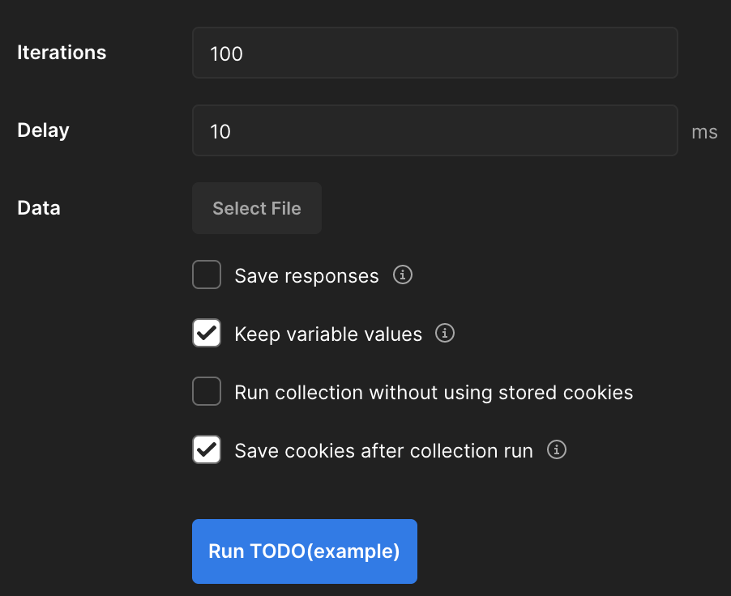
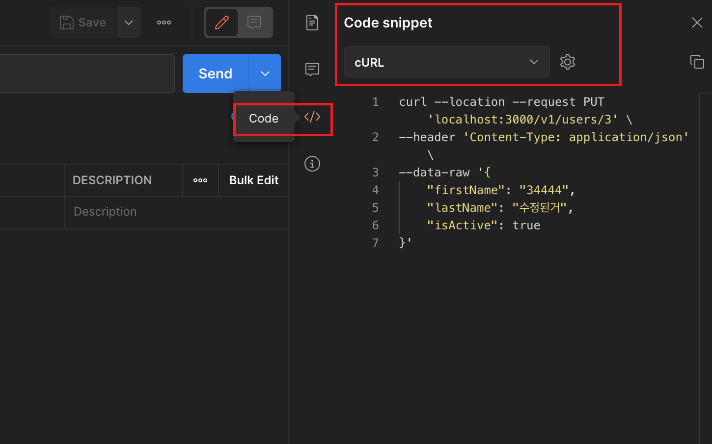
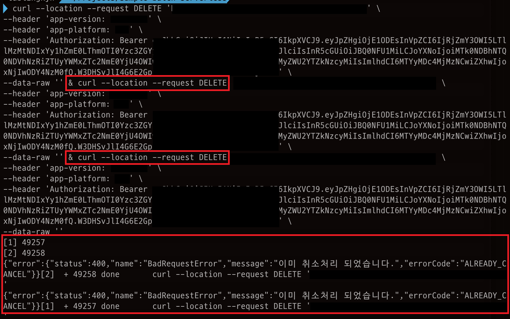

회사에서 운영 중인 API가 같은 시간에 동일한 요청이 여러 번 들어와서 문제가 생긴 적이 있었다.

당시에 문제 해결을 위한 코드를 작성하고 로컬에서 테스트를 진행하면서 삽질을 한 경험이 있어서 그 방법을 공유하려고 한다.

PUT, DELETE, PATCH 성격의 API에 동일한 요청을 동시에 여러 번 요청을 보내는 경우를 테스트하기 위함이었다.

API를 테스트하고 부하를 줄 수 있는 도구들은 많았다.
- [autocannon](https://github.com/mcollina/autocannon)
- [loadtest](https://github.com/alexfernandez/loadtest)

간단하고 빠르게 하나의 API 만을 테스트하고 싶었고, 굳이 다른 도구들의 사용법을 익히지 않아도 테스트할 수 있는 방법이 필요했다.

처음에는 [Postman](https://www.postman.com/)의 Test Runner를 사용했다.



하지만 Delay가 아무리 줄어도 동기 방식이었기 때문에 병렬로 동시에 보내는 요청이 아니었다. 순차적인 요청이었기 때문에 내가 원하는 테스트 방식이 아니었다.

## curl 사용

Postman에서 지원해주지 않는 것 같아서 찾아보니 [curl](https://curl.se/)을 사용해서 병렬로 요청을 보내는 방법이 있었다.

```bash
curl url1 & curl url2 & curl url3 & ...
```

url1과 url2를 같은 url로 하면 동시에 병렬로 요청이 가능하다.

테스트가 필요한 API는 Header에 인증정보와 몇 가지 다른 정보들이 있었는데 Postman에서 curl 코드로 변환해주는 기능이 있다. `Code`를 누르면 변환할 수 있다.



테스트가 필요한 API에 위의 방법으로 동시에 세 번의 요청을 보냈고 최초의 요청만 처리하고 나머지의 요청들은 오류 메시지를 던지고 있는지 테스트가 가능했다. 다음과 같은 결과를 확인할 수 있었다.



### Reference

[Postman: How to make multiple requests at the same time](https://stackoverflow.com/questions/36157105/postman-how-to-make-multiple-requests-at-the-same-time)

[Converting a POSTMAN request to Curl](https://stackoverflow.com/questions/49432735/converting-a-postman-request-to-curl)