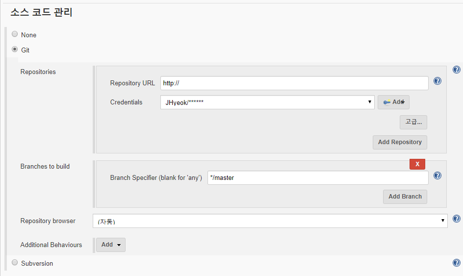
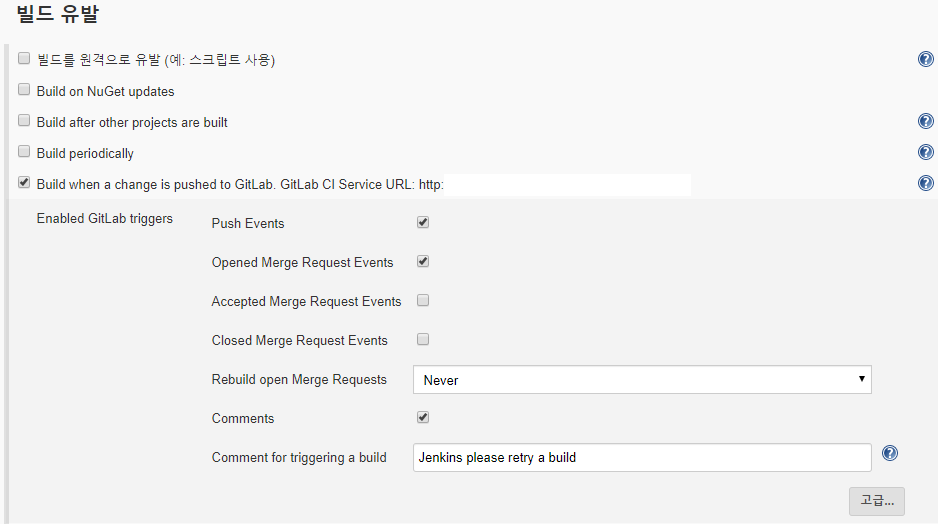
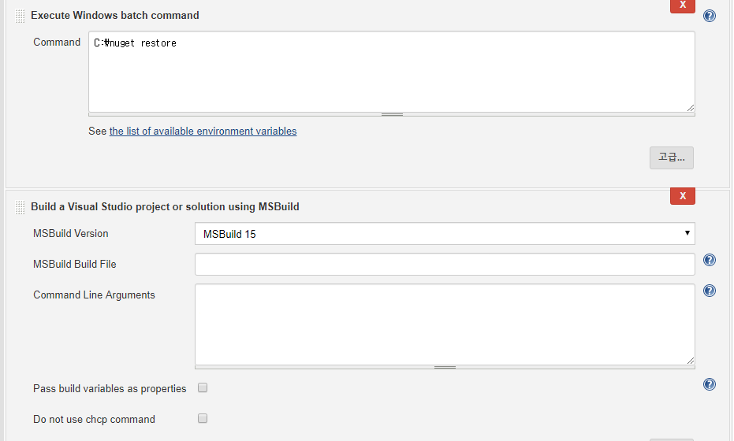
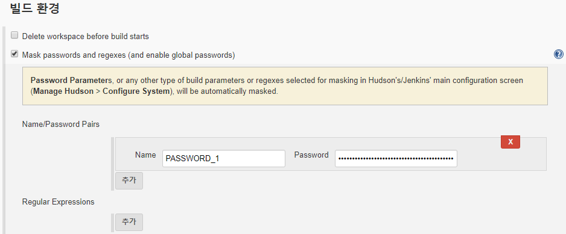
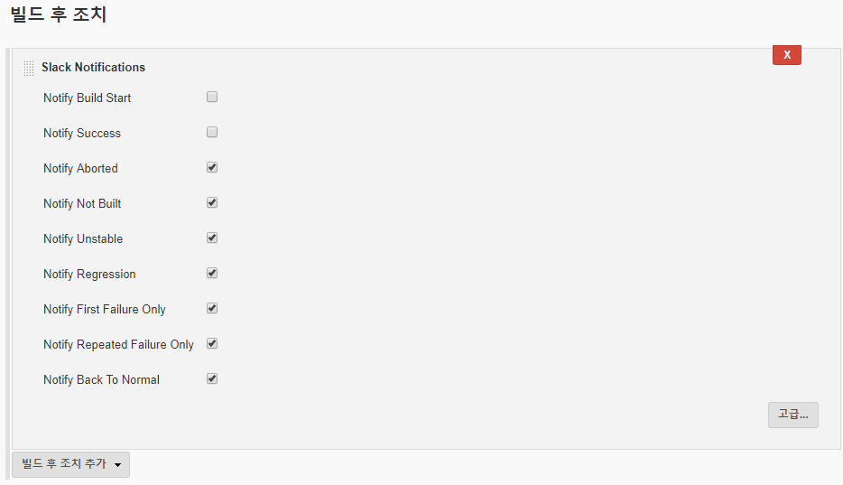

### CI/CD

CI(Continuous Integration)는 지속적인 통합이다. 여러 개발자가 수정한 내용을 지속적으로 통합해서 하나의 레포지토리에 **Build** 및 **Test**를 지속해서 하는 것을 말한다.

CD(Continuous Delivery)는 지속적인 배포이다. CI가 끝난 결과물을 서버에 지속해서 배포하는 것을 말한다.

### Git 연결



소스코드 관리에서 Git의 레포지토리와 연결 정보를 입력한다.



Jenkins에서 빌드 유발 탭에서 `Build when a change is pushed to GitLab`을 체크해서 `push event`를 캐치할 수 있다.

체크해서 받은 CI Service URL을 gitlab의 `Webhook`에 등록해주면 Jenkins의 소스 코드 관리 탭에서 설정해놓은 git repository에 push가 발생하면 Jenkins가 자동으로 빌드가 실행된다.

`Webhook`을 등록 후에 `Test 버튼`을 눌러서 Test가 가능한데 오류가 날 경우 대부분 네트워크/방화벽 문제이다. 나도 오류가 나서 확인해보니 AWS의 공인 IP가 막혀있었고, 내부 IP로 하니 잘 작동하였다.

### MSBuild 사용

**MSBuild 15**를 사용했는데, 비주얼 스튜디오 2017로 만들어진 프로젝트를 빌드하기 위함이다. MS에서 빌드 툴을 다운로드하여서 Jenkins 서버에서 실행해서 다운로드를 해주면 되며 다운로드할 때 웹 개발 빌드 도구를 체크하고(배포하려는 프로젝트의 닷넷 버전도 체크), `NuGet 패키지 관리자`도 체크해서 설치를 해야 한다.

### Jenkins에서 Visual Studio의 게시 기능을 사용

게시 프로파일의 경우 git에 추가하거나, 따로 만들어서 Jenkins의 특정 폴더에 넣어놓아야 한다.
만약 특정 폴더에 넣는 방식이면 빌드 전에 그 폴더에 들어있는 게시 프로파일을 옮겨야 하고 git에 추가된 경우는 별 문제없다.
`git pull` 하면서 전부 가져오기 때문이다.



빌드 전에 nuget으로 `C:\nuget restore WebDeployTest.sln`가 되어야 한다.

```
/t:ReBuild
/p:DeployOnBuild=true
/p:PublishProfile=Default-profile
/p:AllowUntrustedCertificate=true
/p:Password=${PASSWORD_1}
/p:PrecompileBeforePublish=true
/p:EnableUpdateable=true 
/p:Configuration=Release
```



위의 패스워드 같은 경우 `Mask passwords and regexes (and enable global passwords)` 플러그인을 이용해서 `PASSWORD_1`라는 변수에 비밀번호를 집어넣을 수 있다.

### 게시 프로파일 설정 - 특정 파일/폴더 제외

```xml
<ExcludeFilesFromDeployment>
Web.config;NLog.config
</ExcludeFilesFromDeployment>
```

위 설정은 특정 파일을 제외할 수 있다.

```xml
<ExcludeFoldersFromDeployment>
  lib
</ExcludeFoldersFromDeployment>
```

위 설정은 특정 폴더를 제외할 수 있다.

`.config` 파일들의 경우 제외하고 배포하기 때문에 처음에 배포할 때는 수동으로 배포해주는 것이 좋다. 보통 `Web.Config`과 `NLog.config`은 Development, QA, Live 서버의 설정이 다를 수 있기 때문에 제외하는 것이 좋은 것 같다.

필자도 겪은 오류인데 `Web.config`을 제외하게 되면 MVC의 경우 Views폴더의 `Web.config`도 제외되기 때문에 수동으로 한 번 배포해주어야 한다.

### 게시 프로파일 설정 - 기존에 게시된 파일 지우기

기존에 게시된 파일들을 전부 지우고 새롭게 게시할 수 있다. 그리고 기존에 게시된 파일들을 지울 때, `Web.Config`과 `NLog.Config`을 제외시킬 수 있다.
기존에 게시된 파일을 지우는 이유는 기존에는 `Sample.dll`이 배포되어 있었는데 이후에 배포할 때는 `Sample.dll`을 사용하지 않을 수도 있기 때문이다. 아래는 관련 설정이다.

```xml
<SkipExtraFilesOnServer>False</SkipExtraFilesOnServer>
  <ItemGroup>
    <MsDeploySkipRules Include="CustomSkipFolder">
      <ObjectName>filePath</ObjectName>
      <AbsolutePath>\\Web.config</AbsolutePath>
    </MsDeploySkipRules>
  </ItemGroup>
  <ItemGroup>
    <MsDeploySkipRules Include="CustomSkipFolder">
      <ObjectName>filePath</ObjectName>
      <AbsolutePath>\\NLog.config</AbsolutePath>
    </MsDeploySkipRules>
  </ItemGroup>
```

### Jenkins에서 게시하면서 겪은 오류

Jenkins에서 **Visual Studio 게시 기능**을 이용해서 CD를 구현할 수 있다. 내 로컬에서 웹 게시할 때는 문제가 없었는데 Jenkins에서 게시할 경우 계속해서 오류가 나면서 게시가 되지 않았다.

확인해보니 게시에서 사용하는 8172 포트가 열려있지 않아서 오류가 나고 있었다.
aws를 이용하기 때문에 aws 보안 그룹에서 해당 포트에 허용을 해주어야 하며, 게시에는 **공인 IP**를 이용해야 한다.

### Jenkins와 Slack 알람 통합

Jenkins에서 빌드를 시작하거나, 빌드에 오류 또는 빌드가 완료되었을 때의 알람 처리를 **Slack**에다가 할 수 있다. Jenkins의 빌드 후 조치에서 `git commit`을 주거나, **Jira**에 코멘트를 한다는 등 여러 조치가 가능하지만, **Slack**을 이용해서 적용했다.


1. 가장 먼저 Slack 계정과 채널을 만든다.

2. Jenkins-ci를 Slack에 설치해야 한다.

https://myspace.slack.com/services/new/jenkins-ci

위 주소에서 `myspace`를 적용하려는 Slack의 주소로 변경해서 들어간 후, **Jenkins-ci**를 설치한 다음 구성을 추가하고. 알람을 보낼 채널을 선택한다. `Post to Channel`에서 선택을 하면 된다. 채널을 선택하는 부분 아래에 **Token**이 보일 텐데 이 **Token**을 잘 기억해야 한다.

3. Jenkins에 들어가서 Slack Notifications plugin을 설치한다.

해당 플러그인을 설치한 이후에 Jenkins 구성에서 Slack에 나온 `Setup Instructions`을 보고 따라 하면 되는데, 굉장히 쉬웠다.

`BaseURL`만 넣어주고 `Token`만 넣어주면 끝이다.
그 이후에는 각 `Job 구성`에서 빌드 후 조치에서 `Slack Notifications`을 선택해서 원하는 알람 유형에 체크를 하면 된다.



`Build Start`와 `Build Success`보다는 오류가 생겼을 때, 알람이 효율적인 것 같아서 해당 유형들만 체크했다.

### 마치며

젠킨스를 이용해서 CI를 구축하였으며, MSBuild를 이용해서 CD를 구축했다. 방법으로 QA 서버에 CI와 CD를 구축했으며, 운영 서버에서는 CI까지 만을 구축하였는데 비개발자분들이 개발자들이 만들어놓은 결과물들을 QA서버에서 확인하는데 정말로 좋았다.

여러 명의 개발자들이 Push 해놓은 내용들을 지속적으로 업데이트해서 결과물을 보여주는데 그 과정에서 수동으로 빌드를 안 한다는 게 정말 큰 장점으로 다가왔다.

---
### Reference

http://matthewyukiuchino.com/how-to-use-jenkins-to-deploy-c-web-applications-to-iis/

https://medium.com/appgambit/integrating-jenkins-with-slack-notifications-4f14d1ce9c7a

