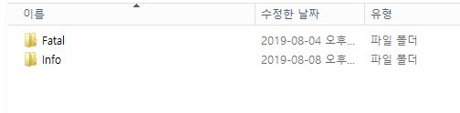
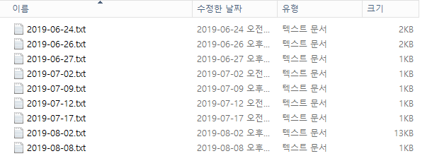
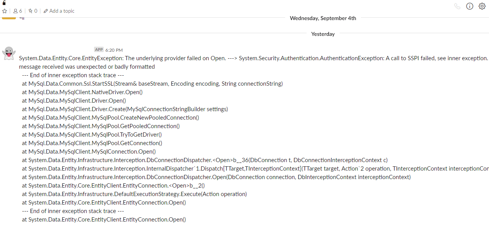

## ASP.NET Core에서 로그 라이브러리 NLog 적용하기

**NLog**는 닷넷 플랫폼 로그 라이브러리이다. 옵션들을 이용해서 다양한 레벨에서 로그를 남길 수 있다. 이번 ASP.NET Core MVC 시리즈에서는 **NLog**를 적용하는 방법을 알아본다.

ASP.NET MVC 5에서 NLog를 적용하는 방법과는 다르게 ASP.NET Core 2.2에서는 정말 간단하게 적용할 수 있다.

Nuget에서 [NLog.Web.AspNetCore](https://www.nuget.org/packages/NLog.Web.AspNetCore/4.8.3)를 다운로드한다.

프로그램 진입점인 Program 클래스의 `Main`에다가 아래처럼 코드를 작성한다.

```csharp
public static void Main(string[] args)
{
    var logger = NLogBuilder.ConfigureNLog("nlog.config").GetCurrentClassLogger();
    try
    {
        logger.Debug("Init Main");
        CreateWebHostBuilder(args).Build().Run();
    }
    catch (Exception ex)
    {
        logger.Error(ex, "Stopped program because of exception");
        throw;
    }
    finally
    {
        NLog.LogManager.Shutdown();
    }
}
```

그리고 `NLog.config`을 만들어준다.

```xml
<?xml version="1.0" encoding="utf-8" ?>
<nlog xmlns="http://www.nlog-project.org/schemas/NLog.xsd"
      xmlns:xsi="http://www.w3.org/2001/XMLSchema-instance" >
  <extensions>
    <add assembly="NLog.Web.AspNetCore"/>
  </extensions>

  <targets>
    <target name="file" type="File"  fileName="${basedir}/Logs/${level}/${shortdate}.txt" layout="${longdate}|${event-properties:item=EventId_Id}|${uppercase:${level}}|${logger}|${message} ${exception:format=tostring}" />
  </targets>
  <rules>
    <logger name="*" minLevel="Error" writeTo="file" />
  </rules>
</nlog>
```

로깅할 최소 레벨을 설정이 가능한데, `Trace`로 하면 모든 오류를 다 쌓고, `Error`로 설정하면 Error위의 레벨만 쌓는다.

자세한 로그 레벨 정보는 [여기서](https://github.com/NLog/NLog/wiki/Configuration-file#log-levels) 확인이 가능하다.

```csharp
public static IWebHostBuilder CreateWebHostBuilder(string[] args) =>
    WebHost.CreateDefaultBuilder(args)
    .UseStartup<Startup>()
    .UseNLog();
```

`CreateWebHostBuilder`에다가 `UseNLog()`로 주입을 시킨다.
이러면 NLog설정이 끝난다. 오류가 발생한다면 `NLog.config`에 정의해놓은 `target`과 `rule`에 맞추어서 파일이 만들어진다.

짧은 시간 안에 ASP.NET Core에서 오류 라이브러리인 NLog를 적용하였다.




`NLog.config`에 설정해놓은 `fileName`, `layout`에 맞게 파일이 생성된 것을 확인 할 수 있다.

## NLog와 Slack 연동

```xml
<?xml version="1.0" encoding="utf-8" ?>
<nlog xmlns="http://www.nlog-project.org/schemas/NLog.xsd"
      xmlns:xsi="http://www.w3.org/2001/XMLSchema-instance" >
  
  <extensions>
    <add assembly="NLog.Slack" />
  </extensions>
  
  <targets>
    <target name="Slack" xsi:type="Slack" layout="${message}" webHookUrl="" channel="#ft_batch_error" username="ft_batch_bot" compact="false" icon=":ghost:" />
  </targets>
  
  <rules>
    <logger name="*" minlevel="Error" writeTo="Slack" />
  </rules>
</nlog>
```

extensions에 NLog.Slack을 추가해주어야 한다. Nuget에서 설치를 하면 되며, `targets`에 Slack설정을 추가해주며 `rules`에도 추가해주면 오류가 발생하면 아래 사진처럼 봇이 Slack 메시지로 오류가 났음을 알려준다.



## 주의할 점

NLog.Config이 잘못되면 NLog가 쌓이지 않을 수 있다.\
필자는 운영서버에서는 Slack을 적용하고, QA서버에서 Slack을 제거해야 해서, Config을 수정해야 할 일이 생겼다. QA서버에서 `targets`에서 Slack을 제거했는데, 파일 탐색기에 NLog가 쌓이지 않게 되었다.\
그런데 NLog를 다시 수정 전으로 돌리면 파일이 쌓이는 아이러니한 상황이 생겨서 잘 살펴보았더니, `targets`에는 제거가 되어있는데, `rules`에서는 남아있어서 생긴 문제였다.

`target name="Slack"`을 지워줬으면 `rules`에서도 Slack에 해당되는 `rules`을 지워주어야 한다.
그 이후 잘 쌓이게 되었다.

### Reference
- https://github.com/NLog
- https://www.nuget.org/packages/NLog.Web.AspNetCore/4.8.3
- https://github.com/NLog/NLog/wiki/Configuration-file#log-levels
