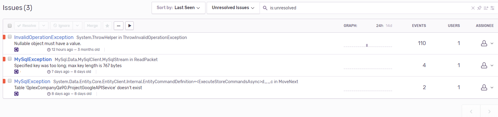

## ASP.NET Core에서 Sentry 적용하기

**Sentry**는 오류를 실시간으로 모니터링할 수 있고, 알림 또는 메일 시스템과 연동해서 받아 볼 수 있다. 이번 ASP.NET Core MVC 시리즈에서는 **Sentry**를 적용하는 방법을 알아본다.

>.NET Core의 초창기 버전에서는 Sentry를 쌓으려면 Sentry미들웨어를 만들고, RavenSharp.Core라는 패키지를 이용해야 한다.

>Sentry에게 오류를 보내는 클래스를 만들고 해당 클래스를 가지고 처리하는 SentryMiddleware를 만들어야 하며 오류를 보내는 클래스를 DI 하고, SentryMiddleware는 ASP.NET Core 요청 파이프라인에 추가해야 한다.

[SentryMiddleware를 이용한 방법 보러가기](https://medium.com/@aevitas/logging-to-sentry-in-asp-net-core-8c84c5c592db)

하지만 위의 방법은 Sentry가 .NET Core에 대한 공식지원이 없을 때의 방법이고 공식지원을 하기 시작하면서 간단하게 적용을 할 수 있게 되었다.

```csharp
public static IWebHostBuilder CreateWebHostBuilder(string[] args) =>
    WebHost.CreateDefaultBuilder(args)
    .UseStartup<Startup>()
    .UseSentry()
    .UseNLog();
```
`CreateWebHostBuilder`에 `UseSentry()`를 호출한다. `UseSentry`에서 람다식으로 `Sentry DSN`과 옵션을 추가할 수 있다.

```
"Sentry": {
  "Dsn": "https://@sentry.io/projectNumber",
  "IncludeRequestPayload": true,
  "IncludeActivityData": true
},
```
위의 예시처럼 `appsettings.json`에서 `Sentry DSN`과 옵션을 추가할 수 있다.

두 가지 중에서 선택해서 `Dsn`을 옵션으로 넘겨주기만 한다면, Sentry에 오류보고가 완료된다.



Issuse목록에서 오류들을 확인할 수 있다.


오류 목록에서 선택해서 들어가면 오류에 대한 자세한 내용을 위의 사진처럼 보여준다.


그 외 사용하는 패키지의 버전 및 `Exception`위치를 Sentry에서 확인할 수 있다.

초창기 닷넷 코어 버전에서 적용하는 방법을 생각하면 개발자는 큰 힘 들이지 않고 Sentry를 적용 할 수 있는 것 같다.

.NET Core가 오픈소스화 되면서 좋은 방향으로 발전하고 있다.

### Reference
- https://medium.com/@aevitas/logging-to-sentry-in-asp-net-core-8c84c5c592db
- https://github.com/getsentry/sentry-dotnet
- https://github.com/NLog/NLog/wiki/Configuration-file#log-levels
