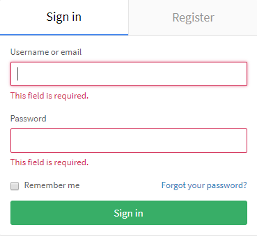

이번 포스팅에서는 [ASP.NET Core 유효성 검사 - 1](https://jhyeok.com/aspnetcore-validate/)에서 자세히 설명하지 않은 부분들에 대해서 적었다. Ajax.BeginForm에서는 유효성 검사를 어떻게 처리해야 하는지? 유효성 검사에 CSS를 어떻게 적용해야 하는지? 그러면 이제 저 부분들을 어떻게 처리해야 하는지 알아보자.

`Ajax.BeginForm`로 Json을 반환하는 컨트롤러와 뷰는 ``Html.BeginForm에서 처럼 `ModelState.AddModelErrorr`가 작동하지 않는다.

```csharp
return Json(new { status = false, error = ModelState.Values.Where(i => i.Errors.Count > 0).Select(i => i.Errors.Select(m => m.ErrorMessage)) });
```

위처럼 반환해서 메시지로 뿌리는 방법이 있고, 프론트엔드에서 유효성 검사를 한 것처럼 Validation위치에 텍스트를 넣어주는 방법은 아래처럼 하면 된다.

개별 속성에 대한 `ModelState` 오류를 나타내는 클래스를 만든다.

```csharp
public class ValidationError
{

    public string PropertyName = "";
    public string[] ErrorList = null;
}
```

`ModelState`를 기반으로 `ValidationErrors` 목록을 리턴하는 메서드를 작성한다.

```csharp
public IEnumerable<ValidationError> GetModelStateErrors(ModelStateDictionary modelState)
{
    var errors = (from m in modelState
                        where m.Value.Errors.Count() > 0
                        select
                           new ValidationError
                           {
                               PropertyName = m.Key,
                               ErrorList = (from msg in m.Value.Errors
                                              select msg.ErrorMessage).ToArray()
                           })
                        .AsEnumerable();
    return errors;
}
```

그런 다음 컨트롤러의 Post 메서드에서 다음을 수행한다.

```csharp
if (!ModelState.IsValid)
{
    return Json(new
    {
        errors = true,
        errorList = GetModelStateErrors(ModelState)
    }, JsonRequestBehavior.AllowGet);
}
```

위에서 반환 된 오류 목록을 반복하는 Javascript 함수를 만들 수 있다.

```js
$.ajax({
            cache: false,
            async: true,
            type: "POST",
            url: form.attr('action'),
            data: form.serialize(),
            success: function (data) {
                if (data.errors) {
                    displayValidationErrors(data.errorList);
                 }
            },
        error: function (result) {
            console.log("Error");
        }

    });

function displayValidationErrors(errors) {
    $.each(errors, function (idx, validationError) {

        $("span[data-valmsg-for='" + validationError.PropertyName + "']").text(validationError. ErrorList[0]);

    });
}
```

위의 예에서는 `ErrorList`에서 첫 번째 오류 메시지만 받고 있다. 모든 메시지를 가져오고 유효성 검사 범위에 추가하기 위해 추가 루프를 만들 수 있다.



위 사진에 보이는 GitLab 로그인 페이지처럼 유효성 검사에 걸리면 빨간 테두리가 Input Box에 나타나는 효과를 ASP.NET MVC에서 구현해보자.

모델 속성에 대한 유효성 검사가 실패하면 `html input`, `textarea`, `select`에서 `input-validation-error` 클래스가 추가된다.

이 클래스에 CSS를 편집하면 유효성 검사를 통과하지 못하면 해당 `input`, `textarea`, `select`에 효과를 줄 수 있다.

```css
input.input-validation-error,
textarea.input-validation-error,
select.input-validation-error {
    box-shadow: none;
    border-radius: 2px;
    border: 1px solid #d22852;
}
```

유효성 검사를 통과하지 못하면 ASP.NET MVC에서는 `input-validation-error` 클래스를 추가한다. 포커스가 되었을 때의 CSS를 수정하시면 포커스가 되어서 빨간 테두리가 가려지지 않는다.

### 마치며

이 방법을 몰랐을 때는 직접 백엔드에서 상황에 따른 오류 메시지를 `if`문으로 처리해서 프론트엔드에서 그 `model`의 이름을 기반으로 해당 `input`폼에 메시지를 직접 넣어주었다. 매우 귀찮은 작업이었다. 하지만 위의 방법을 이용하면 그 부분이 간소화된다.

보통 필자처럼 `ajax`의 경우 직접 가공을 해서 화면에 일일이 뿌려주는 경우가 많은데 위의 방법을 이용하면 우아한(?) 방법으로 유효성 검사를 처리할 수 있을 것이다.

---
### Reference

https://stackoverflow.com/questions/7287412/jquery-validate-asp-net-mvc-modelstate-errors-async-post

https://stackoverflow.com/questions/2830431/red-border-around-textbox-when-validation-fails
