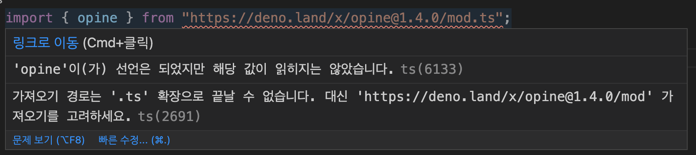

Deno를 간단히 사용해보고 느낀 점을 정리한 글입니다.

사용된 코드는 [여기](https://github.com/JHyeok/deno-example)에서 확인할 수 있습니다.

## Deno란?


Deno는 V8을 사용하고 Rust로 빌드된 JavaScript 및 TypeScript를 위한 간단하고 현대적이며 안전한 런타임이다. Node.js 창립자 Ryan Dahl이 만들었다. 처음 Deno를 알게 된 것은 개발 바보들의 놀이터라는 블로그에서 [주목할 만한 프로젝트 – deno](https://www.devpools.kr/2018/06/21/deno/)를 보았다. 지하철로 출퇴근하면서 본 글이었는데 이미 많은 개발자들이 Node.js를 많이 사용하고 있었지만 Ryan Dahl은 Node.js 초기 설계 단계에서의 후회 10가지에 대해 언급했다. 그리고 마지막에 새로 만들고 있는 프로젝트를 공개하였다.

> Ryan Dahl: “Reducing complexity is always beneficial”

Ryan Dahl은 [복잡성을 줄이는 것은 항상 유익하다고 한다](https://evrone.com/ryan-dahl-interview).

[위키피디아](https://ko.wikinew.wiki/wiki/Deno_(software))에 정리되어 있는 Deno와 Node.js의 차이점이다.

```
CommonJS 대신 ES 모듈을 기본 모듈 시스템으로 사용합니다.
브라우저와 유사한 로컬 또는 원격 종속성을 로드하기 위해 URL을 사용합니다.
리소스 가져오기를 위한 내장 패키지 관리자가 포함되어 있으므로 NPM이 필요하지 않습니다.
캐싱 메커니즘이 있는 스냅샷 TypeScript 컴파일러를 사용하여 즉시 TypeScript를 지원합니다.
광범위한 웹 API를 사용하는 브라우저와의 호환성 향상을 목표로 합니다.
샌드박스 코드를 실행하기 위해 파일 시스템 및 네트워크 액세스를 허용합니다.
Promise, ES6 및 TypeScript 기능을 활용하도록 API를 재설계합니다.
핵심 API 크기를 최소화하는 동시에 외부 종속성이 없는 대규모 표준 라이브러리를 제공합니다.
권한 있는 시스템 API를 호출하고 바인딩을 사용하기 위해 메시지 전달 채널을 사용합니다.
```

## Deno를 VS Code에서 사용하기

Deno는 설치가 간단하다.

```
# Using Homebrew (macOS):
brew install deno

# Using PowerShell (Windows):
iwr https://deno.land/x/install/install.ps1 -useb | iex
```

VS Code에서 개발하기 위해서는 마켓플레이스에서 [Deno](https://marketplace.visualstudio.com/items?itemName=denoland.vscode-deno)를 설치한다.

설치 후에는 VS Code를 재실행하고, TypeScript로 코드를 작성하다 보면 문제가 발생한다.

```ts
import { opine } from "https://deno.land/x/opine@1.4.0/mod.ts";
```

Deno에서 외부 모듈을 가져오는 코드인데 VS Code에서는 경고가 발생한다.




가져오기 경로는 `".ts"` 확장자로 끝날 수 없습니다.라는 경고가 발생하는데 이 부분은 아래의 방법으로 해결이 가능하다.

먼저 VS Code에서 `F1`을 누른 다음에 `deno: Init` 명령어를 실행하면 된다.

아래의 파일들이 자동으로 추가되고 VS Code를 재실행하겠냐는 창이 나오는데 다시 재실행하면 해결된다.


자동으로 `.vscode` 경로가 만들어지고 VS Code에서의 Deno 관련 옵션들이 추가되었다. VS Code에서 Deno 프로젝트 개발 환경 구성이 완료되었다.

## 내가 생각한 장점

**Deno는 Node.js에서 의존성을 관리하기 위해 사용한 `package.json`이 없고, 모듈들이 설치되는 `node_modules`이 없다.** Node.js 개발 환경에서 프론트엔드 또는 백엔드를 개발 중에 `node_modules`로 인한 문제를 한 번씩은 마주쳤을 것이다. Deno에서는 이러한 문제들을 마주하지 않아도 된다. Deno로 만들어진 프로젝트에서는 `npm install` 또는 `yarn install`을 하지 않아도 된다.

처음에는 `.ts` 파일마다 필요한 모듈을 `import`해서 사용하였는데, Deno 공식 문서에서는 `deps.ts`를 만들어서 필요한 종속성들을 관리하고 있었다.

*deps.ts*

```typescript
// Dero
export { Dero, Controller, Get, Wares, Post, Put, Delete, Status } from "https://deno.land/x/dero@0.2.8/mod.ts";
export type { HttpRequest, HttpResponse, NextFunction } from "https://deno.land/x/dero@0.2.8/mod.ts";

// Body Parser
export { json, urlencoded } from "https://deno.land/x/parsec/mod.ts";
export type { ReqWithBody } from 'https://deno.land/x/parsec/mod.ts';

// value schema
export { default as vs } from "https://deno.land/x/value_schema/mod.ts";

// MySQL
export { Client } from "https://deno.land/x/mysql@v2.8.0/mod.ts";
```

`deps.ts`를 만들어서 관리하면 다음과 같이 사용할 수 있다.

```typescript
import { 
  Controller, 
  Get,
  HttpRequest,
  Status,
  Wares,
  Post,
  ReqWithBody,
  Put,
} from "https://deno.land/x/dero@0.2.8/mod.ts";

@Controller("/users")
class UserController {
  //... 생략
}

export default UserController;
```

다른 `controller.ts`를 생성한다면 `"https://deno.land/x/dero@0.2.8/mod.ts"`에서 동일하게 참조를 해야 한다.

```typescript
import { 
  Controller, 
  Get,
  HttpRequest,
  Status,
  Wares,
  Post,
  ReqWithBody,
  Put,
} from "../deps.ts";

@Controller("/users")
class UserController {
  //... 생략
}

export default UserController;
```

`deps.ts`를 만들어서 관리한다면 위와 같이 수정할 수 있다. 대규모 프로젝트라면 동일한 URL에 대한 많은 참조를 피할 수 있을 것이다.

```
Deno에서는 외부 모듈을 로컬 모듈로 직접 가져오기 때문에 패키지 관리자의 개념이 없습니다.
이는 패키지 관리자 없이 원격 종속성을 관리하는 방법에 대한 의문을 제기합니다.
종속성이 많은 대규모 프로젝트에서는 모듈을 모두 개별 모듈로 가져오는 경우 모듈을 업데이트하는 것이 번거롭고 시간이 많이 걸립니다.
Deno에서 이 문제를 해결하기 위한 표준 관행은 deps.ts 파일을 만드는 것입니다.
```

Deno 공식 문서에서는 `deps.ts` 파일에 대해 위와 같이 설명하고 있다. 모든 종속성을 `deps.ts`에서 관리한다면 관리가 더 쉬워진다. 만약 `deps.ts` 없이 개별 모듈로 가져온다면 해당 모듈을 사용하는 모든 파일들을 확인해서 URL을 변경해야 하는 번거로운 상황이 발생한다.

**Node.js에서는 TypeScript 사용이 복잡했지만 실행환경도 TypeScript를 염두에 두고 설계한 Deno에서는 간단했다.**

```typescript
import { opine } from "https://deno.land/x/opine@1.4.0/mod.ts";

const app = opine();

app.get("/", (_req, res) => {
  res.send("Hello World");
});

app.listen(3000, () => console.log("server has started on http://localhost:3000 🚀"));
```

TypeScript로 간단하게 웹서버를 만들 수 있다.

**Deno는 TypeScript 및 JavaScript 코드를 정리해주는 코드 포맷팅 기능이 내장되어 있다.**

```
deno fmt
```

위 명령어를 통해 자동으로 코드가 정리되는 것을 확인할 수 있다. Deno 표준으로 제공되기 때문에 여러 스타일 가이드 중에서 선택을 해야 하는 시간 낭비가 줄어드는 것 같다. 기본으로 제공되기 때문에 이 점이 굉장히 편리하다고 생각했다.

## 내가 생각한 단점

처음에는 [Oak 프레임워크](https://github.com/oakserver/oak)를 사용했는데 자잘한 오류가 너무 많아서 [Dero 프레임워크](https://github.com/herudi/dero)로 변경해서 API 서버를 만들었다. 스타수가 많은 Oak 프레임워크에서 발생한 오류들이 깃허브 이슈에 올라와 있었지만 해결이 되지 않는 것 같았다. 프레임워크를 사용하지 않는 것도 괜찮은 것 같다.

MongoDB를 사용하려고 하니 안정화되지 않는 기능이라고 오류가 발생하면서 `--unstable` 옵션을 사용하도록 했다.

Deno는 특별히 활성화하지 않으면 파일이나 네트워크 등의 환경에 액세스 할 수 있는 권한이 없다. 명령줄에서 Deno 프로세스에 부여할 권한들을 명시해야 한다.

```
deno run --allow-net --allow-write --allow-read --allow-plugin app.ts
```

권한 목록은 Deno의 [Permissions 문서](https://deno.land/manual/getting_started/permissions)를 참고하면 된다.

## 마치며

아직까지는 Deno를 사용하는 사람이 적어서 오픈 소스 생태계가 활발하지 않았고, 레퍼런스가 많이 부족한 느낌이었다. 개인적인 생각으로는 지금 Deno를 사용해서 서버를 개발해야 한다면 기존 Node(NPM) 패키지들과의 호환성 때문에 힘들 것 같다고 생각했다. 실제로 이 부분은 Deno 1.0 공식 릴리즈에서도 한계로 안내되었다.

그렇지만 Deno는 지금의 Node.js에서 동적 언어를 즐기기 위해서는 빌드 시스템과 프로젝트 자체를 관리하는 툴만으로도 굉장히 복잡해지고 있다고 꼬집고 있으며 JavaScript 생태계에서 인프라 환경은 더욱 단순해져야 한다고 한다.

Deno를 짧게 사용한 것인데도 Node.js와 비교해서 정말로 단순하다고 생각했다.

---
## Reference

https://developers.episource.com/blog/intro-to-deno/

https://www.devpools.kr/2018/06/21/deno/

https://ko.wikinew.wiki/wiki/Deno_(software)

https://evrone.com/ryan-dahl-interview

https://github.com/denoland/deno/issues/5027

https://deno.land/manual