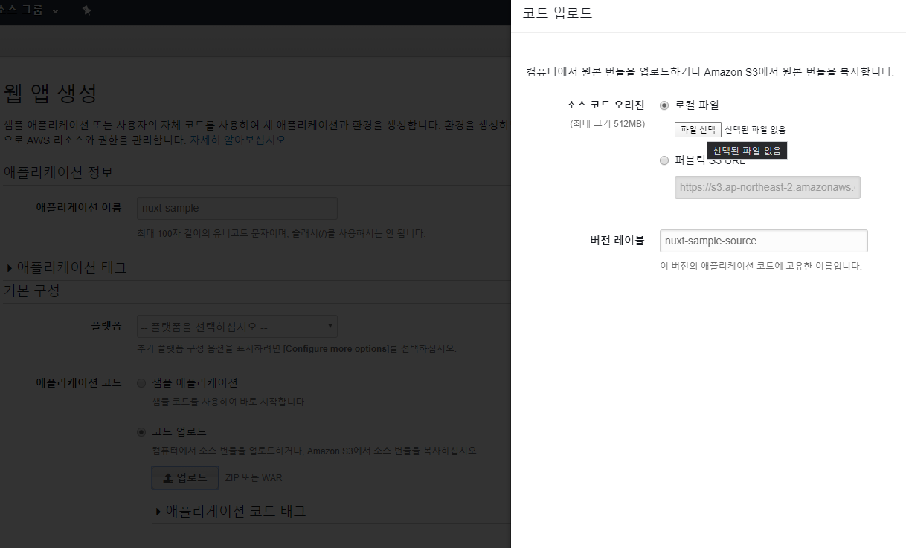
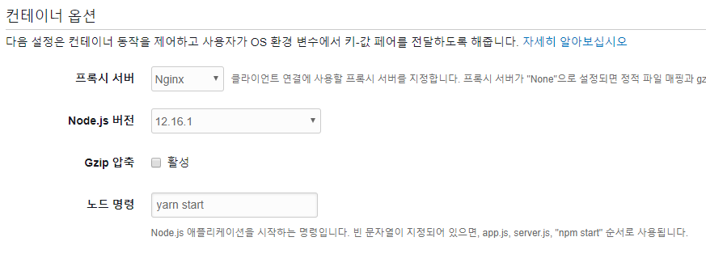
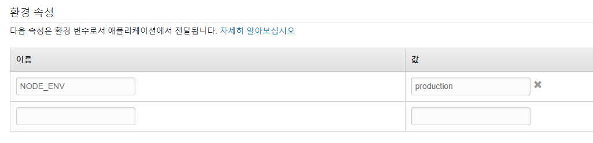
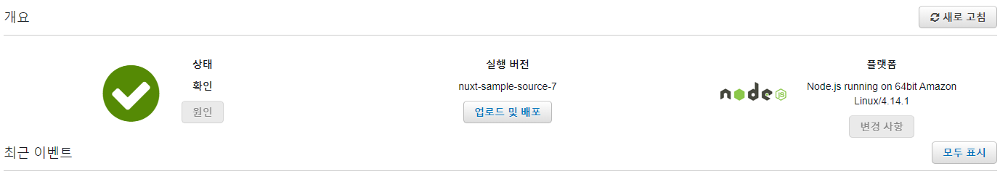

사용된 소스코드는 [여기](https://github.com/JHyeok/jaebook-client)에서 확인할 수 있으며 TypeScript를 사용하는 Nuxt 애플리케이션을 AWS Elastic Beanstalk에 배포하면서 겪은 문제들과 해결하는 과정을 정리하였습니다.

## AWS Elastic Beanstalk 시작하기

AWS에 로그인한 다음에 Elastic Beanstalk에 들어가서 웹 앱을 생성하면 된다.



원하는 플랫폼을 선택한 다음에 코드 업로드를 클릭해서 소스 코드를 올리면 웹 앱이 만들어진다.

다른 사람들에게 지금까지 만들어진 결과물을 보여줄 때, 서버를 세팅하고 올리는 데까지 시간이 오래 걸린다면 AWS Elastic Beanstalk를 추천한다. 시간을 절약하고 빠르게 결과물을 보여줄 수 있다.

## AWS Elastic Beanstalk에서 Yarn 사용하기

AWS Elastic Beanstalk는 기본적으로 NPM을 사용하도록 되어있는데 내가 만든 사이드 프로젝트에서는 Yarn을 사용하고 있었다.

그래서 그 부분을 고쳐줄 필요가 있었다. 열심히 검색을 해본 결과 AWS Elastic Beanstalk에서 NPM을 사용하고 Yarn을 사용하도록 하는 config들이 공유가 되고 있었다.

이 config 파일들은 `.ebextensions` 폴더에 생성해준다. `.ebextensions` 은 Amazon EC2 인스턴스 환경에서 스크립트를 실행하도록 한다.

`.ebextensions/disable-npm.config` 생성

```
files:
  "/opt/elasticbeanstalk/hooks/appdeploy/pre/50npm.sh":
    mode: "000755"
    owner: root
    group: users
    content: |
      #!/usr/bin/env bash
      #
      # Prevent installing or rebuilding like Elastic Beanstalk tries to do by
      # default.
      #
      # Note that this *overwrites* Elastic Beanstalk's default 50npm.sh script
      # (https://gist.github.com/wearhere/de51bb799f5099cec0ed28b9d0eb3663).

  "/opt/elasticbeanstalk/hooks/configdeploy/pre/50npm.sh":
    mode: "000755"
    owner: root
    group: users
    content: |
      #!/usr/bin/env bash
      #
      # Prevent installing or rebuilding like Elastic Beanstalk tries to do by
      # default.
      #
      # Note that this *overwrites* Elastic Beanstalk's default 50npm.sh script.
      # But their default script actually doesn't work at all, since the app
      # staging dir, where they try to run `npm install`, doesn't exist during
      # config deploys, so ebnode.py just aborts:
      # https://gist.github.com/wearhere/de51bb799f5099cec0ed28b9d0eb3663#file-ebnode-py-L140
```

`.ebextensions/yarn.config` 생성

```
files:
    # Found at https://stackoverflow.com/a/42096244/9074640
    # Runs right before `npm install` in '.../50npm.sh'
    "/opt/elasticbeanstalk/hooks/appdeploy/pre/49_yarn.sh" :
        mode: "000775"
        owner: root
        group: root
        content: |
            #!/bin/bash

            # install node
            curl --silent --location https://rpm.nodesource.com/setup_12.x | bash -;

            # install yarn
            curl --silent --location https://dl.yarnpkg.com/rpm/yarn.repo | tee /etc/yum.repos.d/yarn.repo;
            yum -y install yarn;

            # install node_modules with yarn
            app="$(/opt/elasticbeanstalk/bin/get-config container -k app_staging_dir)";
            cd "${app}";
            echo "Inside ${app}, about to run yarn."
            yarn --production;
```

## 소스 번들 생성하고 업로드

그리고 소스 번들을 git으로 쉽게 만드는 방법이 있는데 이 명령을 사용하는 이유는 git에 저장된 파일들만 포함시켜서 소스 번들을 생성하기 때문에 소스 번들을 최대한 작게 유지할 수 있는 장점이 있다.

```
$ git archive -v -o myapp.zip --format=zip HEAD
```



노드 명령에는 `yarn start`로 설정했고, `prestart` 옵션을 프로젝트의 package.json에 추가해서 AWS Elastic Beanstalk에서 프로젝트를 빌드하고 실행하도록 설정했다.

```json
  "scripts": {
    "start": "nuxt-ts start",
    "prestart": "nuxt-ts build",
  },
```



AWS Elastic Beanstalk 환경에서 환경 변수를 생성할 수 있는데 `NODE_ENV`를 `production`으로 설정하고 소스 번들을 업로드했다. 하지만 실패하였는데 해결해보도록 하자.

## 로그 확인 및 오류 해결하기

502 오류를 마주쳤는데 AWS Elastic Beanstalk에서는 로그를 확인할 수 있다. 위 사진처럼 두 가지 옵션으로 로그를 확인할 수 있는데 전체 로그를 선택하면 로그 파일을 다운로드하게 된다.


필자는 마지막 100줄을 선택해서 Web 환경에서 로그를 확인했다.

```
 FATAL  Cannot find module '@nuxt/typescript-build'
Require stack:
- /var/app/current/node_modules/@nuxt/core/dist/core.js
- /var/app/current/node_modules/@nuxt/cli/dist/cli-command.js
- /var/app/current/node_modules/@nuxt/cli/dist/cli.js
- /var/app/current/node_modules/@nuxt/typescript-runtime/bin/nuxt-ts.js
```

로그를 확인해본 결과 프로젝트의 devDependencies에 있는 `@nuxt/typescript-build`가 `node_modules`에 없어서 오류가 생긴 것을 확인했다.

TypeScript 기반이기 때문에 종속성을 설치할 때, Production으로 `dependencies`에 있는 종속성만 설치하면 안 된다는 것을 알았고 `.ebextensions/yarn.config`에서 해당 부분을 수정했다.

`yarn --production;`을 `yarn install;`로 변경했다.

그리고 다시 소스 번들을 올려보았는데 이번에도 똑같이 502 오류가 뜨고 있었다. 로그를 다시 확인해본 결과, 이번엔 Nginx에서 오류가 발생하고 있었다.

```
-------------------------------------
/var/log/nginx/error.log
-------------------------------------
connect() failed (111: Connection refused) while connecting to upstream, client: xx.xx.xx.xx, server: , request: "GET / HTTP/1.0", upstream: "http://127.0.0.1:8081/"
```

오류의 일부분인데 AWS Elastic Beanstalk은 웹서버로 Nginx를 사용하고 있는데 기본적으로 Nginx가 트래픽을 8081로 리디렉션 하려고 시도하기 때문이다. 그래서 Nuxt.js의 포트를 8081로 수신하도록 변경하였더니 배포가 정상적으로 진행되었다.



## 마치며

이전에는 .NET 애플리케이션의 배포를 위해서 AWS Elastic Beanstalk를 사용했었는데, 이번에 개인 프로젝트를 진행하면서 Nuxt.js 애플리케이션을 배포했다.

AWS Elastic Beanstalk를 사용해보니 기존에는 배포를 위해서 EC2를 만들고 Nginx를 설정하는 등의 자잘한 작업들을 AWS Elastic Beanstalk에서 알아서 관리해주고 사용자는 필요한 옵션만 건드릴 수 있도록 해서 간편했다. 구성 메뉴에서 카테고리 별로 옵션을 수정할 수 있어서 자잘한 설정도 가능하고 모니터링 메뉴에서 모니터링도 가능해서 좋았다.

### Reference
- https://www.trytape.com/2019/10/28/using-yarn-on-elastic-beanstalk/
- https://docs.aws.amazon.com/ko_kr/elasticbeanstalk/latest/dg/applications-sourcebundle.html
