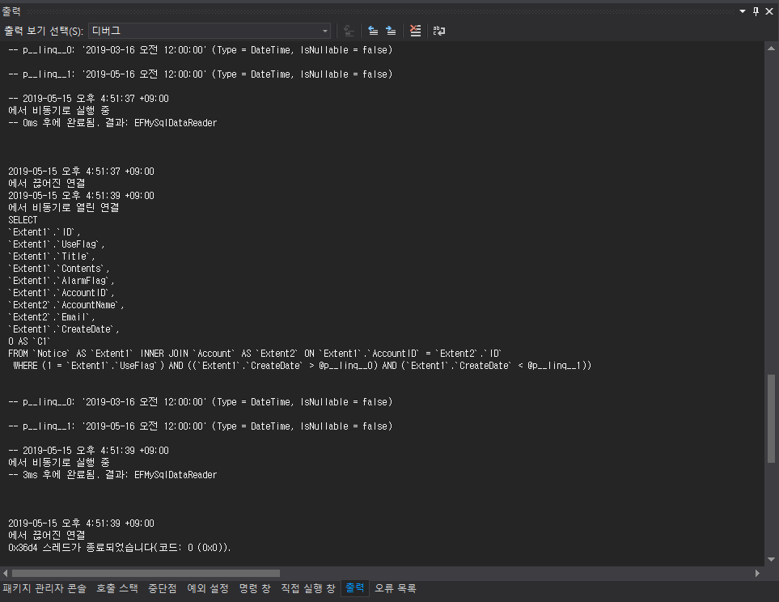

ASP.NET MVC에서 Entity Framework 6을 사용해서 개발을 진행 중에 실제로 쿼리가 날아가는 것을 확인하고 싶었는데 기존에 ORM을 사용하지 않는 개발에서는 외부 라이브러리나 툴을 이용해서 DB에 어떤 쿼리가 날아가는지 확인해야 합니다. 하지만 Entity Framework 6에서는 디버깅 중에 확인할 수 있는 방법이 있습니다.

DB.Context에서 Database.Log를 이용한 방법입니다.

```csharp
_db.Database.Log = x => System.Diagnostics.Debug.WriteLine(x);
```



현재 콘텍스트에서 생성된 모든 SQL이 출력되게 됩니다.

VisualStudio의 디버그 모드에서 출력 탭에서 날아가는 쿼리 및 로그를 확인할 수 있습니다. 비동기로 실행되는지 여부와 콘텍스트가 열리고 닫히는 부분도 모두 확인이 가능합니다.

