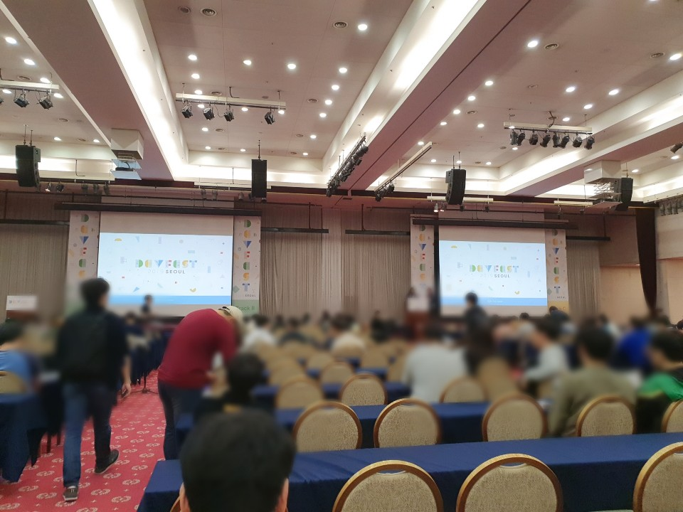
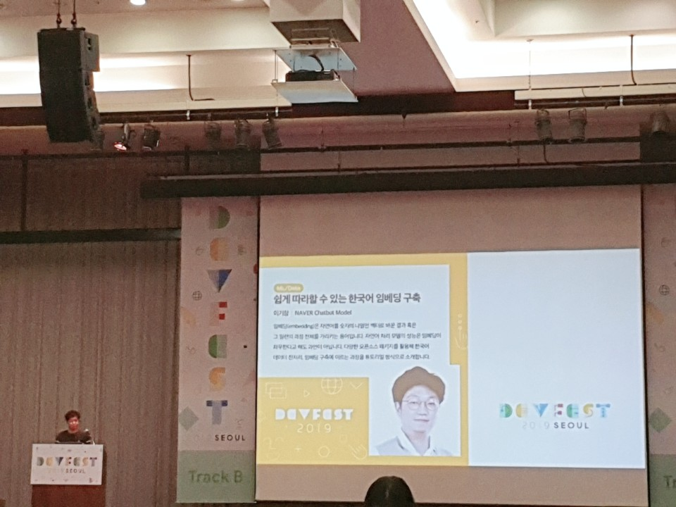
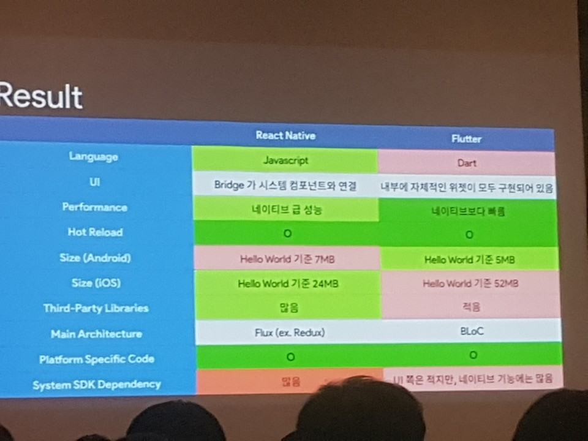
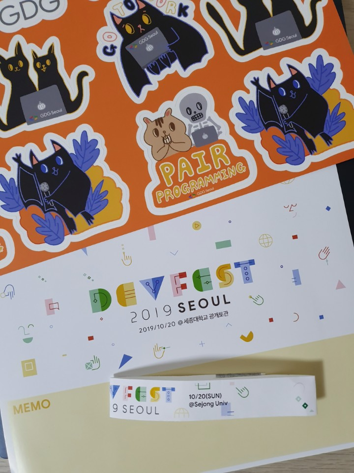

10월 20일에 세종대학교 광개토관 지하 2층 컨벤션홀에서 열리는 GDG DevFest Seoul 2019를 다녀왔다. 많이 늦었지만 후기를 작성해보려 한다. 각 세션에 대한 짤막한 정리와 마지막에는 GDG DevFest Seoul 2019의 후기를 적었다.

- [쉽게 따라할 수 있는 임베딩 활용 (이기창, NAVER)](#devfest1)
- [React Native와 Flutter를 고민하는 개발자분들에게 (이상훈, Loplat)](#devfest2)
- [개인앱 수익, Firebase를 만나 최대 2배로 늘었습니다 (박상권, PRND컴퍼니)](#devfest3)
- [웹서비스에서 MSA 톺아보기 (김한성, SKT)](#devfest4)
- [테스트 관점으로 아키텍쳐 완성하기 (이승민, 뱅크샐러드)](#devfest5)
- [후기](#devfest6)

## 쉽게 따라할 수 있는 임베딩 활용 (이기창, NAVER)

임베딩: 단어나 문장을 벡터로 바꾼 것 혹은 그 과정\
자연어처리에서 임베딩은 벡터 내지 벡터화\
빈도 그 자체를 임베딩으로 씀

임베딩으로 할 수 있는 것들
- 관련도/유사도 계산
- 시각화
- 벡터 연산(유추 평가): 아들-딸+소녀 = 소년
- 전이학습(transfer learning): 임베딩한 것들 다른 딥러닝 모델의 입력값으로 사용

**단어 수준 임베딩 (워드 임베딩)**

사람같은 경우 새로운 책을 읽을 때, 완전히 학습하는 것이 아님 배경지식을 활용해서 독해를 하게됨\
이 딥러닝 모델도 랜덤같은 경우 학습을 완전히 제로, FastText 는 이미 공개된 의미나 문법 정보를 한번 보고나서 하게 됨.

단어 임베딩 구축 - fastText.git

각각의 단어 임베딩 기법들이 조금씩 차이가 있지만 0.70~0.73 사이

그거 단어벡터를 cos 한건데 우리가 원하는 task의 성능을 70%이상을 달성.

시사점
복잡한 딥러닝 모델을 써도 80%대 성능을 기록\
단어 임베딩 품질이 좋으면 자연어 처리의 성능을 높일 수 있음\
임베딩 만으로도 저 성능이면 임베딩 자체에 집중을 할만하다.

임베딩이 어떻게 의미를 가지는가
- 일단 빈도를 센다. -> 문서를 쓴 이의 의도는 단어 사용 패턴에 드러난다.
- 단어가 어떤 순서로 나타나는지 살핀다. (시퀀스 정보에 의미가 녹아 있다) ELMo, BERT
- 단어가 어떤 단어와 주로 같이 나타나는지 살핀다.(문맥에 의미가 녹아 있다) word2vec, fastText,Glove ... 워드임베딩

**문장 수준 임베딩**

최근 ELMo, BERT 등 다양한 문장 수준 임베딩 등장 (성능 BERT > ELMo)

문장 수준 임베딩의 장점은 동음이의어 분간 가능, 다시 말해 문장의 문맥적 의미를 벡터화할 수 있음

우리들이 만든 말뭉치를 넣으면 커스텀해서 사용 가능함, ELMo는 87% 나왔음

BERT-Korean-Model.git 공개 되어 있음.

전이학습 듀토리얼: ratsgo/embedding.git

## React Native와 Flutter를 고민하는 개발자분들에게 (이상훈, Loplat)

같은 서비스를 Android, IOS 멀티 플랫폼을 지원하기 위함.

하이브리드 플랫폼의 경우 하나의 코드로 여러 플랫폼에 대응할 수 있다는 장점이 있음.

그 중, React Native, Flutter\
Web View가 아닌 Native Platform이기 때문에 N급 성능이 나옴.

React Native
- 8.1k 10.12 기준 React Native이 더 인기가 많음
- 리엑트 컴포넌트가 브릿지를 네이티브 컴포넌트에 연결
- UI면에서 플랫폼, SDK에 대한 종속성이 있음
- 일부 컴포넌트의 경우에는 안드로이드, IOS 각각에만 존재하기 때문에 플랫폼별 각각 다르게 구현해야 할경우가 있음.

Flutter
- 7.5k
- Skia 기반의 자체 UI엔진이 모든 위젯을 직접 그림
- UI면에서 플랫폼, SDK에 대한 종속성이 없음
- 각각의 스타일을 유지하기 위해서는어쩔 수 없이 분기처리 해야함 (안드로이드 스타일, IOS 스타일)

**성능 (갤럭시 S10 기준 카운트 늘어나는 + 버튼 눌러서, 2분간 실행 1초에 2번씩 누름 기준)**
Native 안정\
Flutter, React Native은 가끔씩 CPU가 높이 올라감. 그런 경우들이 있음.\
React Native은 평균 20%, flutter는 평균 10%
평가 : React Native이 CPU를 더 씀\
Pixel 폰에서 테스트 결과도 React Native이 더 CPU를 쓴다.

C++ 엔진으로 그리는 것 vs 브릿지를 한번 더 통과해야하는 리엑트컴포넌트\
Flutter는 네이티브보다 빠르다.\
React Native은 네이티브급 빠름이다.

**App Size (Hello world 기준)**
안드로이드 타겟\
플루터는 4.5mb, React Native은 7.1mb

IOS 타겟은 반대상황\
플루터 52mb, React Native은 24mb

빌드 도구 버전에 따라 크기 차이가 날 수 있음

**개발자 측면**
Flutter, React Native 둘 다 지원\
지원하는 IDE는 많음\
Hot Reload는 변경된 순간 APP재시작 없이 반영

JS는 익숙하지만, Dart는 생소, Dart는 구글에서 만든 언어. 인터프리터언어가 아닌 컴파일 언어\
UI를 클래스 기반으로 들여쓰기 형태로 짬\
React Native은 JSX 기반

개발자 측면에서 UI를 짤 때 Dart는 불편하다.\
필자 개인의견 : HTMl 처럼 태그기반이엇으면 괜찬앗을 것 같다.

**아키텍처**

리엑트 네이티브 Redux\
데이터가 아래처럼 한 방향으로만 흐르기 때문에 관리하기가 좋고,
함수형 프로그래밍에 최적화, Store에서 상태를 저장하여 UI와 연결하여 사용

플루터 BLoC\
페이지당 BLoC 하나씩 하는게 정석, Stream형태로 구성되어 있다.

아키텍처는 설계 나름이지만 보통 위처럼 사용을 많이 한다고 한다.

**3rd-party Libraries**
React Native > Flutter\
Flutter는 구글 공식 라이브러리들이 정식 버전이 아닌 pre 버전들이 많음.\
Flutter는 플러그인이 많이 존재하지 않음.\
React Native은 나온지 오래됬기 떄문에 라이브러리들이 많고 관리도 나름 잘되는 편이다.

**생태계 EcoSystem**
React Native은 문서가 잘되어 있고 래퍼런스도 많음. 예제가 많음\
Flutter는 문서가 은근 되어있지만, 아직 나온지 얼마 되지 않아 래퍼런스가 부족함. 예제가 아직 부족함(추가되는 중으로 보임)\
Flutter는 First-Party 라이브러리의 버전들이 아직 0점대임.\
실제 서비스되어 있는 앱들이 React Native이 더 많다.

지금은 React Native을 추천하는 바이지만, 나중에 Flutter의 생태계가 발전한다면 경쟁하는 프레임워크가 될 것 같다.\
발표자분은 React Native을 선택할 것 같다.

## 개인앱 수익, Firebase를 만나 최대 2배로 늘었습니다 (박상권, PRND컴퍼니)

- Firebase Prediction을 이용해서 사용자의 행동을 예측
- 결제할 가능성이 높은 사용자에게 아이템을 더 비싸게 팔아봤습니다.
- 총 수익이 -69~93% 늘었습니다.
- Firebase Prediction을 사용하기 위해 알아야할 다른 Firebase 제품들에 대해서도 설명합니다.

Prediction 프레덱션(=예측)

이번달 이후 구글 어널리틱스는 모바일에서 사용 불가, Firebase 어널리틱스를 써야 한다.

상품을 1개만 만드는 것보다 여러개를 만드는 것이 수익률을 올리는데 좋다. 이것은 꼭 추천한다.

## 웹서비스에서 MSA 톺아보기 (김한성, SKT)

기존 모놀리틱 
- 기능 하나를 수정하기 위해서는 단위 애플리케이션을 재배포해야 하는 문제.
즉 서비스가 중단이 된다.

무중단 배포를 꿈꾸지만 서비스가 커지거나 규모가 커지면 예상치 못한 문제가 발생한다.

SOA에서 파생된 MSA

MSA 3가지 요소
- API Gateway : API의 End-point를 통합
- Orchestration : 여러개의 서비스를 묶어서 하나의 서비스로 만듦 (서비스,컨테이너 배포 관리)
- Service Mesh : 서비스간의 통신 (네트워크 관리)
공통적으로 아직 표준이 없음.

장점
- 확장의 유연함(ex. 알림서비스 추가, scaling)
주문서비스의 웹서버만 증가시키던가 각각의 서비스에 스케일링이 가능
하나의 서비스가 죽었을 때, 전체 서비스에 영향이 적다

단점
- 장애 추적

microservices.io 예제들 많음.

On-Premise에서 MSA?
- 물리 서버 관리하는 것부터 일 - 네트워크, 스토리지 등
- 다양한 프레임워크를 쓰다보면 매번 새로운 장애 발생 - 라이브러리, 모듈 등
- 관리용 애플리케이션의 필요 - Cron, Montiroting, Batch 등
- Scaling(Up/Down/In/Out)등에 제약이 있음 - 서버 구매부터 설치까지

차라리 모놀리틱이 편한...?
꼭 지금 MSA가 정답은 아니다.

이제는 Serverless 시대이다.

대표적으로 람다
람다를 쓰면 MSA 환경으로 구축할 수 있다 라고 주장 
람다로도 MSA가 가능

문제는 Cloud는 모든게 비용이다.
개발 기간이 길어지면 당연히 돈, 잘못된 테스트도 당연히 돈.
로그(스토리지)또한 돈이다. 등등

onpremise에서 cloud 마이그레이션
- cloud에 맞게 커스텀이 필요함
- 잘못된 설계시 롤백의 위험성
- 러닝커브
- 결국 MSA는 커녕 일만 2배로...

Multi Cloud
terraform, serverless 프레임워크

여러가지 문제로 Hybrid Cloud까지 오게되었다.
Onpremise + public cloud

장비를 새로 사긴 그렇고, 기존 장비 인력 재활용하기 위해서
하이퍼바이저

그런데 답이 Docker가 있음.
쿠버네티스: 컨테이너화된 애플리케이션을 좀 더 쉽게 배포하고 관리해주는 솔루션
Istio 분산된 MSA 실행 지원하는 독립형 서비스 메시

문제는 진짜 답이 없습니다. MSA에는 정답이 없습니다.
사실 최적의 조화는 적절한 Cloud Service + k8s Cluster 사용
클라우드 서비스에서 데이터 스토어, k8s 클러스터에서 애플리케이션

멀티 클라우드에서는 하나의 클라우드를 리전으로 사용. GCP 리전, Azure 리전, AWS 리전

## 테스트 관점으로 아키텍쳐 완성하기 (이승민, 뱅크샐러드)

안드로이드 개발자가 아니어서 해당 세션을 듣는데 혹시나 하는 불안감이 있었지만 좋은 세션이었던 것 같다.

이상을 쫓는 것보다 당장의 할 수 있는 것 부터 해야한다. TDD는 너무 멀고, 일단은 테스트 케이스를 추가해서 개발을 해야 한다.

성공케이스부터 테스트 케이스 개발을 하다보면 실패케이스도 자연스럽게 될 것이다.

DB 테스트의 경우 테스트 데이터 베이스를 만들어서 한다.

## 후기

`개인앱 수익, Firebase를 만나 최대 2배로 늘었습니다 (박상권, PRND컴퍼니)` 세션의 내용이 적은 것은 해당 내용만 적고 그 이후는 편안한 마음으로 들었다. (발표자분께서 저것만 적고 나가도 된다고 장난식으로 말씀하심)

`웹서비스에서 MSA 톺아보기 (김한성, SKT)` 세션에서 MSA에는 정답이 없다는 말씀은 정말 인상이 깊었다.

`테스트 관점으로 아키텍쳐 완성하기 (이승민, 뱅크샐러드)` 세션은 PPT가 많았는데 해당 PPT를 보면서 내용을 들었다. 막바지에 다른 분들이 질문하신 내용에 대한 답변들을 적어보았다. 그 답변들은 [주니어 개발자의 Nuxt.js에서 테스트 코드 짜기](https://jhyeok.com/nuxtjs-api-test/)에 많은 도움이 되었다.

방명록을 작성하는 Commit 이벤트는 아이디어가 참신해서 재밌었다. [GDG DevFest Seoul 2019 방명록 보러가기](https://github.com/GDG-Seoul/DevFest-Seoul-2019-guestbook)

개인적으로 도움이 많이 되는 개발자 행사였다. 실제로 하는 프로젝트에 테스트 코드를 작성해보았으니 좋은 경험이 된 것 같다.

