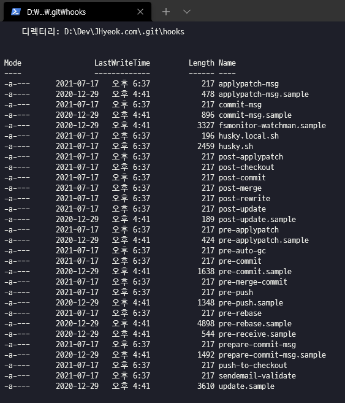

여러 사람이 참여하는 프로젝트에서 코딩 컨벤션을 만들고 하나의 일관된 코딩 스타일에 따라서 코드가 작성되는 것은 중요하다고 생각한다. 여러 명의 개발자가 각자 본인의 스타일에 맞춰서 코딩을 한다면 소스는 한눈에 알아보기 힘들 것이다. 개발자가 일일이 신경을 써서 하기에는 리소스 낭비라고 생각되고 이러한 과정을 도와주는 도구들이 있다.

Node.js 개발 환경에서는 eslint와 prettier가 널리 사용되고 있지만 gts를 알게 되어서 gts에 대해서 소개하고 husky에 대해 소개하려고 한다.

## gts란?

gts(Google TypeScript Style)는 Google에서 만든 타입스크립트 스타일 가이드이며 포맷터(formatter), 린터(linter), 자동 코드 수정(automatic code fixer)의 구성을 도와준다.

코드 스타일을 적용하는 가장 쉬운 방법이며, 귀중한 코드 검토 시간을 절약할 수 있다고 설명한다.

시작하는 방법은 간단하다.

```
npx gts init
```

위 명령어는 `package.json`에 필요한 의존성을 자동으로 추가해주며 Google TypeScript 스타일을 사용하는 `tsconfig.json`이 생성된다. 그리고 `package.json`에는 아래와 같은 스크립트들이 추가된다.

```
lint: 린트 및 포맷 문제를 확인합니다.
fix: 가능한 경우 서식 및 린트 문제를 자동으로 수정합니다.
clean: 출력 파일을 제거합니다.
compile: 타입스크립트 컴파일러를 사용하여 소스 코드를 컴파일합니다.
```

## eslint + prettier + gts

대부분의 프로젝트들이 eslint와 prettier를 사용하고 있을 것이다. 필자는 위의 방식으로 사용하는 것을 추천하지 않는데 기존의 eslint와 prettier 환경에서 gts를 사용하는 방법이 있다.

```
npm install gts -D
```

프로젝트의 루트 경로에서 `.eslintrc`를 다음과 같이 수정한다.

*.eslintrc*

```
extends:
  - './node_modules/gts'
```

기존에 `.eslintrc.json`와 `.prettierrc.js`를 사용한다면 다음과 같이 수정한다.

*.eslintrc.json*

```json
{
  "extends": "./node_modules/gts"
}
```

*.prettierrc.js*

```javascript
module.exports = {
  ...require('gts/.prettierrc.json')
}
```

eslint, prettier를 사용하면서 Google TypeScript 스타일을 사용할 수 있다.

## Git hooks

eslint, prettier를 직접 설정해서 사용하거나 gts를 사용하거나 프로젝트의 코드 스타일을 강제하는 도구는 여러 가지가 있다. 하지만 이 도구를 사용하는 개발자들이 실수로 적용을 하지 못한 채 Git에 올리는 경우도 있다.

Git에서는 hook을 지원하는데 프로그래밍에서 hook이란 특정 이벤트 또는 함수가 호출되기 전, 후에 호출이 되는 코드를 말한다.

Git hook은 git에서의 커밋, 풀, 머지 등과 같은 이벤트에서 특정 스크립트를 실행하는 것이며, pre-commit은 커밋 직전에 실행되는 hook이다.

다른 hook들을 확인하고 싶다면 git과 연동된 다른 프로젝트 폴더에 들어가서 `cd .git/hooks/`를 하면 된다.

Mac 환경에서는 `ll`, Windows 환경에서는 `ls`를 하면 `.sample` 확장자의 여러 파일들이 나오는데 이 파일들이 Git에서 지원하는 hook이다.



## husky란?

husky는 Node.js 개발 환경에서 Git hook을 사용하기 편리하게 만들어주는 도구이다.

husky를 사용하는 방법은 어렵지 않다.

```
npm install husky -D
```

프로젝트의 개발 환경에 husky를 설치하고 다음의 명령어로 `package.json`에 prepare라는 스크립트를 추가하고 실행한다.

```
npm set-script prepare "husky install"
npm run prepare
```

npm의 버전이 낮아서 set-script 명령어가 사용이 되지 않는다면 npm의 버전을 올리거나 직접 추가해야 된다.

```json
"scripts": {
  "prepare": "husky install"
}
```

프로젝트에 husky가 설치가 완료되었으면 다음은 Git hook을 추가하는 방법이다.

```
npx husky add .husky/pre-commit "npm run format && npm run lint"
git add .husky/pre-commit
```

단위 테스트를 실행하는 스크립트를 넣어도 되고 Git에서 커밋을 하기 이전에 강제적으로 실행하고 싶은 스크립트를 넣어서 구성하면 된다. 커밋 이외에도 다른 Git 작업에서 hook을 설정할 수 있다.

이제 커밋을 하면 자동으로 프로젝트에서 format과 lint 스크립트를 실행해서 코드 스타일을 강제하도록 한다.

## 마치며

평소에 eslint와 prettier를 사용하지만 Github에 올라온 오픈 소스에서 gts를 사용하는 것을 보고 관심을 가지게 되었다. eslint에서도 gts를 사용할 수 있으니 괜찮은 것 같다.

여담으로 NestJS를 사용하면 eslint와 prettier가 자동으로 설정된다. (NestJS 👍)

husky는 이번에 v7의 버전이 나오면서 기존에 v4를 사용하고 있던 환경에서 마이그레이션을 하게 되면서 정리를 해보았다.

### Reference
- https://github.com/google/gts
- https://github.com/typicode/husky
- http://meonggae.blogspot.com/2017/03/git-git-hooks.html
