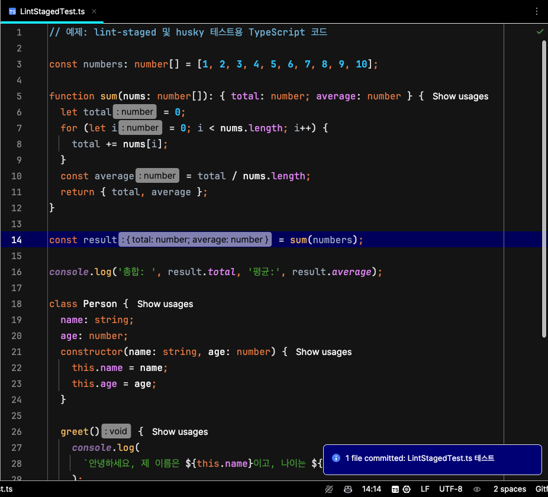

이전에 [gts와 husky에 관련된 글](https://jhyeok.com/gts-and-husky/)을 작성한 적이 있습니다.

이번 글에서는 [husky](https://github.com/typicode/husky)와 [lint-staged](https://github.com/lint-staged/lint-staged)를 활용하여 Git 커밋 시 변경된 파일에만 ESLint와 Prettier를 실행하는 방법을 소개합니다.
이전에도 간단한 설정으로 활용할 수 있었지만, husky 최신 버전(v9)에서는 더욱 간편하게 적용할 수 있어 정리합니다.

husky, lint-staged를 적용한 코드는 [여기](https://github.com/JHyeok/nestjs-api-example/tree/master/.husky)에서 확인할 수 있습니다.

## husky, lint-staged 란?

- husky: Git 훅을 쉽게 설정하고 관리할 수 있도록 도와주는 도구로, 커밋이나 푸시 등의 Git 이벤트에 맞춰 자동으로 스크립트를 실행할 수 있게 해준다.

- lint-staged: Git에 스테이징된 파일에만 지정된 린터나 포맷터를 실행하여, 변경된 코드만 검사하고 자동 수정할 수 있도록 도와주는 도구이다.

## 설치

```
# npm 사용
npm install --save-dev husky lint-staged

# yarn 사용
yarn add --dev husky lint-staged
```

## 설정 방법

1. husky 설치 및 초기화

husky v9에서는 단 한 줄의 명령어로 간단하게 설정할 수 있다.

```
npx husky init
```

이 명령어를 실행하면 `.husky` 디렉터리가 생성되고, 기본적으로 `prepare` 스크립트가 `package.json`에 추가된다.

2. pre-commit 훅 추가

```
echo "npx lint-staged" > .husky/pre-commit
```

직접 .husky/pre-commit 파일을 열어 아래와 같이 작성할 수도 있다.

```
npx lint-staged
```

3. lint-staged 설정

변경된 파일에 대해서만 Prettier와 ESLint를 실행하도록 `package.json`에 lint-staged 스크립트를 추가한다.

```json
  "lint-staged": {
    "**/*.ts": [
      "prettier --write",
      "eslint --fix"
    ]
  },
```

이제 설정이 완료되었다. 그렇다면 실제로 어떻게 동작하는지 테스트한다.

## 설정 후 동작 확인하기

다음의 예시 코드는 ChatGPT를 사용해서 만들었다.

```ts
// 예제: lint-staged 및 husky 테스트용 TypeScript 코드

const   numbers:number[]=[1,2,  3,4,5,6,7,8,9,10] ;

function sum( nums: number[] ):{total:number, average:number } {
  let total=  0;
  for(let i =0 ;i<nums.length ; i++){
    total += nums[i]
  }
  const average= total /nums.length
  return { total ,  average }
}


const result = sum( numbers )

console. log( "총합: " ,result.total,  "평균:", result.average )


class  Person {
  name:string;
  age:number;
  constructor(name:string,age:number){ this.name=name; this.age=age}

  greet(){
    console.log(`안녕하세요, 제 이름은 ${this.name}이고, 나이는 ${this.age}살입니다.`)
  }
}


const user  = new   Person( "철수", 25 )
user. greet () ;

export{ sum , Person } ;
```

예시 코드를 IDE에서 ESLint, Prettier 단축키 및 코드 서식 정리를 하지 않고, Git 커밋을 실행하면 다음과 같이 ESLint, Prettier가 실행되어서 코드가 깔끔해진 상태로 커밋된다.



## 마치며

husky와 lint-staged를 사용하면 ESLint, Prettier 실행을 깜빡했거나 IDE의 오류로 자동 포맷팅이 적용되지 않아도, 커밋할 때 코드 스타일이 자동으로 정리된다. 덕분에 팀원 간 환경 차이와 실수로 인한 스타일 불일치를 줄이고, 코드 일관성을 유지할 수 있다.

### Reference

https://github.com/typicode/husky

https://github.com/lint-staged/lint-staged
