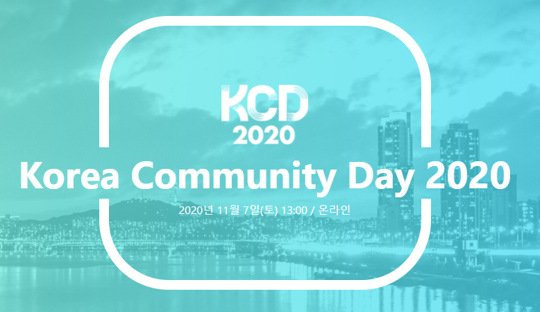

`KCD 2020(Korea Community Day 2020)`을 온라인으로 참여하고 정리한 내용입니다.

## Session 1

**코드 주석으로 GitHub Pages를 만들 수 있다?**\
**박동하 (C++ Korea)**

**문서로 작성할 것들은 많다.**

- 목표와 요구에 대한 분석, 전체를 관통하는 철학
- 명세와 구현 내용
- 매 개발 주기마다 진행된 논의, 결정사항 등

그런데 이런 문서를 작성하는데 의견을 나누는 기회가 부족하다고 느낀다.

그런 맥락에서 한 사람의 문서 관리자로서, 경험담을 공유

이전에는 직접 작성한 마크다운을 GitHub Wiki로 직접 한장씩 작성해 나가기 시작

**알려진 해답**

- 소스코드의 주석에서 문서를 생성
- 이런 방법은 결국 개발자는 주석에 신경쓰도록 하고 선순환이 생길 수 있음
- 한계점이 있지만 정보전달에는 크게 문제 없음

C++ 생태계의 Doxygen 은 생성된 HTML이 심미적으로 아쉬움

**고민1. 어떤 배포 방법이 문서들을 잘 보여줄 수 있을까?**

- 배포 방식을 GitHub Wiki와 GitHub Pages 중에서 선택
- Travis CI 같은 배포를 지원하고 있기 때문에 Github Pages를 선택
- 이제는 다른 서비스들이 많기 때문에 꼭 Travis CI 일 필요는 없다!

**고민2. 어떻게 정적 웹사이트를 생성할까?**

- Doxygen에서 생성하는 LaTex를 Pandoc을 사용해서 HTML로 바꾼다.
- 가독성도 별로 좋지 않고, 새로운 언어를 배워야하기 때문에 진입장벽이 될 수 있다.

마크다운으로 작성된 Keras의 문서를 보고, Markdown으로 작성된 문서들을 YAML로 구조화해서 HTML로 찍어내는 MkDocs를 사용하기로 함.

지금은 직접 작성한 마크다운을 Travis CI로 PUSH

**장점**

- 직접 문서를 작성할 수 있으면서도, 코드 주석을 반영할 수 있음
- 웹 브라우저로 열어보면서 검색 가능
- Git 저장소는 하나로 통일
- 문서 배포 자동화

**단점**

- 아직까지는 생성된 웹페이지에서 한글 검색이 되지 않음
- 함수, 클래스 이름 앞에 \_를 붙일 수 없음

문서 관리가 소프트웨어의 관리와 동시에 이루어지기 때문에 신뢰감을 준다.

실습을 빠르게 직접 보여주셔서 기억이 남았던 Session이다.

[실습에서 소개해주신 프로젝트](https://luncliff.github.io/ssf)

## Session 2

**내가 태국(망해가는 회사)에서 일하는 방법**\
**김태우 (비원이즈)**

싱가포르 소재 PG, 말레이시아 태국 인도네시아 등지에 지사를 운영하며 본사 및 지사에서 약 50여 명인 회사에 근무

각 사무실에서 서로 원격으로 근무를 하고 있다. 온라인 및 클라우드 서비스를 업무에 적극적으로 활용

대화 및 회의는 메신저와 화상회의로 하고, 문서 작성 및 공유는 구글 클라우드 문서 오피스 365 등 사용

핸드폰에는 회사 업무와 관련된 여러 가지 앱들이 설치

휴가 중 심각한 장애로 모두가 당황, 인수인계 문서에 해당 장애를 처리할 수 있는 방법이 있어서 한 개발자가 그 인수인계 문서를 보고 장애를 복구할 수 있었다.

약 130여 명이 근무하고 있던 회사였지만 내부 문제로 인해 현재는 50여 명이 근무중이다.
부서의 인원도 30여 명에서 10명이 채 되지 않지만, 하는 일은 줄어들지 않았다.

반복적인 작업을 자동화하는데 재미를 느낀다. 회사 업무의 효율성을 늘릴 수 있는 몇 가지 자동화를 생각해내었다.

**ChatOps(슬랙을 이용해서 데브옵스 봇 구현)**

- 회사 데이터베이스에서 특정 데이터를 추출하는 업무, 젠킨스 파이프라인 자동 구축 등을 봇을 통해서
  얻을 수 있도록 함
- 반복적으로 하는 업무들은 슬랙 봇으로 대체

**Automatic Recovery System**

**Monitoring Together**

- 정말 크리티컬 한 알림 들은 기술 부서 및 다른 팀 및 회사 주요 임원들에게 알림이 가도록.
- 비상연락망 모니터링
- 경영 악화로 한 명만 모니터링해야 하는 것을 회사 전체가 다 같이 하는 문화를 구축

**Saving 비용 절감 부분**

- 모든 인프라가 AWS 상에서 돌고 있는데, 회사에서 6년째 사용 중
- 항상 비용을 절감할 수 있는 부분에 대해서 자주 고민.
- Reserved Instance - 365일
- Spot Instnace - 상시 이용이 필요 없는, 개발 및 테스트에 사용한
- 서버가 필요 없는 배치 서비스는 Serverless
- Auto Start , Stop 스팟 인스턴스 모두 사용안하는 시간에는 자동으로 끄도록

**정리하면**

- 문서작업을 통해서 모든 사람이 원하는 자료를
- 분류작업을 통해서 새로운 인원이 들어와도 손쉽게 자료를 찾을 수 있도록
- 표준화작업을 통해서 로그들을 특성별로 구분, 시간 단축
- 인프라 코드화 작업으로 새로운 환경, 새로운 서버 구축 시 손쉽게 명령어 하나만으로 구축하도록 구현

**그래서 지금은요?**

- 개인능력 향상
- 업무효율 향상, 비즈옵스 봇을 이용해서 요청하기 때문에 불필요한 시간 낭비 줄여줌
- 자동화로 인해서 인프라 인원의 운영 미숙으로 발생하는 문제를 해결해줌. 안전성 향상
- 자동화를 통해 서버 평균 가동시간을 줄여서 운영비 절감. 월평균 4000달러 인프라비용이 현재는 2500달러가 채 되지 않음

**정리**

- 회사가 어려운 시기에 무엇을 할 수 있는지 찾아보려고 노력했고, 회사 내의 반복적인 업무를 자동화시켰다.
- 일이 줄어든 건 아니다. 다른 팀의 일들을 자동화해주는 업무를 받고 있다.
- 이러한 요청들을 통해서 그들의 업무를 깊이 이해할 수 있는 계기가 되었다.
- 회사 내의 진정한 DevOps를 장착할 수 있는 계기가 되었다.
- 자동화를 구축하는 건 회사마다 방법이나 방향이 다를 수 있다. 처음 자동화를 구축할 경우 많은 비용과 시간이 발생할 수 있지만 차근차근 한 부분씩 자동화를 한다면 그 비용들을 보상받을 수 있을 것이다.

## Session 3

**오픈소스 커뮤니티의 딜레마**\
**김종민 (Elastic)**

Elastic 이라는 회사에 대한 소개

**ELK 개발**

- Elasticsearch 검색엔진 개발
- Kibana 시각화 도구
- Logstash, Beats 수집기

주요 기능 오픈소스로 제공

**Elastic 라이선스 관련 설명**

- 오픈소스
- Basic
- Gold
- Platinum

우리 회사는 Basic을 사용중인거 같은데, 필요한 기능들은 다 있는 것 같다.

"ElastAlert 좋다, xpack 못사는 사람들은 ..." "대체품"

Elastic 의 상용기능을 다른 제품이 대체할 수 있다.. 이런 글들은 커뮤니티 운영자이지만 Elastic 에서 월급을 받는 직원이기 때문에 이런 글을 어떻게 해야 하나 가끔 고민이 된다.

좋은 목적으로 Elastic 의 오픈 소스 확장 기능들, 이런 정보들이 너무나 소중하고 감사한데 이것이 Elastic 의 비즈니스에 경쟁이 되는 경우가 있다.

모두 다 허용한다. Elastic 커뮤니티는 Elastic 사의 소유물이 아니다!

커뮤니티에 도움이 되는 정보라면 (CoC를 준수하는) 어떤 정보이던 환영한다고 하신다.

오픈소스 (그리고 Basic) 기능이 워낙 잘 되어 있어 기술 지원 판매가 어렵다.

한국어로 응대가 가능한 7명의 기술지원 엔지니어분들이 있다.

## Session 4

**오픈소스 비지니스 모델**\
**박민우 (라인)**

이 발표를 하게 된 이유는 2017년에 이미 발표 했던 주제이지만, 3년 정도가 지난 지금 그 사이에 오픈 소스 관련된 뉴스를 다시 접하면서 이때 했던 내용을 업데이트해서 다시 공유하고 싶다고 하셨다.

Realm는 2017년 당시 다녔던 회사이고 오픈소스 회사이며 모바일용 소프트웨어에 들어가는 데이터베이스를 만드는 회사중의 하나로 Realm은 널리 퍼진 오픈소스 중의 하나이다.

**오픈소스 회사의 평가 지표**

- GitHub Star
- Download

이런것들이 꾸준히 증가! 그런데 마지막에 매출로 잘 이어지지 못했다. 결국 Realm은 MongoDB에 인수되었다.

이렇게 많은 오픈소스 회사들이 독자적인 사업모델을 구축하다가 어떤 장벽을 넘지 못하고 정리되는 경우가 많다.

**그 이후에 오픈소스 비즈니스의 변화**

- IBM이 Red Hat을 인수
- MS가 GitHub를 인수

**오픈소스와 기업?**

- 어울리지 않는 단어, 오픈소스는 재미와 열정으로 시작! 리누스 토발즈가 재미로 시작했듯이!
- 지속가능한 오픈소스를 위해서는 회사와 돈이 필요하다. 오픈소스는 무료인데, 기업은 영리를 얻기 위하여 재화나 용역을 생산하고 판매하는 업체

**오픈소스 개발의 장점은**

- 빠른 피드백
- 외부 개발자 기여를 통한 개발
- Marketing
- Developer Adoption
- 채용

**오픈소스 하는 기업들**

- 오픈소스로 직접적인 매출을 내는 기업
- 오픈소스로 매출을 내지는 않지만 플랫폼을 리드하고 사업을 위해 활용하는 기업

오픈소스로 살아남는 것은 쉽지 않다.

**요즘 유행하는 오픈소스 회사의 수익모델**

- Open Core: Closed Source Tooling & Monitoring
  - Elastic은 기본적으로 오픈소스인데 추가로 되어 있는 다양한 툴킷들은 유료
- SaaS
  - Elastic Cloud
  - Databricks
  - GitHub

**기업의 오픈소스들**

- TensorFlow, Visual Studio Code, TypeScript, GraphQL, Jest, React 등이 있다.

**페이스북이 오픈소스 하는 이유**

- 소프트웨어 화사라면 당연히 해야 하는 것 오픈소스에서 얻은 만큼 돌려주는 것
- 더 나은 사람들과의 협업을 통한 혁신, React
- 더 나은 SW 만들고 개발자들이 자랑스러움을 느낌

**기업이 오픈소스를 하는 이유**

- 플랫폼 주도권 경쟁: AI, Mobile, Data
  - 오픈 소스여야 믿을 수 있기에 빠르게 잠재고객(개발자)을 늘릴 수 있다.
  - 빠르게 혁신하고 업계 de facto standard 가 되기 위해서
- 오픈소스 하면 다 주는 것인가?
  - commit 권한은 누가 가졌는가? 제품의 방향성
  - 그 프로젝트를 가장 잘 이해하는 개발자가 일하는 곳이 실질적인 소유
- 기업의 평판과 채용

**정리**

- 일단, 모두가 사용하는 소프트웨어를 만들어라!
- 오픈소스는 무료니까 공개하면 알아서 많이 쓸 것이다 X!
- 정말 사람들이 필요로 하는 프로젝트를 만드는 게 중요
- 좋은 제품, 문서 관리도 필요하고 적절한 마켓에서의 포지셔닝
- 커뮤니티도 관리해야 하고, 피드백을 잘 수집해서 관리해야 함
- 소셜 채널 관리 및 꼭 필요하다면 마케팅도 필요
- 지속 가능성을 위한 비즈니스 모델

**SW는 많이 쓰이는 것이 사실상 표준이 되고, 이 표준을 이끌어 나가는 것이 사업적으로 돈이 될 수 있다.**

- 소프트웨어의 버전 관리 - GitHub
- 데이터 검색, 시각화 - Elastic
- 데이터 분석 - Databricks
- 스마트폰 OS - Android
- 클라이언트 데이터베이스 - SQLite
- 리눅스 컨테이너 - Docker

## Session 5

**오픈소스 데이터 베이스, MySQL 고가용성 구축해보기**\
**류수미 (오라클)**

MySQL이 올해로 25주년이 되었다.
95년부터 시작돼서 오랜 기간 동안 발전해온 DB이다.

MySQL은 오픈소스 데이터베이스 중에서 가장 많이 사용되고 있다.
(db-engines.com에서 내놓은 랭킹 자료를 근거)

**MySQL InnoDB Cluster**

- MySQL 팀에서 개발해서 제공하는 HA Solution
- 사용 용이성
- 유연하고 현대적이다
- Read/Write 확장성 지원

**MySQL InnoDB Cluster: MySQL Router**

- 전체 노드에 대한 맴버십을 관리
- 마스터가 장애가 났을 때, 바로 뉴 마스터에 대한 정보를 확인한 다음에 트래픽을 돌려주는 역할

MySQL 8.0 버전을 사용할 것을 권장

**MySQL InnoDB Cluster: MySQL Shell**

- InnoDB Cluster 관리
- 개발자에게 친화적인 툴 제공
- Javascript, Python and SQL 제공

MySQL InnoDB Cluster 셋업 데모를 빠르게 보여주셨다.

## Session 6

**DevOps는 왜 필요한가?**\
**김인태 (DevOps Korea)**

DevOps 정의, DevOps 목적 등을 설명해주셨다.

**웹 기반 서비스인지, 네이티브 앱을 서비스하는지에 따라 적합한 환경과 문화가 다르다.**

- 앱 배포는 웹에 비해 배포 수행 후에 반영되기까지의 시간이 오래 걸림
- 다행히 모두가 비슷한 고민을 해왔기 때문에 유형별로 분류를 하다 보면 기존에 하던 사례 중에 자신에게 적합한 사례 선택 가능

**DevOps에서 테스트 코드가 중요!**

- 기존에 해오던 검증과정을 모아서 집대성한 측면도 있음
- 테스트 코드 또한 이미 과거부터 존재했지만, DevOps에서는 필수 불가결한 도구 중의 하나
- 의외로 많은 개발자들이 테스트 코드를 생략한 채 제품 코드를 작성

테스트 코드 작성의 중요성을 많이 강조하셨다.

**우리의 개발 일상 돌아보기**

- 유지/보수할 때 편의성보다는 어떻게든 빨리 구현하려는 경향
- 구현할 때 제반 컨텍스트를 알면 코드를 읽기 어렵게 만드는 경향이 있음
  - 컨텍스트 없이 보는 함수 이름
  - 컨텍스트 없이 보는 파라미터
  - 구조 파악이 어려운 딕셔너리 자료형

PHP 코드에서 실제 겪으신 사례로 설명하셨다.

**DevOps를 제대로 하려면 구현 방식부터 바꾸지 않으면 DevOps는 짐으로 전략하기 쉽다.**
**이번 주제를 준비하면서 너무 당연한 이야기를 언급하기로 했다.**
**무엇이든지 변화를 수용하려면 시간과 노력이 필요하다.**

## Session 7

**CodeIgniter4만으로 RESTful api 구현하기**\
**한대승 (codeigniter한국사용자포럼)**

PHP 개발자가 아니지만, 다른 개발 환경에서 어떻게 개발하는지 궁금해서 이 Session을 듣기로 결정했습니다.

**CodeIgniter**

- PHP로 작성된 웹 프레임워크
- 2020년 2월 24일 버전 4 발표

**CodeIgniter 특징 (발표자분이 생각하는)**

- 설치가 쉽다
- 배우기 쉽다
- 도움받기 쉽다 (한국 커뮤니티를 통해)
- 태클 걸지 않는다(MIT 라이선스)

PHP 7.2 이상이 필요하다.

## Session 8

**도메인 지식 탐구를 위한 이벤트 스토밍(Event Storming)**\
**박재성(Jason) (SLiPP)**

**도메인 주도 설계란?**

- 실제 코드로 구현 가능한 현실성 있는 도메인 모델 분석과 그것을 추상화하는 설계
- 도메인 모델의 적용 범위를 구현까지 확장하여 도메인 지식을 구현 코드에 반영

바운디드 컨텍스트를 나누는 기준?, 애그리게잇은 어떻게 도출?, DDD를 업무에 도입하려면 어떻게 시작? 등의 많은 질문들이 있음

DDD는 개발자만의 것이 아니다.

도메인 지식이 고르지 않게 분배되어 필요한 지식을 습득해야 하는데 쉽지가 않다. 하나의 기능을 개발하기 위해 여러 동료들에게 물어봐야 한다. 문제에 대한 해결책을 찾기 위해 퍼즐 조각을 모으는데 엄청난 비용이 들게 됨

**이벤트 스토밍**

- 복잡한 비즈니스 도메인을 빠르게 탐색하고 학습할 수 있는 워크숍

**준비물**

- 문제 해결에 관련된 모든 사람을 초대, 큰 회의실, 커다란 종이, 수많은 포스트잇과 마커펜
- 원활한 진행을 위해 퍼실리테이터 필요

**진행방법**

- 벽에 커다란 종이를 붙여 놓고, 그 위에 포스트잇을 붙여나가는데 모든 사람의 생각을 허용하고 존중해야 하며 비즈니스 프로세스를 이해하는데 초점을 맞춤
- 단순히 포스트잇을 벽에 붙이는 행위가 아니라 커뮤니케이션
- 가장 간단한 표기법을 사용해서 모든 사람이 적극적으로 참여하게 하기 위해서
- 떼어 내고 붙여내기 쉽고 이동도 가능하고, 참여자의 부담도 줄여줌
- 구현 코드보다 포스트잇을 변경하는 것이 훨씬 쉬움

**1단계**

- 각자가 알고 있는 도메인 이벤트를 작성
- 각자가 작성한 이벤트는 볼 수 있지만, 토론은 시작하지 않고 자신이 옳다고 생각하는 방식으로만 기록

**[포스트잇] 도메인 이벤트 - 주황색**

- 도메인 전문가가 관심이 있는 어떤 사건
- 이벤트 이름은 과거 시제 사용
- 이벤트가 발생한다는 것은 상태가 변경된 것을 의미

**2단계**

- 타임라인 적용
- 올바른 타임라인으로 도메인 이벤트들을 정렬
- 중복되는 이벤트들은 제거
- 시간은 왼쪽에서 오른쪽으로 흐르도록
- 위에서 아래로는 평행한 시간 표현

**[포스트잇] 핫 스폿 - 자주색**

- 2단계에서 발생한 갈등 시각화에 사용
- 각자의 의견을 자유롭게 표출
- 당장 토론이 아닌 나중에 문제가 해결되면 제거

**[포스트잇] 액터와 시스템 - 노란색과 분홍색**

- 구체적인 페르소나 설정
- 책임을 전가할 수 있는 모든 것

**바운디드 컨텍스트**

- 같은 용어라도 의미가 다르고, 같은 대상이라도 지칭하는 용어가 다를 수 있음

**[포스트잇] 커맨드 또는 액션 - 파란색**

- 시스템에서 일어나는 일
- 도메인 이벤트가 발생하는 원인

**[포스트잇] 리드 모델 또는 정보 - 초록색**

- 결정을 내리는데 필요한 정보

**[포스트잇] 정책 - 연보라색**

- 주로 '~할 때마다'라는 단어로 시작
- 도메인 이벤트와 커맨드 사이에 위치
- 단순한 조건부터 복잡한 정책까지

**[포스트잇] 에그리게잇 또는 비즈니스 규칙- 연노란색**

- 트랜잭션 일관성 유지하는 단위
- 에그리게잇은 일종의 캡슐
- 개발자가 아닌 사람에게 에그리게잇 강요 X
- 비즈니스 규칙이라고 표현 바꿀 수 있음

**모두가 서로에게서 배운다.**
**모두가 서로 소통한다.**

## Session 9

**Graal로 둘러보는 Message Queue**\
**이용혁 (JBoss User Group)**

원래는 실습을 해봐야 하는 2시간 이상이 걸리는 세션인데, 온라인 발표로 전환되다 보니 25분의 짧은 발표로 실습 영상을 따로 제공

실습의 대부분의 코드는 Java 기반

**The Reactive Manifesto**

- 응답성
- 탄력성
- 유연성
- 메시지 구동

**Graal VM**

- 스펙만 보면 좋음
- 아직 실무에는 적용해보진 않음
- EE가 CE보다 30% 더 좋음
- 네이티브 이미지로 빌드
- 구동시간을 확 줄일수 있음
- 적은 메모리

발행한 메시지가 전달받아야 되는 시스템의 신뢰성이 있게 전달 필요

**Queue vs Topic**

- 한꺼번에 같은 메시지를 받는 것을 Topic이라 함
- Topic은 예를 들어 채팅방
- 이 영상을 보고 있으면 말을 하고 있고 이 메시지를 같은 메시지를 여러 명이 받으면 Topic
- Queue는 메시지 하나를 하나의 클라이언트가 받음

**Rabbit MQ**

- Direct exchange
- Fanout exchange
- Topic exchange

**Apache Kafka**

- Exactly-once 개념으로 Queue 또는 Topic으로도 사용 가능
- 현존하는 Queue 중에서 가장 대용량을 가장 빠르게 처리
- 채팅 구현에는 용도가 맞지 않음

## 후기

2월에 신청을 하였는데 COVID-19로 인해서 연기가 되었고 이번에 온라인으로 진행되었다. 아무래도 커뮤니티와 관련된 행사이기 때문에 커뮤니티에 대한 소개들이 많았다. Session 시간이 25분으로 짧은 시간에 진행되다 보니 발표자분께서 빠르게 설명하려는 모습들이 많이 보였다. 실습이 필요한 Session 들의 경우에는 Session 시간이 좀 더 길었으면 하는 아쉬움이 있었다.
