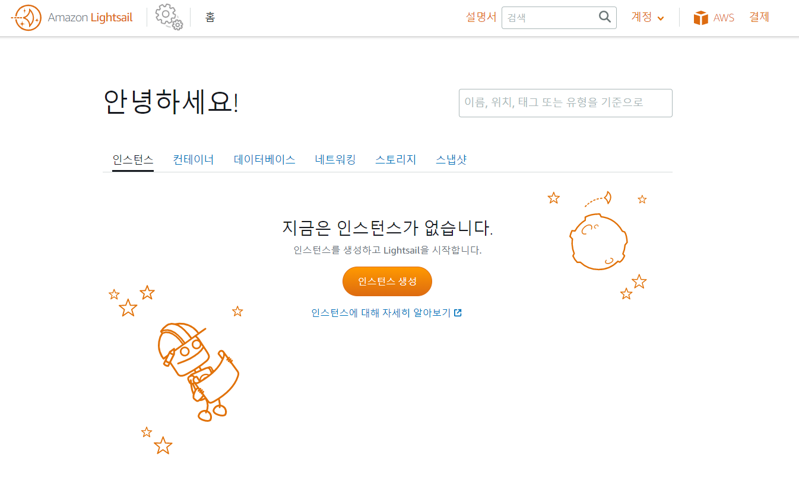
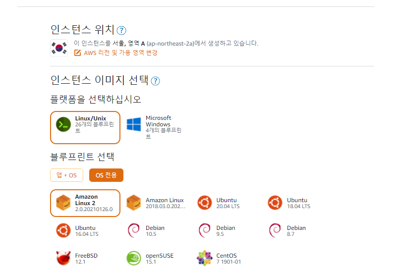
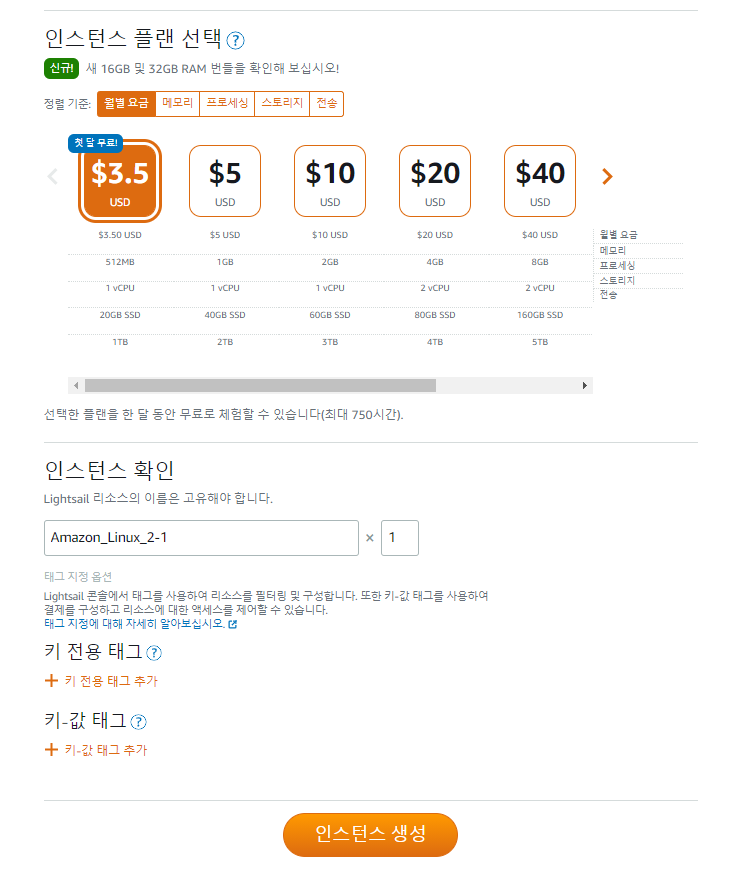
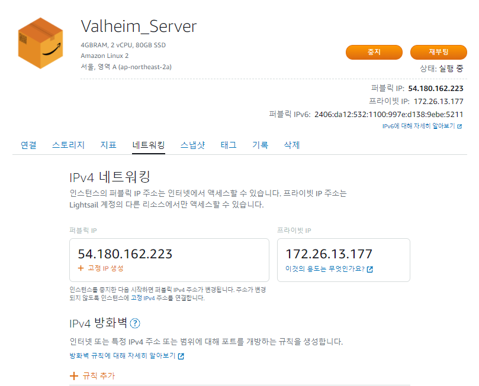
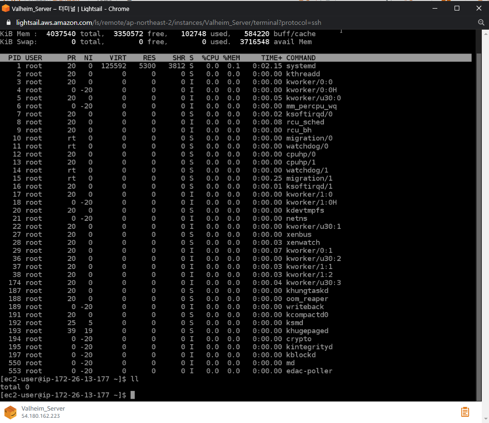
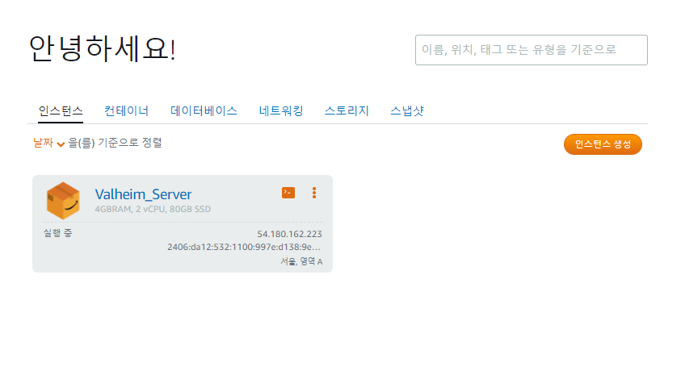
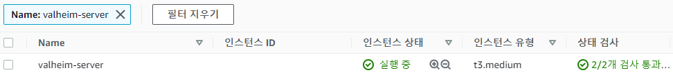

최근 친구들과 주말 또는 평일 저녁 시간대에 같이 게임을 즐기고 있는데 이 게임은 Steam에서 출시 13일 만에 200만 장의 판매량을 돌파한 Valheim(발하임)이라는 게임이다.

발하임은 Iron Gate AB에서 개발한 오픈 월드 생존 게임으로 2021년 2월에 출시했다. 여담으로 발하임 로드맵에서 팀 전체의 인원이 5명이라고 해서 놀랐다.

발하임은 친구가 월드를 만들면 들어가서 같이 게임을 즐길 수 있는 게 특징인데 친구가 직접 호스트의 역할을 할 수 있다. 하지만 친구가 직접 호스트 역할을 해야 하기 때문에 호스트 역할을 하는 친구가 접속을 하지 않았거나 컴퓨터를 킬 수 없는 상황이 되면 게임을 같이 즐길 수가 없는 문제가 생긴다. 다른 친구가 호스트 역할을 하게 되면 월드의 정보가 다르기 때문에 우리는 다시 처음의 월드를 플레이하게 되는 불상사를 겪어야 했다.

위의 문제를 해결하기 위해서는 호스트 역할을 하는 친구가 계속해서 컴퓨터를 켜야 했고 현실적으로 불가능했기 때문에 서버 컴퓨터에서 직접 호스팅 하기로 마음먹었다.

> 발하임 FAQ 中
```
Q: 멀티 플레이어 서버는 어떻게 작동합니까?
A: 게임을 시작할 때 공개 또는 비공개가 될 수있는 자신 만의 p2p 기반 플레이 세션을 만들 수 있습니다. Iron Gate는 공식 서버를 제공하지 않습니다. 영구 서버를 실행하려면 Steam에서 발하임 전용 서버 애플리케이션을 다운로드 할 수 있습니다.
```

발하임은 Dedicated Server를 Steam에서 제공하고 있었는데 다행히 여러 능력자들이 Dedicated Server를 Docker로 운영할 수 있도록 Github에 오픈 소스 활동을 하고 있었는데 README를 읽어 보니 조금의 개발 지식만 있어도 충분히 서버를 오픈할 수 있도록 설명이 친절했다.

## AWS Lightsail

MS Azure나 GCP와 같은 선택지가 있었지만 가장 익숙한 AWS를 선택했다. AWS의 서비스를 이용하려고 할 때 가장 먼저 생각이 난 것은 EC2였다. 그런데 플레이하는 사람의 수에 따라 서버의 사양을 어떻게 해야 할지 몰라서 구글링을 하고 있었을 때 Reddit의 어떤 글을 읽었는데 그 글의 Comments에 Lightsail에 대한 언급이 있었다. Lightsail의 요금이 저렴하며 소규모 서버를 운영하기 좋다는 내용이었다.

그렇게 나는 EC2에서 Lightsail로 방향을 바꾸었다. Lightsail을 한 번도 사용해 본 적이 없었지만 무턱대고 들어간 Lightsail은 EC2와 다르게 깔끔했다. 그래서 Lightsail의 요금 산정 방식과 어떤 점이 EC2와 다른지 확인도 하지 않은 채 바로 인스턴스를 만들었던 것 같다.



처음 Lightsail을 사용해서 인스턴스를 생성해보고 느낀 점은 EC2에서 복잡하게 설정하지 않아도 알아서 해준다는 느낌이 너무 강했다. 개발에 전문 지식이 없더라도 손쉽게 사용자들이 인스턴스를 생성할 수 있도록 한 것 같았다.





인스턴스 생성까지 플랫폼과 월별 요금만 선택하면 인스턴스가 생성된다. 그리고 인스턴스 관리에서 고정 IP 생성이나 IPv4 방화벽 설정, 스냅샷 생성 등 서버 운영에 필요한 기능들은 모두 제공된다.



웹으로 직접 서버 터미널에 접속할 수 있다. 접속하는데 EC2처럼 `.ppk` 파일이 필요하지 않았다.



## Lightsail의 장단점과 EC2로 돌아간 이유



발하임 서버를 구축하고 직접 테스트하면서 내가 놓쳤던 가장 중요한 것이 생각났다.

> 우리는 직장인이라서 게임을 정해진 시간에만 한다.

평일 아침에 출근하는 시간대부터 점심시간, 저녁시간까지 나와 내 친구들은 게임을 할 수 없다. 아무도 플레이하지 않는데 서버를 운영하고 있으면 돈이 낭비될 것이다. 그러면 그 시간대에는 Lightsail의 인스턴스를 중지시키면 되지 않을까 했다.

```
Q: 플랜에 대한 요금은 언제 부과됩니까?
Lightsail 인스턴스는 실행 중이거나 중지된 상태에서만 요금이 부과됩니다.
```

Lightsail의 Q&A를 꼼꼼히 살펴보았는데 EC2는 중지하면 EBS 스토리지에 대한 요금만 부과되지만 Lightsail은 다르다고 한다. Lightsail 플랜에는 트래픽에 대한 요금도 포함되어 있고 EC2와 동일 사양 대비 가격이 더 저렴하다는 장점들이 있었는데 이 장점들은 한 달 내내 운영하는 서버에만 해당됐다.

Lightsail의 인스턴스를 중지한 이후에 스냅샷을 만들어서 종료하고 필요할 때마다 켜는 방법은 서버 내 월드 파일의 안전성과 켜지는데 시간이 오래 걸리는 문제 등이 있어서 불편했다. 심지어 주말에만 사용을 한다면 인스턴스가 실행 중일 때만 요금이 나오는 EC2가 더 저렴할 수도 있다는 계산이 나왔다.

## 마치며

정리하자면 한 달 내내 운영하는 서버에서는 Lightsail이 더 저렴하지만 한 달 내내 사용하는 게 아니라면 월별 과금 형식인 Lightsail보다는 EC2가 더 저렴한 경우가 있을 수 있다. Lightsail은 EC2 대비 저렴한 가격에 트래픽도 기본적으로 제공하기 때문이다.

하지만 나의 쓰임새에서는 EC2가 저렴했기 때문에 Lightsail의 인스턴스를 삭제하고 EC2에 인스턴스를 만들어서 사용했다.



### Reference
https://www.reddit.com/r/valheim/comments/lbl2h0/valheim_faq/  
https://aws.amazon.com/ko/lightsail/faq/  
https://aws.amazon.com/ko/ec2/pricing/on-demand/