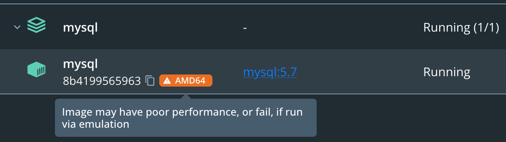
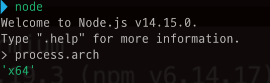
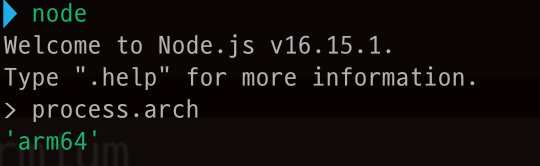

최근에 맥북 프로(M1 Pro)의 개발 환경을 설정하면서 만난 문제들을 해결하면서 정리한 글입니다.

주로 Node.js와 TypeScript를 사용하기 때문에 다른 기술 스택을 사용하신다면 도움이 되지 않을 수 있습니다.

Apple Silicon (M1)과 호환되는지 확인하는 사이트는 [M1 Apple Silicone Mac에 최적화된 macOS 앱 안내서](https://isapplesiliconready.com/kr)에서 확인할 수 있습니다.

## MySQL 5.x 설치

M1에서 MySQL 5.x 버전의 도커 이미지를 실행하면 아래의 메시지가 나오면서 오류가 발생한다.

```
docker : no matching manifest for linux/arm64/v8 in the manifest list entries.
```

MySQL 5.x 버전을 공식적으로 지원하지 않는다.

```yaml
version: "3"
services:
  db:
    platform: linux/x86_64
    image: mysql:5.7
    // ... 생략
```

docker-compose를 사용하지 않고 명령어를 사용한다면 `--platform linux/x86_64`을 사용하면 된다. `linux/x86_64` 또는 `linux/amd64`를 사용하면 해결할 수 있다.

하지만 위 방식으로 설치하면 [도커 데스크탑](https://www.docker.com/products/docker-desktop/)에서는 `Image may have poor performance, or fail, if run via emulation`라는 경고 문구가 표시된다.



에뮬레이션을 통해서 실행하기 때문에 성능 저하가 있을 수 있다고 한다.

다른 해결 방법으로는 MySQL 8 버전을 사용하거나 MariaDB를 사용하거나 비공식적인 [MySQL 5.7 이미지](https://github.com/biarms/mysql)를 사용하는 것이다.

## bcrypt를 사용하는 Node.js 프로젝트

회사에서 운영하고 있는 Node.js 프로젝트에서 도커 이미지를 만들 때 아래의 오류를 만났다.

```sh
npm ERR! code 1
npm ERR! path /user/src/app/node_modules/bcrypt
npm ERR! command failed
npm ERR! command sh -c node-pre-gyp install --fallback-to-build
npm ERR! Failed to execute '/usr/local/bin/node /usr/local/lib/node_modules/npm/node_modules/node-gyp/bin/node-gyp.js configure --fallback-to-build --module=/user/src/app/node_modules/bcrypt/lib/binding/napi-v3/bcrypt_lib.node --module_name=bcrypt_lib --module_path=/user/src/app/node_modules/bcrypt/lib/binding/napi-v3 --napi_version=8 --node_abi_napi=napi --napi_build_version=3 --node_napi_label=napi-v3' (1)
npm ERR! node-pre-gyp info it worked if it ends with ok
npm ERR! node-pre-gyp info using node-pre-gyp@1.0.10
npm ERR! node-pre-gyp info using node@16.15.1 | linux | arm64
npm ERR! node-pre-gyp info check checked for "/user/src/app/node_modules/bcrypt/lib/binding/napi-v3/bcrypt_lib.node" (not found)
npm ERR! node-pre-gyp http GET https://github.com/kelektiv/node.bcrypt.js/releases/download/v5.0.1/bcrypt_lib-v5.0.1-napi-v3-linux-arm64-musl.tar.gz
npm ERR! node-pre-gyp ERR! install response status 404 Not Found on https://github.com/kelektiv/node.bcrypt.js/releases/download/v5.0.1/bcrypt_lib-v5.0.1-napi-v3-linux-arm64-musl.tar.gz
npm ERR! node-pre-gyp WARN Pre-built binaries not installable for bcrypt@5.0.1 and node@16.15.1 (node-v93 ABI, musl) (falling back to source compile with node-gyp)
npm ERR! node-pre-gyp WARN Hit error response status 404 Not Found on https://github.com/kelektiv/node.bcrypt.js/releases/download/v5.0.1/bcrypt_lib-v5.0.1-napi-v3-linux-arm64-musl.tar.gz
... 생략
------
executor failed running [/bin/sh -c npm install]: exit code: 1
```

여러 메시지가 출력되면서 도커 이미지를 만드는데 실패하지만 아래의 메시지에서 원인을 찾을 수 있다.

```sh
npm ERR! bcrypt@5.0.1 install: node-pre-gyp install --fallback-to-build
```

프로젝트에서 사용하는 [bcrypt](https://www.npmjs.com/package/bcrypt)가 원인이었다.

bcrypt를 5.1.0 버전으로 설치하면 해결된다.

```sh
$ npm i bcrypt@5.1.0
```

글을 작성하는 시점의 최신 버전이기 때문에 이후의 버전들은 문제가 해결되었을 가능성이 높다.

## Node.js v16 이전 버전을 설치할 때

여러 프로젝트에 다양한 Node.js 버전을 사용하면서 관리를 편리하게 하기 위해서 [nvm(Node Version Manager)](https://github.com/nvm-sh/nvm)을 사용하고 있다.

Node.js v16.0.0은 Apple Silicon용으로 사전 빌드된 바이너리를 제공하는 첫 번째 릴리즈이기 때문에 nvm으로 설치했을 때 문제가 없었다.

하지만 Node.js v14를 nvm으로 설치를 했을 때 문제가 발생했다.

조용했던 M1 Pro 맥북이 펜이 돌기 시작하면서 터미널에는 설치 과정이 계속해서 출력되고 끝날 기미가 보이지 않았다. 약 5분 이상 걸려서 설치가 완료됐지만 이전 Intel 맥북에서는 경험해보지 못한 문제여서 정상은 아니라고 생각했다.

Node.js v16.0.0 이전의 버전을 설치할 때는 `arch -x86_64 zsh`를 사용한다.

```sh
$ arch -x86_64 zsh
$ nvm install 14.15.1
```

Node.js v16.0.0 이후의 버전을 설치할 때는 `arch -arm64 zsh`를 사용한다.

```sh
$ arch -arm64 zsh
$ nvm install 18.12.0
```

설치된 Node.js가 어떤 아키텍처로 실행되는지의 `process.arch`로 알 수 있다.

```sh
$ node
Welcome to Node.js v16.15.1.
Type ".help" for more information.
> process.arch
'arm64'
```

위 명령어는 한 번만 사용하면 된다.

이제 nvm을 사용해서 Node.js를 설치하면 v16 이상에서는 arm64 아키텍처로 설치되고 그 이전 버전에서는 x64 아키텍처로 설치된다.





### Reference

[MySQL 5.7 Does Not Have an Official Docker Image on ARM/M1 Mac](https://betterprogramming.pub/mysql-5-7-does-not-have-an-official-docker-image-on-arm-m1-mac-e55cbe093d4c)

[Install Node on M1 Mac](https://stackoverflow.com/questions/65342769/install-node-on-m1-mac)

[Using nvm to deal with different versions of Node.js - Apple Silicon support included](https://sensidev.net/blog/nvm-node-versions-apple-silicon)
