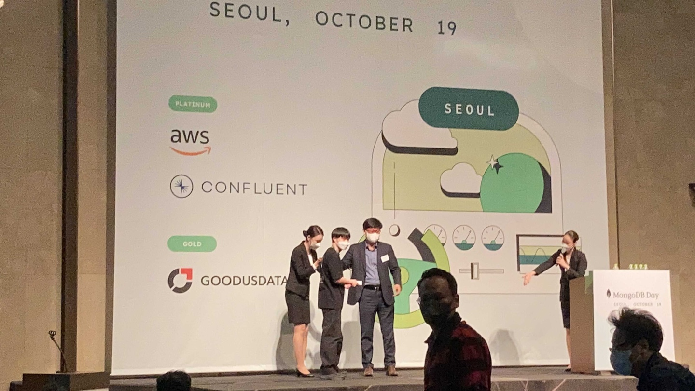

코로나로 인해서 오프라인 행사를 참여하지 못했는데 이번에 서울에서 오프라인으로 진행되는 MongoDB Day Seoul 2022를 다녀왔습니다. 세션이 모두 끝나고 럭키드로우 이벤트도 진행되었습니다.

기대 1도 안 했는데 갤럭시 버즈2 프로를 선물로 받게 되었습니다!

## MongoDB Developer Data Platform (마이클 카힐 VP, MongoDB)

전체적으로 MongoDB 장점과 6.0 설명 위주\
MongoDB는 오늘날 1억 달러를 추가하고, 플랫폼 개선\
RDB는 경직되어 있고 유연성 없고 스케일링도 어렵다.

MongoDB Atlas

- 통일된 API 필요, 개발자가 오늘날 작업하는 방식에 적합
- 이 플랫폼은 광범위한 다양한 워크로드를 지원
- 최대한 다양한 유형의 워크로드를 이 플랫폼상에서 특별한 고려 사항 없이 뒷받침되어야 한다.
- 서로 다른 쿼리 언어를 습득해야 하는 요구사항도 없어야 한다.
- 대규모 성능, 보안이 필요하다.
- 가장 중요한 애플리케이션에서 이 플랫폼을 안심하게 구동할 수 있어야 한다.

물리적 서버 - 가상 머신 - 컨테이너 - 서버리스\
각각의 단계에서 개발자가 인프라스트럭쳐 신경 쓰지 않아도 되고, 비즈니스 핵심 개발에 집중 가능

MongoDB Atlas serverless (GA)

- 개발자 입장에서 절충할 필요가 없음
- MongoDB 스케일링 관점에서 타협할 필요 없음 아틀라스에서 다 알아서 해준다.

Leafy 샘플 애플리케이션

- 화분을 구매, 판매 애플리케이션
- 판매자, 구매자, 마켓플레이스
- 구매자 입장에서는 검색이 필요하다.
- 기존 방식은 복잡하다. DB 동기화 문제
  - 개발자가 여기에 힘을 쏟는다
  - 그게 기존 방식의 문제이고 Atlas Search를 제공한다.

Realm & Atlas Device Sync

- 모바일 애플리케이션 만들 때 빈번하게 사용
- 컨플릭트 해결, 커넥션 리스토어 리커버리 골치 아픈 문제를 신경 쓰지 않아도 된다.
- 비동기적 싱크가 프리뷰 상태
- Kotlin, Flutter SDK 지원

Leafy 샘플 애플리케이션에서 판매자는 대시보드가 필요

- 이런것을 제공하려면 기존방식은 복잡하다.
- MongoDB는 이러한 애플리케이션을 쉽게 개발할 수 있도록 한다.

v6.0

- 6.0에서는 Faster $lookups
- FK 매치가 많은 경우 그 경우에 2배 정도 빨라진다.
- 소수의 매치만 나오는 결과에는 기존에 비해서 5배 빨라짐
- 시계열 컬렉션
- 암호화 Queryable Encryption 기능
  - 내년에 GA

많은 기업들의 레거시가 RDB이다.\
RDB가 데이터 중심으로 복잡한 구조로 만들어져 있다.\
RDB를 Document로 전환할 수 있도록 Relational Migration 툴 (프리뷰 상태)

## 시리즈 A 스타트업이 검색엔진으로 MongoDB Atlas Search를 선택한 이유 (이동욱 CTO, 인프랩)

MongoDB Atlas Search

- 지금 가장 효율적인 아키텍처를 선택
- 비즈니스 요구 사항 달성
- 원래라면 Amazon DynamoDB(비정형 데이터 처리), OpenSearch 두 개를 사용해야 하는 상황을 하나로 해결하게 됨
- 비정형 데이터 처리 + 검색엔진 = MongoDB
- SNS 멀티 구독
- SQS 최종적 일관성
- 스프링 부트를 통한 배압 조절
- Zero Payload로 이벤트 순서 보장
- 기존 서비스와 장애 격리되고 언제든 교체할 수 있는 구조로 만듬 (MongoDB 아니어도 가능한 구조)

도입 후 장점

- 현재 오로라는 5~7% 사용하도록 개선 (기존 20%)
- 검색 결과가 좋아짐

앞의 이야기는 OpenSearch, Elasticsearch, MongoDB Atlas Search 에서도 같은 효과가 나옴

MongoDB Atlas Search 단점

- 부족한 국내 레퍼런스 + 커뮤니티
- ES에 비해 검색 기능 부족 (ES의 Term Vectors API)
- MongoDB Atlas Search이다.
  - MongoDB가 가지고 있는 게 아님
  - MongoDB 테스트 컨테이너가 Search 미지원
- 테스트 컨테이너로 로컬에서 격리화된 단위 테스트 작성 불가능
  - 로컬에 있는 DB로 테스트를 못함
  - 격리화되지 않음
  - 원격에 있는 DB로 접근해서 테스트하다 보면 여러 명이 데이터 넣고 하다가 문제가 발생할 수 있음.
- 단어가 어떻게 tokenizing 되는지 볼 수 있는 화면 미지원

MongoDB Atlas Search 장점

- MongoDB Korea팀과 함께 만들어가는 국내 레퍼런스
- 상대적 익숙함
  - NodeJS MongoDB 조합
  - 개발팀 내에서 모두 MongoDB 1번은 사용해보았음.
- 높은 SLA
  - 공식문서에서 AWS OpenSearch와 비교
- 한글 형태소 분석기 잘 지원됨

RDBMS로 서치를 사용하는 소규모 개발팀은 고려해볼 만한 옵션이다.\
개인적으로 비정형 데이터를 관리할 때 Amazon DynamoDB와 비교하면 MongoDB의 경험이 더 좋았다고 하셨다.

## MongoDB 6.0의 새로운 기능 (김준 기술총괄전무, MongoDB)

MongoDB 버전별 발전 과정과 6.0 기능 위주로 설명해주셨다.\
기존에 6.0 릴리즈 되었을 때 회사의 개발과 스테이징 환경의 DB의 버전을 올리면서 관련 글들을 읽어서 익숙한 내용이었다.\
[7 Big Reasons to Upgrade to MongoDB 6.0](https://www.mongodb.com/blog/post/big-reasons-upgrade-mongodb-6-0)

## MongoDB Atlas Search Deep-dive Session (최근한 이사, MongoDB)

검색 기능을 만드는 두 가지 방법

- Database Engine, Search Engine
- 두 가지를 합쳐서 구현을 하려면… (DB - sync/ETL - search Engine)
- 연계기능 개발
- 동기화 기능을 위한 비용
- 운영 비용이라는 문제점들이 있다.

Atlas에서 DB engine 쪽에서 완벽하게 관리되는 Apache Lucene Engine 추가

- 개발자의 생산성을 높여준다.
- 데이터 아키텍처의 단순화
- 완벽하게 관리되는 구조

사용 절차

- Atlas Cluster 생성 -> 데이터베이스와 컬렉션 생성 -> Search Index 구성 -> $search stage 사용

$search와 match/sort를 같이 사용하는 것은 심각한 성능 저하가 발생할 수 있다.

## Confluent와 함께 분산된 데이터를 MongoDB로 연결하기 (김현수 상무, 컨플루언트)

- 여러 레거시 시스템을 클라우드 통합하는데 어려움이 있다
- Confluent로 스트리밍 ETL 파이프라인을 강화, 데이터베이스를 쉽게 현대화
  - 마이그레이션 간소화 및 가속화
  - 실시간 동기화
  - 비용 절감
- Confluent Cloud
  - 클라우드 네이티브
  - 완전성
  - 어디에서나

## MongoDB Atlas App Service (김규동 상무, MongoDB)

- 클라우드 기반
- 다양한 애플리케이션에 서비스 제공
- Web Application Hosting
- Hosting
  - 정적 컨텐츠 제공
- Authentication
  - 다양한 인증 방법 제공
- Serverless Function
- Serverless Trigger
  - 재고 적을 때 경고 보내기
  - 상품 배송 시 사용자에게 문자 보내기 등
- Serverless API Services
- GraphQL API
- Data Access Rules 등

Realm 데이터베이스 강조

- 양방향 동기화
- 관련 데모를 보여주심

## MongoDB Atlas on AWS와 함께하는 MSA Journey (윤기원 매니저, AWS)

비지니스/데이터 트렌드

- 사용자와 데이터의 폭발적인 증가
- 빠르게 변화하는 시장과 고객의 요구
- 모놀리식 시스템에서 MSA로의 변화
  (다양한 데이터 소스와 데이터 종류, 데브옵스 도입으로 인한 변화율 증가, 다양한 개발 언어와 데이터베이스 활용)

기존의 모놀리식 아키텍처의 한계

- 확장성 한계
- 성능 이슈
- 개발자들의 유연성 저해
- 개발 및 배포 지연
- 통합된 하나의 관계형 데이터베이스는 현대 비지니스 어플리케이션의 요구사항을 더 이상 충족하기 힘듬

MSA 구조에 맞게 목적별 DB 사용 이유

- 확장성
- 성능
- 가용성

RDBMS에서 MongoDB Atlas를 사용한 UseCase를 설명 (실제 기업의 사례)

- CRM
- IOT
- Music Metadata
- Text Search

## 네이버의 MongoDB 활용 사례 (이재웅 매니저, 네이버클라우드)

기존에는 RDB를 사용했지만 시간이 지날수록 더 많은 종류의 데이터 플랫폼에 대한 요구사항이 생김

- 사용하기 쉽고
- 빠르고
- 더 많이 저장할 수 있는
- 연관성이 있는

상품 데이터를 예시로 설명

- 기존 RDB로 처리한다면 다른 성격의 상품을 저장하기 위해 ALTER 작업이 필요
- 이 ALTER 작업은 장애로 까지 이어질 수 있는 위험요소가 있음
- MongoDB는 유연하게 대처가 가능
- ALTER 작업이 필요 없음

이러한 비정형 데이터에 대한 니즈가 5,6년 전부터 회사에서 있었다.\
현재는 여러 가지 데이터 플랫폼을 운영 중이라고 하심.

사내의 많은 개발 조직이 MongoDB에 대한 needs 증가

- 원래 개발팀들이 자체적으로 설치하고 운영
- 개발 업무 + DB 운영 리소스 분담

그 당시에는 MongoDB를 자체적으로 구축해서 사용

- 모니터링, 알림, DB 설치 자동화, 운영 표준, 경험, etc 등

2017년도까지 시범적으로 운영하다가 2019년부터 정식적으로 운영\
당시에 자체적으로 운영을 하다 보니까 한계점이 생기기 시작

- 2019년부터 MongoDB Korea와 파트너쉽
- 지금은 네이버의 많은 서비스들이 MongoDB를 사용

  3.4 버전부터 MongoDB를 사용

- 3 버전대에서 wiredTiger 엔진 들어온 것이 MongoDB 격변기라고 생각
- 이제는 네이버 서비스에 활용할 수 있겠다고 생각

발생했던 여러 이슈들을 SR 가이드를 통해 해소하거나 작업 & 테스트했던 내용들

- Orphaned Documents
- LogicalSessions 삭제 불가 현상 (Single Replica Set)
- Secondary 재구축 방법 2가지
- zstd compress method
- Signing key issue

MongoDB Korea에 전달한 요구사항

- Secondary 재구축
- HelpCenter
  - 한국어 채널
- 트랜잭션
  - 현재 진행 중인 트랜잭션을 좀 더 빠르게 찾고 어떤 쿼리들이 트랜잭션에 포함되는지 등
- MongoDB버전 업그레이드
  - 메이저 버전 업그레이드 시 여러 차례의 FCV 변경 번거로움
