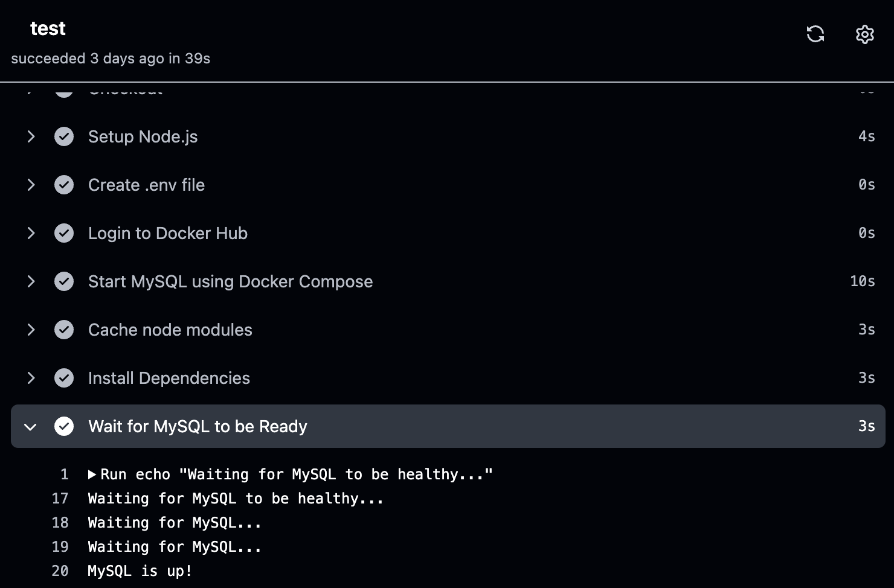
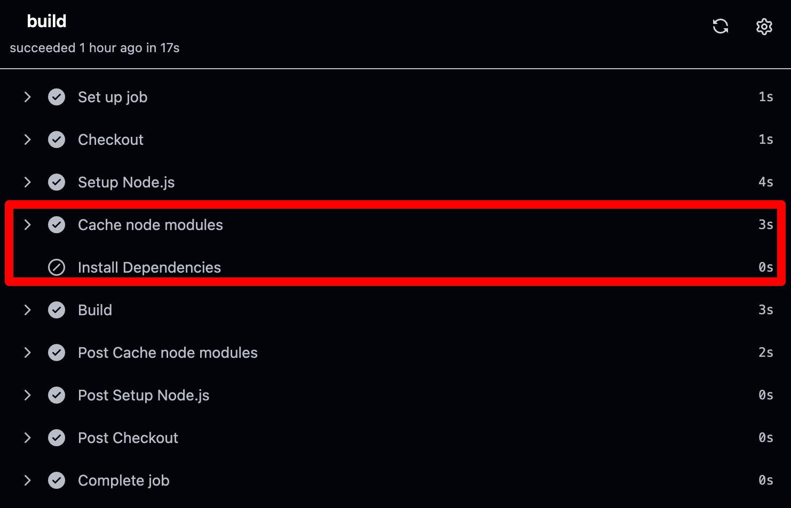
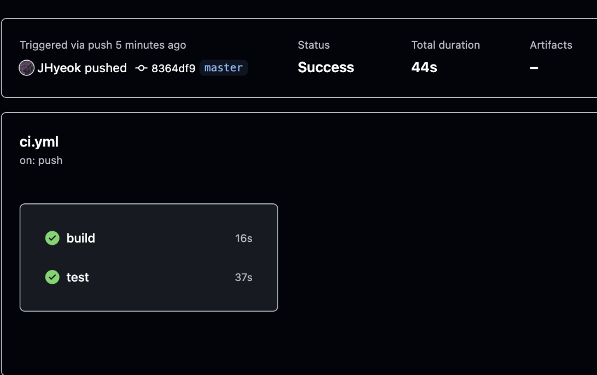

NestJS 개발 환경에서 GitHub Actions를 활용하여 빌드와 테스트를 자동화하는 방법을 알아보겠습니다.
또한, 의존성 설치 시간을 단축하기 위해 캐시를 활용하고, 실제 DB(MySQL)를 띄워 테스트하는 방법도 소개합니다.

과거 C#으로 개발할 때는 Jenkins를 많이 사용했습니다. 이후 Node.js 환경에서는 gulp.js와 AWS CodePipeline을 활용했지만, GitHub Actions를 접한 후로는 점점 이를 주로 사용하게 되었습니다.
GitHub Actions는 `.yml` 파일만으로 자동화된 빌드 및 테스트 환경을 구성할 수 있어, 이전 도구들보다 훨씬 직관적이고 편리했습니다.

이번 글에서는 제가 NestJS에서 사용하고 있는 GitHub Actions workflow 파일을 공유하려고 합니다. 이 글에서 소개하는 GitHub Actions workflow 파일은 [여기](https://github.com/jhyeok/nestjs-api-example)에서 확인할 수 있습니다.

## 빌드

PR이 생성되거나 master 브랜치에 코드가 푸시되면 자동으로 빌드가 실행된다.

```yml
# workflow의 이름입니다.
name: Build

# workflow 동작 trigger 입니다.
# master 브랜치에 Push가 발생하거나 PR이 열리면 실행됩니다.
# push 이외에도 PR이 만들어지거나 병합되는 등 여러 이벤트 트리거가 가능합니다.
# 'release/**' 처럼 필터도 사용할 수 있습니다.
on:
  push:
    branches:
      - master
  pull_request:
    types: [opened, reopened, synchronize]

# 동시성을 제어하는 concurrency 설정입니다.
# 동일한 ref(브랜치)에서 여러 개의 workflow가 동시에 실행되지 않도록 합니다.
# 예를 들어, 같은 브랜치에서 여러 번 push가 발생하면 이전 workflow를 취소(`cancel-in-progress: true`)하고 최신 작업만 실행합니다.
# 'group'의 값은 workflow 이름과 ref를 조합하여 지정됩니다.
concurrency:
  group: ${{ github.workflow }}-${{ github.ref }}
  cancel-in-progress: true

# job에서 사용할 환경 변수 설정입니다.
env:
  NODE_VERSION: 22.11.0

# job은 실행할 작업 단위입니다.
# 각 job은 독립적으로 실행되며, 여러 개의 job을 정의할 수도 있습니다.
# 필요하면 job 간의 데이터 공유도 가능합니다.
jobs:
  build:
    # job의 이름입니다.
    name: build

    # 해당 job을 실행할 운영체제 환경입니다.
    # 'ubuntu-latest'는 최신 안정화된 Ubuntu 버전에서 실행됩니다.
    runs-on: ubuntu-latest

    # step은 job 안에서 실행되는 개별 작업들입니다.
    steps:
      # 1. 코드 체크아웃 (저장소 코드를 가져옵니다.)
      - name: Checkout
        uses: actions/checkout@v4

      # 2. Node.js 설정 (job 환경 변수에 설정된 Node.js 버전 사용)
      - name: Setup Node.js
        uses: actions/setup-node@v4
        with:
          node-version: ${{ env.NODE_VERSION }}

      # 3. node_modules 캐싱
      - name: Cache node modules
        uses: actions/cache@v4
        id: npm-cache
        with:
          path: '**/node_modules'  # 캐싱할 디렉토리
          key: ${{ runner.os }}-node-${{ hashFiles('**/package-lock.json') }} # 키값 지정
          restore-keys: |
            ${{ runner.os }}-node-

      # 4. 의존성 설치 (캐시가 없을 경우에만 실행)
      - name: Install Dependencies
        if: steps.npm-cache.outputs.cache-hit != 'true'
        run: npm install

      # 5. 빌드 실행
      - name: Build
        run: npm run build
```

`actions/cache@v4`를 사용하여 `npm install` 시간을 단축한다.
GitHub Actions Runner에서 매번 `npm install`을 실행하면 불필요한 시간이 낭비되므로, 캐시를 활용하여 의존성 설치 시간을 줄인다.

의존성 관리를 [Yarn](https://classic.yarnpkg.com/lang/en/docs/getting-started/)으로 하는 경우, 다음 코드를 사용하면 된다.

```yml
- name: Cache node modules
  uses: actions/cache@v4
  id: yarn-cache
  with:
    path: '**/node_modules'
    key: ${{ runner.os }}-node-${{ hashFiles('**/yarn.lock') }}
    restore-keys: |
      ${{ runner.os }}-node-
```

## 테스트

PR이 생성되거나 master 브랜치에 코드가 푸시되면 자동으로 테스트가 실행된다.

```yml
# workflow의 이름입니다.
name: Test

# workflow 동작 trigger 입니다.
# master 브랜치에 Push가 발생하거나 PR이 열리면 실행됩니다.
on:
  push:
    branches:
      - master
  pull_request:
    types: [opened, reopened, synchronize]

# 동시성을 제어하는 concurrency 설정입니다.
# 동일한 ref(브랜치)에서 여러 개의 workflow가 동시에 실행되지 않도록 합니다.
# 이전 workflow를 취소하고 최신 작업만 실행합니다.
concurrency:
  group: ${{ github.workflow }}-${{ github.ref }}
  cancel-in-progress: true

# job에서 사용할 환경 변수 설정입니다.
env:
  NODE_VERSION: 22.11.0

# job은 실행할 작업 단위입니다.
# 각 job은 독립적으로 실행되며, 필요하면 여러 개의 job을 정의할 수도 있습니다.
jobs:
  test:
    # job의 이름입니다.
    name: test

    # 해당 job을 실행할 운영체제 환경입니다.
    runs-on: ubuntu-latest

    # step은 job 안에서 실행되는 개별 작업들입니다.
    steps:
      # 1. 코드 체크아웃 (저장소 코드를 가져옵니다.)
      - name: Checkout
        uses: actions/checkout@v4

      # 2. Node.js 설정 (job 환경 변수에 설정된 Node.js 버전 사용)
      - name: Setup Node.js
        uses: actions/setup-node@v4
        with:
          node-version: ${{ env.NODE_VERSION }}

      # 3. 환경 변수 파일(.env) 생성
      # .env.example 파일을 복사하여 .env 파일을 생성합니다.
      - name: Create .env file
        run: cp .env.example .env

      # 4. Docker Hub 로그인
      # 도커 이미지를 사용할 수 있도록 Docker Hub에 로그인합니다.
      # GitHub Secrets에서 저장된 사용자명과 토큰을 사용합니다.
      - name: Login to Docker Hub
        uses: docker/login-action@v3
        with:
          username: ${{ secrets.DOCKERHUB_USERNAME }}
          password: ${{ secrets.DOCKERHUB_TOKEN }}

      # 5. MySQL 컨테이너 실행 (Docker Compose 사용)
      # 데이터베이스가 필요한 테스트를 위해 MySQL을 컨테이너에서 실행합니다.
      - name: Start MySQL using Docker Compose
        run: docker compose up -d

      # 6. node_modules 캐싱
      - name: Cache node modules
        uses: actions/cache@v4
        id: npm-cache
        with:
          path: '**/node_modules'  # 캐싱할 디렉토리
          key: ${{ runner.os }}-node-${{ hashFiles('**/package-lock.json') }} # 키값 지정
          restore-keys: |
            ${{ runner.os }}-node-

      # 7. 의존성 설치 (캐시가 없을 경우에만 실행)
      - name: Install Dependencies
        if: steps.npm-cache.outputs.cache-hit != 'true'
        run: npm install

      # 8. MySQL이 준비될 때까지 대기
      # MySQL 컨테이너의 상태를 확인하며, 최대 30초간 대기합니다.
      - name: Wait for MySQL to be Ready
        run: |
          echo "Waiting for MySQL to be healthy..."
          for i in {1..30}; do
            STATUS=$(docker inspect --format='{{.State.Health.Status}}' nestjs-test-db)
            if [ "$STATUS" == "healthy" ]; then
             echo "MySQL is up!"
             exit 0
            fi
            echo "Waiting for MySQL..."
            sleep 2
          done
          echo "MySQL did not start in time" >&2
          exit 1

      # 9. 유닛 테스트 실행
      # Jest, Mocha 또는 기타 테스트 프레임워크를 사용하여 유닛 테스트를 수행합니다.
      - name: Unit Test
        run: npm run test

      # 실제 프로젝트에 사용하신다면 테스트 리포트나 커버리지 결과를 업로드하는 작업을 추가할 수 있습니다.
      # 또는 슬랙 알림으로 발송하거나, 배포 워크플로우에서도 배포가 완료되고 슬랙 알림을 발송하거나 할 수 있습니다.
```

DB 테스트의 경우, GitHub Actions Runner에서 Docker Compose를 사용하여 MySQL 컨테이너를 실행한 후, 해당 MySQL을 사용하여 애플리케이션의 테스트를 수행한다.
하지만 MySQL 컨테이너가 실행된 직후에는 아직 완전히 준비되지 않았기 때문에, 바로 연결을 시도하면 오류가 발생할 수 있다.
이를 방지하기 위해 Wait for MySQL to be Ready 작업을 수행하여, MySQL의 Health 상태가 정상(healthy) 이 될 때까지 대기한 후 테스트를 시작한다.

아래 실행 로그를 보면, MySQL이 정상적으로 올라올 때까지 반복적으로 상태를 확인하고 대기하는 과정을 확인할 수 있다.



MySQL 컨테이너의 상태를 확인하는 작업이 정상적으로 동작하려면, Docker Compose 설정에서 healthcheck를 활성화해야 한다. 다음과 같이 설정할 수 있다.

```yml
version: "3.8"
services:
  db:
    image: mysql:8.0.36
    container_name: nestjs-test-db
    ports:
      - "3306:3306"
    environment:
      - # 생략
    tmpfs:
      - # 생략
    command:
      - # 생략
    healthcheck:
      test: ["CMD", "mysqladmin", "ping", "-h", "localhost"]
      interval: 10s
      timeout: 5s
      retries: 3
```

## 실행 결과

프로젝트에서 `ci.yml`을 적용하여 GitHub Actions로 빌드와 테스트를 자동화한다.
GitHub Actions에서는 여러 개의 job을 동시에 실행할 수 있어, 각 job이 병렬로 실행되면서 전체 빌드 시간이 단축된다.

또한, 앞서 적용한 `actions/cache@v4`를 활용하여 `npm install` 시간을 줄였다.
실행 시마다 의존성을 새로 설치하는 대신, 이전 실행 결과를 캐싱하여 불필요한 설치 과정을 최소화했다.



실행 결과를 보면, build job은 16초, test job은 37초가 소요되었으며, 캐시 최적화 및 병렬 실행 덕분에 워크플로우가 더욱 최적화되었다.



## 마치며

GitHub Actions는 단순한 CI/CD 도구를 넘어, 재사용 가능한 Action을 구성하고, 팀 내에서 표준화할 수도 있다.

회사에서 GitHub Actions를 도입하면서 얻은 장점과, Composite Action 및 Reusable Workflows를 활용해 공용 레포지토리에서 효율적으로 관리하는 방법을 기술 블로그에 정리한 적이 있다.

테이블링에서 GitHub Actions를 어떻게 활용하고 있는지 궁금하다면, 아래 글을 참고할 수 있다.
- [백엔드팀에서 GitHub Actions를 사용하는 방법](https://techblog.tabling.co.kr/%EB%B0%B1%EC%97%94%EB%93%9C%ED%8C%80%EC%97%90%EC%84%9C-github-actions%EB%A5%BC-%EC%82%AC%EC%9A%A9%ED%95%98%EB%8A%94-%EB%B0%A9%EB%B2%95-a10f03f750ba)
