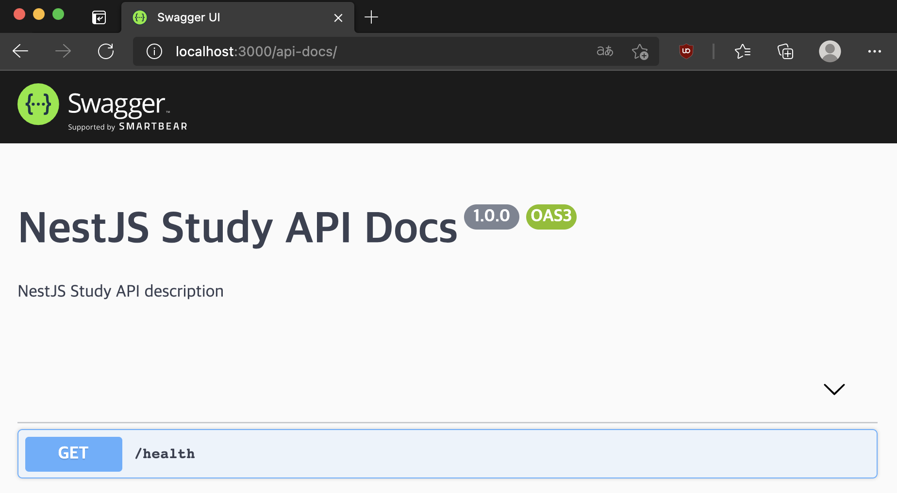

이 글은 NestJS에서 Swagger를 사용하면서 정리한 글입니다.

이 글에서 사용된 코드는 [여기](https://github.com/JHyeok/nestjs-api-example)에서 확인할 수 있습니다.

### Swagger란?

Swagger는 API 문서 자동화 도구이다. 이전의 프로젝트에서 사용한 경험으로는 API 문서를 따로 작성할 필요 없이 코드를 수정하면서 API 문서를 같이 수정할 수 있는 것이 큰 장점이었다.

만약에 코드와 API 문서를 따로 관리하게 되면 코드를 수정하였는데 API 문서 최신화를 잊어버려서 다른 팀원들에게 공유된 API 문서가 실제 API와 다른 문제가 발생할 수 있다.

다른 장점으로는 Swagger는 API를 테스트할 수 있는 화면을 제공한다는 것이다.

### NestJS에서 Swagger 설치

Swagger를 사용하는 방법은 간단하다. NestJS에서 사용할 수 있도록 모듈이 제공되고 있다. 아래의 모듈들을 설치하면 된다.

```bash
$ npm install --save @nestjs/swagger swagger-ui-express
```

NestJS(fastify)를 사용하는 경우 `swagger-ui-express` 대신 `fastify-swagger`를 설치해야 한다.

```bash
npm install --save @nestjs/swagger fastify-swagger
```

### NestJS에서 Swagger 사용하기

`main.ts`에서 `SwaggerModule`를 사용해서 초기화한다.

따로 `setupSwagger`를 만들었다. `DocumentBuilder`로 문서의 기본을 구성할 수 있다. 제목, 설명, 버전 등과 같은 속성을 설정할 수 있는 몇 가지 메서드를 제공한다. API 문서를 만들기 위해 `SwaggerModule`의 `createDocument()` 메서드를 사용한다.

```typescript
import { NestFactory } from '@nestjs/core';
import { AppModule } from './app.module';
import { setupSwagger } from './util/swagger';

async function bootstrap() {
  const app = await NestFactory.create(AppModule);

  // ... 생략

  setupSwagger(app);

  await app.listen(3000);
}

void bootstrap();
```

```typescript
import { INestApplication } from '@nestjs/common';
import { SwaggerModule, DocumentBuilder } from '@nestjs/swagger';

/**
 * Swagger 세팅
 *
 * @param {INestApplication} app
 */
export function setupSwagger(app: INestApplication): void {
  const options = new DocumentBuilder()
    .setTitle('NestJS Study API Docs')
    .setDescription('NestJS Study API description')
    .setVersion('1.0.0')
    .build();

  const document = SwaggerModule.createDocument(app, options);
  SwaggerModule.setup('api-docs', app, document);
}
```

`SwaggerModule.setup('api-docs', app, document);`의 코드에서 `setup()` 메서드를 통해서 Swagger UI를 마운트 하는 경로를 설정할 수 있다. 브라우저에서 `http://localhost:3000/api-docs`로 이동하면 Swagger UI가 표시된다.



기초 구성은 끝났으니 이제 만들어진 API에 문서화를 해보자.

`@nestjs/swagger`에서 제공하는 데코레이터들을 사용하면 된다.

```typescript 
import { ApiTags, ApiOperation, ApiResponse } from '@nestjs/swagger';

@Controller('v1/users')
@ApiTags('유저 API')
export class UserController {
  constructor(private readonly userService: UserService) {}

  @Post()
  @ApiOperation({ summary: '유저 생성 API', description: '유저를 생성한다.' })
  @ApiCreatedResponse({ description: '유저를 생성한다.', type: User })
  async create(@Body() requestDto: UserCreateRequestDto, @Res() res: Response) {
    const user: User = await this.userService.createUser(requestDto);

    return res.status(HttpStatus.CREATED).json(user);
  }
}
```

컨트롤러에만 Swagger를 사용하고 Swagger UI를 확인해본다.


API에 대한 Swagger UI가 만들어졌는데, `Try it out` 버튼을 클릭하면 API의 동작을 테스트할 수 있는 화면이 나온다.


`Execute` 버튼을 클릭하면 API를 호출해서 응답을 확인할 수 있다.

`@ApiTags()`로 '유저 API'를 설정하였는데 해당 컨트롤러가 어떤 API 인지 설정할 수 있다. 각 API에 대한 설명으로는 `@ApiOperation()`로 설정할 수 있다. `@ApiCreatedResponse()`와 같은 API 응답에 대해서 정의할 수 있는 데코레이터를 제공한다.

`@nestjs/swagger`에서 제공하는 API 응답 데코레이터들은 아래와 같다.

```typescript
@ApiOkResponse()
@ApiCreatedResponse()
@ApiAcceptedResponse()
@ApiNoContentResponse()
@ApiMovedPermanentlyResponse()
@ApiBadRequestResponse()
@ApiUnauthorizedResponse()
@ApiNotFoundResponse()
@ApiForbiddenResponse()
@ApiMethodNotAllowedResponse()
@ApiNotAcceptableResponse()
@ApiRequestTimeoutResponse()
@ApiConflictResponse()
@ApiTooManyRequestsResponse()
@ApiGoneResponse()
@ApiPayloadTooLargeResponse()
@ApiUnsupportedMediaTypeResponse()
@ApiUnprocessableEntityResponse()
@ApiInternalServerErrorResponse()
@ApiNotImplementedResponse()
@ApiBadGatewayResponse()
@ApiServiceUnavailableResponse()
@ApiGatewayTimeoutResponse()
@ApiDefaultResponse()
```

유저를 생성하는 API의 코드에서는 UserCreateRequestDto 클래스를 사용하는데 이 클래스는 현재는 Swagger UI에서는 표시되어 있지 않다.

```typescript
import { ApiPropertyOptional } from '@nestjs/swagger';

export class UserCreateRequestDto {
  @ApiProperty({ description: '이름' })
  firstName!: string;

  @ApiProperty({ description: '성' })
  lastName!: string;
}
```

UserCreateRequestDto 클래스의 속성에 `@ApiProperty()` 데코레이터를 사용해서 Swagger 문서화를 할 수 있다. `@ApiProperty()`에서 제공하는 옵션들을 활용해서 다양한 설정도 할 수 있다. 

Swagger UI에서 UserCreateRequestDto 클래스의 스키마도 확인할 수 있다.


```typescript
import { Entity, Column, PrimaryGeneratedColumn } from 'typeorm';
import { ApiProperty } from '@nestjs/swagger';

@Entity()
export class User {
  @PrimaryGeneratedColumn()
  @ApiProperty({ description: 'id' })
  id!: number;

  @Column({
    length: 50,
  })
  @ApiProperty({ description: '이름' })
  firstName!: string;

  @Column({
    length: 50,
  })
  @ApiProperty({ description: '성' })
  lastName!: string;

  @Column({ default: true })
  @ApiProperty({ description: '활동' })
  isActive!: boolean;

  static of(params: Partial<User>): User {
    const user = new User();

    Object.assign(user, params);

    return user;
  }
}
```

컨트롤러에서 반환하는 타입을 `User`로 설정하였는데 `User.ts`도 Dto 클래스와 같은 방식으로 Swagger를 사용할 수 있다.


### 마치며

Swagger를 사용하지 않고 Wiki와 같이 API 문서를 따로 관리한다면 Swagger보다 더 유연한 API 문서 제공이 가능할 수 있다. 하지만 Wiki를 사용한다면 코드를 수정할 때마다 최신화하는 것을 잊지 말아야 한다. 그리고 Postman처럼 API를 테스트할 수 있는 도구를 제공해야 한다.

더 많은 `@nestjs/swagger`의 데코레이터들은 [여기](https://docs.nestjs.com/openapi/decorators)에서 확인할 수 있다. 공식문서의 `OPENAPI` 단락에서 더 많은 정보를 얻을 수 있다.

---
### Reference

https://docs.nestjs.com/openapi/introduction

https://docs.nestjs.com/openapi/decorators
