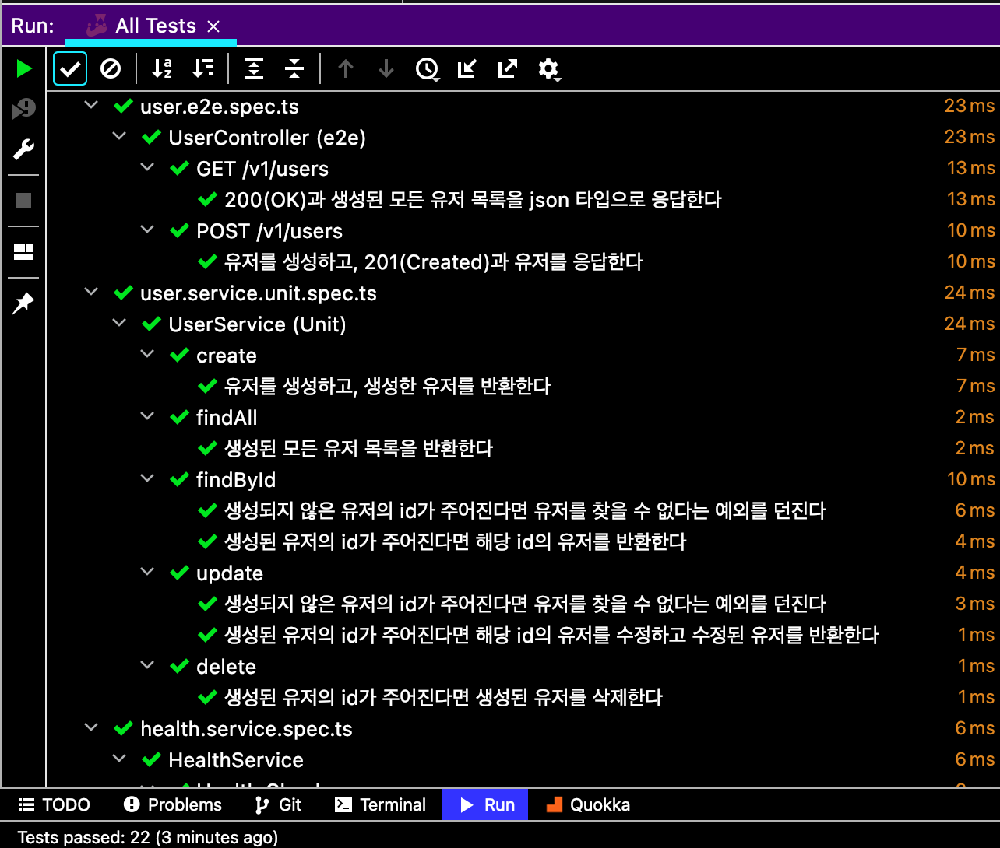

이 글은 NestJS에서 단위 테스트를 작성하면서 정리한 글입니다.

이 글에서 사용하는 단위 테스트 코드는 [여기](https://github.com/JHyeok/nestjs-api-example/blob/master/src/api/user/user.service.spec.ts)에서 확인할 수 있습니다. 하지만 저장소를 Mock 처리해서 작성한 단위 테스트입니다. 저장소를 Mock 처리하지 않고 작성한 E2E 테스트 코드는 [여기](https://github.com/JHyeok/nestjs-api-example/blob/master/test/e2e/user.e2e-spec.ts)에서 확인할 수 있습니다.

## TestingModule

NestJS는 내장된 종속성 주입을 사용해서 쉽게 테스트 코드를 작성할 수 있도록 도와준다. 종속성 주입은 일반적으로 클래스가 아닌 인터페이스를 기반으로 하지만, TypeScript에서 인터페이스는 런타임이 아닌 컴파일 시간에만 사용할 수 있으므로 나중에 신뢰할 수가 없기 때문에 NestJS에서는 클래스 기반 주입을 사용하는 것이 일반적이다.

```typescript{1}
import { Test, TestingModule } from '@nestjs/testing';

describe('UserService', () => {
  let userService: UserService;
  let userRepository: UserRepository;

  beforeEach(async () => {
    const module: TestingModule = await Test.createTestingModule({
      providers: [UserService, UserRepository],
    }).compile();

    userService = module.get<UserService>(UserService);
    userRepository = module.get<UserRepository>(UserRepository);
  });
}
```

NestJS에서는 특정 도구를 강제하지는 않지만 [Jest](https://www.npmjs.com/package/jest)를 기본 테스트 프레임워크로 제공해주며 테스팅 패키지도 제공하기 때문에 개발자가 다른 도구를 찾는데 소모하는 리소스를 줄일 수 있다.

NestJS에서 제공하는 `@nestjs/testing` 패키지를 사용하면 테스트에 사용되는 종속성만 선언해서 모듈을 만들고 해당 모듈로 `UserService`, `UserRepository`를 가져올 수 있다. 따로 단위 테스트를 작성하기 위해 추가로 설치한 패키지는 [faker](https://www.npmjs.com/package/Faker)라는 가짜 데이터를 만들어주는 것밖에 없다. 이 가짜 데이터도 직접 개발자가 임의로 만들어서 넣는다면 추가로 설치할 수고로움 없이 NestJS에서 단위 테스트를 작성할 수 있다.

## Jest Mocking

```typescript
const userRepositorySaveSpy = jest
  .spyOn(userRepository, 'save')
  .mockResolvedValue(savedUser);
```

[Jest](https://www.npmjs.com/package/jest)에서는 모킹(mocking) 함수들을 제공하고 있다. 모킹은 단위 테스트를 작성할 때, 해당 코드가 의존하는 부분을 가짜(mcok)로 대체하는 기법이다. 일반적으로는 테스트하려는 코드가 의존하는 부분을 직접 생성하기가 너무 부담스러울 때 모킹이 사용된다. `jest.spyOn`은 `jest.fn`과 유사한 모의 함수를 만들지만 함수 호출을 추적할 수 있다는 점에서 다르다. 위 코드에서는 `spyOn`으로 `userRepository`의 `save` 함수 호출을 모의하고 이 모의된 함수는 `mockResolvedValue`를 사용해서 `savedUser`를 반환하도록 정의하고 있다.

```typescript{1}
import * as faker from 'faker';

const firstName = faker.lorem.sentence();
const lastName = faker.lorem.sentence();
```

[faker](https://www.npmjs.com/package/Faker)를 사용해서 가짜로 테스트에 필요한 데이터들을 만들어 줄 수 있다.

## NestJS에서 단위 테스트 작성

```typescript
async updateUser(
  id: number,
  requestDto: UserUpdateRequestDto,
): Promise<User> {
  const user = await this.userRepository.findOne({
    where: {
      id: id,
    },
  });

  if (_.isEmpty(user) === true) {
    throw new BadRequestException(Message.NOT_FOUND_USER);
  }

  const { firstName, lastName, isActive } = requestDto;

  user.update(firstName, lastName, isActive);

  return this.userRepository.save(user);
}
```

Jest와 faker를 사용해서 유저를 수정하는 서비스의 단위 테스트를 작성해보자.

`UserService`의 `updateUser` 메서드를 테스트하려고 하는데, 이 메서드에서는 두 가지를 테스트해야 한다. 유저 id에 해당하는 유저가 있으면 성공적으로 수정하고 해당하는 유저가 없을 경우에는 실패하는 로직에 대해서 검증이 필요하다.

```typescript{12,13,14,19,20}
describe('UserService', () => {
  describe('updateUser', () => {
    it('생성되지 않은 유저의 id가 주어진다면 유저를 찾을 수 없다는 예외를 던진다', async () => {
      const userId = faker.datatype.number();

      const updateUserDto: UpdateUserDto = {
        firstName: faker.lorem.sentence(),
        lastName: faker.lorem.sentence(),
        isActive: false,
      };

      const userRepositoryFindOneSpy = jest
        .spyOn(userRepository, 'findOne')
        .mockResolvedValue(undefined);

      try {
        await userService.updateUser(userId, updateUserDto);
      } catch (e) {
        expect(e).toBeInstanceOf(NotFoundException);
        expect(e.message).toBe(Message.NOT_FOUND_USER);
      }

      expect(userRepositoryFindOneSpy).toHaveBeenCalledWith({
        where: {
          id: userId,
        },
      });
    });
  });
})
```

위의 단위 테스트 코드에서는 생성되지 않은 유저를 수정할 때는 `findOne` 메서드가 `null`의 결괏값을 반환할 거라고 모킹 해준다. `updateUser` 메서드는 가짜로 `null`의 값이 반환되는 줄 알고 `null` 일 때 `NotFoundError`가 발생하는 로직을 실행하게 된다. `expect(e).toBeInstanceOf(NotFoundException)`는 이 오류 메시지 객체가 `NotFoundException` 클래스의 인스턴스인지 확인하는 작업이며, `.toBe`로 값을 비교해서 올바르게 오류 메시지가 나왔는지 검증할 수 있다.

```typescript{24,25,26,28,29,30}
describe('UserService', () => {
  describe('updateUser', () => {
    it('생성된 유저의 id가 주어진다면 해당 id의 유저를 수정하고 수정된 유저를 반환한다', async () => {
      const userId = faker.datatype.number();

      const updateUserDto: UpdateUserDto = {
        firstName: faker.lorem.sentence(),
        lastName: faker.lorem.sentence(),
        isActive: false,
      };

      const existingUser = User.of({
        id: userId,
        firstName: faker.lorem.sentence(),
        lastName: faker.lorem.sentence(),
        isActive: true,
      });

      const savedUser = User.of({
        id: userId,
        ...updateUserDto,
      });

      const userRepositoryFindOneSpy = jest
        .spyOn(userRepository, 'findOne')
        .mockResolvedValue(existingUser);

      const userRepositorySaveSpy = jest
        .spyOn(userRepository, 'save')
        .mockResolvedValue(savedUser);

      const result = await userService.updateUser(userId, updateUserDto);

      expect(userRepositoryFindOneSpy).toHaveBeenCalledWith({
        where: {
          id: userId,
        },
      });
      expect(userRepositorySaveSpy).toHaveBeenCalledWith(savedUser);
      expect(result).toEqual(savedUser);
    });
  });
})
```

`updateUser` 메서드에서 id에 해당하는 유저를 찾아서 유저를 수정했다는 로직의 테스트이다. 미리 정의해놓은 `existingUser`를 반환할 거라고 모킹 해주고 이 반환된 값을 수정해서 저장하면 `savedUser`를 반환할 것이라고 모킹 한다. 그리고 오류가 없이 정상적으로 처리된 내용을 `result` 변수의 값에 담고 Jest의 `expect`로 검증한다. 먼저, `.toHaveBeenCalledWith`는 모의 함수가 특정 인수로 호출되었는지 확인하는 데 사용할 수 있고, `.toEqual`로 개체의 모든 속성을 재귀적으로 비교한다.

`UserService`의 유저를 수정하는 코드의 일부분을 살펴보았다. 전체 코드를 확인하려면 [여기](https://github.com/JHyeok/nestjs-api-example/blob/master/src/api/user/user.service.spec.ts)에서 확인할 수 있다.



## 마치며

E2E 테스트는 환경에 의존하는 테스트이지만, 단위 테스트는 실행 중인 환경에 의존하면 안 되고, 빠르게 실행되어야 한다. E2E 테스트에서는 보통 테스트 데이터베이스를 사용하고, 테스트의 신뢰성이 높지만 속도가 느리다는 단점이 있다.

> 이 글을 작성한 이후에 classicist, mockist에 대해서 알게 되었습니다. 이 두 가지에 대해서 어떤 것이 좋은지 고민을 하고 있으시다면 이규원님이 작성하신 [정말로 테스트 대역이 필요한가](https://gyuwon.github.io/blog/2020/05/10/do-you-really-need-test-doubles.html)를 한 번 읽어보시기를 추천합니다.

> 개인적으로 faker로 가짜 데이터를 만드는 방법은 사용하지 않는 것을 추천합니다.

### Reference
- https://docs.nestjs.com/fundamentals/testing
- https://softwareengineering.stackexchange.com/questions/358491/testing-in-memory-db-vs-mocking
- https://blog.logrocket.com/unit-testing-nestjs-applications-with-jest/
- https://jestjs.io/docs/en/expect