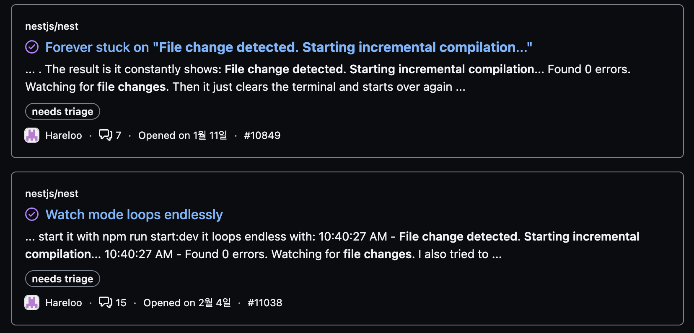
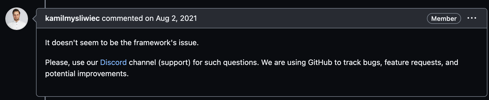
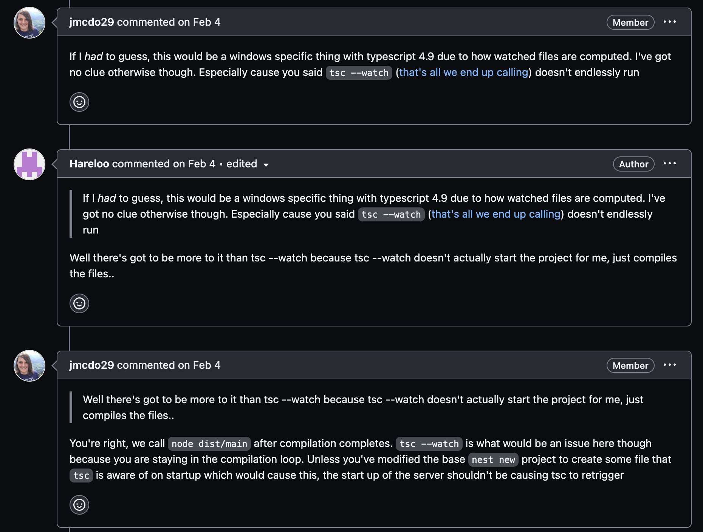

## NestJS 무한 컴파일 문제

로컬에서 NestJS를 Watch 모드(`--watch`)로 실행 중에 간헐적으로 애플리케이션이 강제로 종료되는 문제를 발견했다.

포스트맨에서의 요청에 응답이 없어서 애플리케이션이 오류로 인해 종료된 것으로 생각했지만, 다시 요청을 하니 정상적으로 응답을 하는 것을 확인했다. 로그를 살펴보니 아래와 같은 로그가 출력되면서 자동으로 컴파일이 실행되었다.

```
[11:13:53 PM] File change detected. Starting incremental compilation...

[11:13:54 PM] Found 0 errors. Watching for file changes.
```

Watch 모드는 파일이 변경되었을 때 자동으로 컴파일을 실행하는 기능인데 이번에는 파일을 변경한 적이 없는데도 컴파일을 했다.

포스트맨으로 요청을 하지 않고 가만히 두어도 애플리케이션이 자동으로 파일 변경을 감지하고 예상치 못한 타이밍에 컴파일이 발생하기 때문에 갑자기 연결이 끊기거나 해서 개발하는데 불편함을 겪고 있었다.

처음에는 맥북이 문제인지 의심하여 재시동도 했지만 문제가 해결되지는 않았다.

## NestJS GitHub 이슈에서 찾아보기

처음 겪어보는 황당한 문제였기 때문에 [NestJS GitHub](https://github.com/nestjs)에서 검색을 해보니 관련 결과들이 몇 개 나왔다.



위 사진 말고도 비슷한 몇 가지 이슈들이 더 있었다.

이슈와 코멘트들을 살펴보니 모두가 겪는 문제가 아니라 일부의 개발 환경에서만 발생하는 문제로 추측되었다.

NestJS의 `--watch`와 관련된 이슈에서 NestJS의 창시자인 [kamilmysliwiec](https://github.com/kamilmysliwiec)의 코멘트도 확인했다.



프레임워크의 문제가 아니라는 짧은 내용이었다.

짧은 코멘트와 함께 이슈를 닫아버려서 '그러면 어디가 문제인데?'라는 생각이 들었다.



NestJS의 멤버의 코멘트에서는 TypeScript v4.9에서 발생하는 문제로 추측하고 있으며 NestJS의 Watch 모드가 결국은 `tsc --watch`를 사용한다는 것이었다. 공교롭게도 문제를 겪었던 NestJS의 TypeScript가 v4.9.3을 사용하고 있었다.

다른 이슈들의 코멘트들을 확인해 보고 실험을 해본 내용을 공유하려고 한다.

## 해결

위 문제는 아래의 두 가지 방법으로 해결할 수 있었다.

1. TypeScript 설정 파일(tsconfig.json)을 수정해서 해결하는 방법

`tsconfig.json`에서 `watchOptions`을 추가하고 문제를 해결했다.

```
{
  "compilerOptions": {
    // 생략...
  },
  "watchOptions": {
    "watchFile": "fixedPollingInterval",
    "watchDirectory": "useFsEvents",
    "fallbackPolling": "dynamicPriority",
    "synchronousWatchDirectory": true,
    "excludeDirectories": [
      "**/node_modules",
      "dist"
    ]
  }
}
```

2. TypeScript의 버전을 올려서 해결하는 방법

문제가 발생하는 프로젝트는 TypeScript v4.9.3을 사용하고 있었는데 TypeScript v4.9.5로 v4.9에서 가장 최신의 버전으로 업그레이드를 하고 테스트를 해보니 문제가 해결되었다.

NestJS의 멤버가 남겼던 코멘트대로 TypeScript의 문제였고 TypeScript의 watchOptions을 설정하거나 TypeScript의 버전을 올리면서 문제가 해결된 것이었다.

## 마치며

만약 위와 같은 문제를 겪고 있다면 TypeScript의 문제이기 때문에 TypeScript의 버전을 올리거나 버전을 올리기 힘들다면 `tsconfig.json`에서 `watchOptions`을 설정해서 해결할 수 있다.

NestJS의 Watch 모드는 내부적으로는 `tsc --watch`를 사용한다. NestJS가 직접 파일의 변경을 감시하지 않는다.

### Reference

[File change detected. Starting incremental compilation... #7725](https://github.com/nestjs/nest/issues/7725)

[NestJs Dev server keeps restarting in a loop on ubuntu #10277](https://github.com/nestjs/nest/issues/10277)

[Forever stuck on "File change detected. Starting incremental compilation..." #10849](https://github.com/nestjs/nest/issues/10849)

[Watch mode loops endlessly #11038](https://github.com/nestjs/nest/issues/11038)
