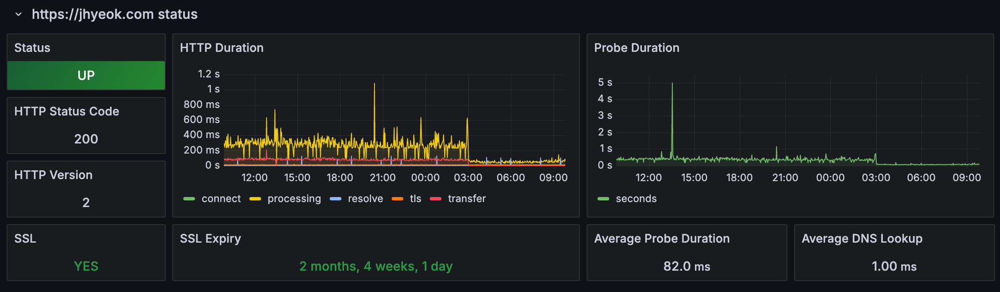
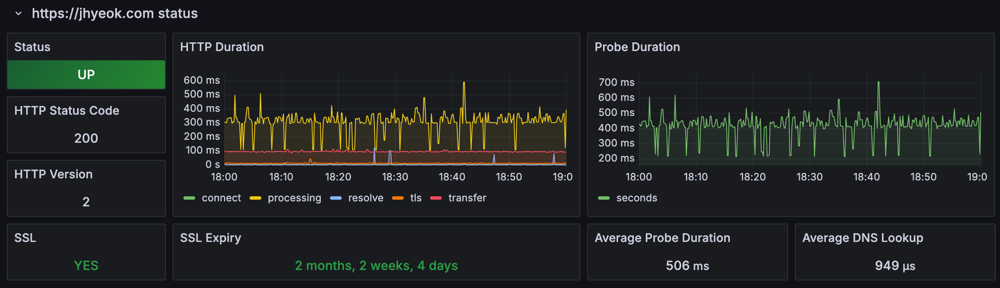
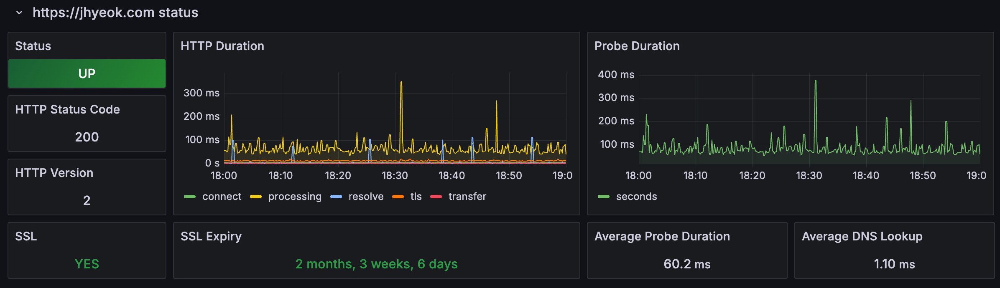
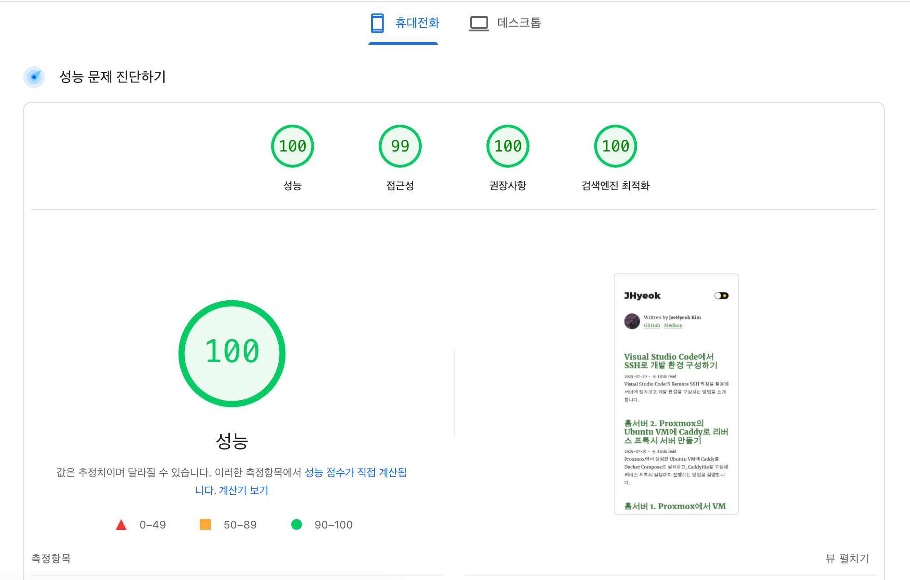
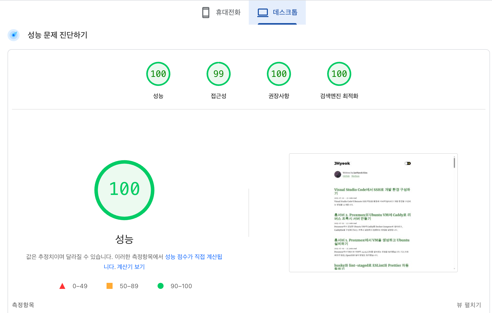

그동안 이 블로그는 Netlify에서 빌드 및 배포되고 있었습니다. 특별한 불만은 없었지만, 도메인과 DNS, Cloudflare tunnel까지 모두 Cloudflare에서 관리하고 있는 김에 블로그도 Cloudflare Pages로 옮겨볼까 하는 생각이 들었습니다.

무엇보다 Netlify가 한국에 서버를 운영하고 있다는 공식적인 정보를 찾을 수 없었기 때문에, 이번 기회에 Cloudflare Pages로 이전하고 성능 차이가 얼마나 나는지 직접 확인해보고 싶었습니다.

이 글에서는 Netlify에서 Cloudflare Pages로 무중단 마이그레이션을 진행한 과정, 그리고 그 결과 실제 성능이 얼마나 개선되었는지를 공유합니다.

## 마이그레이션 전략

운영 중단 없이 자연스럽게 이전하는 것이 목표였습니다. 그래서 처음부터 DNS를 바꾸거나 기존 배포를 끊는 대신, Netlify와 Cloudflare Pages를 일정 기간 동시에 운영하는 방식으로 진행했습니다.

1. Cloudflare Pages에 프로젝트 추가 : 기존 GitHub 저장소를 그대로 연결했는데, Gatsby 기본 설정만으로도 문제없이 빌드가 동작했습니다.

2. 동시 배포로 안정성 확인 : GitHub에 커밋을 푸시하면 Netlify와 Cloudflare Pages 양쪽에 자동으로 배포되도록 했습니다. 덕분에 새로운 플랫폼에서도 정상적으로 작동하는지 빠르게 검증할 수 있었습니다.

3. 새 글 반영 여부 테스트 : 실제로 새 글을 작성해 Cloudflare Pages에서 바로 반영되는지 확인했습니다. 기존과 차이가 없다는 걸 확인한 뒤 최종 정리를 진행했습니다.

4. gatsby-plugin 교체 : Netlify 전용 플러그인이던 gatsby-plugin-netlify는 제거하고, gatsby-plugin-cloudflare-pages로 교체했습니다. Cloudflare Pages에 더 적합한 헤더 처리를 지원하기 때문에 교체하는 것이 적절하다고 판단했습니다.

```shell
yarn remove gatsby-plugin-netlify
yarn add gatsby-plugin-cloudflare-pages
```

## DNS 전환

이제 최종 단계인 DNS 전환입니다.

기존에 jhyeok.com은 Netlify에서 빌드된 사이트에 연결되어 있었고, 기본 제공 주소는 example.netlify.app 형태였습니다.

Cloudflare Pages에서는 example.blog.pages.dev처럼 기본 URL을 통해 배포 결과를 확인할 수 있었으며, 이후 운영 도메인인 jhyeok.com을 해당 Cloudflare Pages 프로젝트에 연결했습니다.

## 성능 변화

기대했던 것보다 훨씬 더 인상적인 결과가 나왔습니다.

배포 직후 새벽에 찍은 Grafana 대시보드 화면입니다.



아래는 마이그레이션 전후의 Grafana 대시보드 비교입니다. 동일한 시간대(18:00–19:00)를 기준으로 측정한 평균 값을 비교한 것입니다.

Netlify



Cloudflare Pages



| 항목          | Netlify                     | Cloudflare Pages |
| ----------- |-----------------------------|------------------|
| 평균 응답 시간    | 506ms                       | 60ms             |
| DNS Lookup  | 0.9ms                       | 1.1ms            |

위 표는 특정 시간대(18:00–19:00)를 기준으로 한 것이지만, 다른 시간대에서도 비슷한 추세를 확인할 수 있었습니다.

해당 시간대 기준으로 평균 응답 속도는 약 88% 개선되었으며, 페이지 로딩 속도는 8배 이상 빨라졌습니다.

[PageSpeed Insights](https://pagespeed.web.dev/)에서 휴대전화와 데스크톱 환경의 성능을 측정한 결과입니다.





## 마치며

Cloudflare Pages는 생각보다 훨씬 성능이 좋았고, 기존 Netlify 환경에서 거의 수정 없이 손쉽게 이전할 수 있었습니다.

특히 DNS 전환만 잘 준비한다면 사용자 입장에서 중단 없는 마이그레이션도 충분히 가능합니다. Gatsby 기반 블로그라면 별다른 호환성 문제도 없었습니다.

정적 사이트를 운영 중이라면, 성능 테스트 겸 Cloudflare Pages를 한 번 시도해보시는 것을 추천드립니다.
