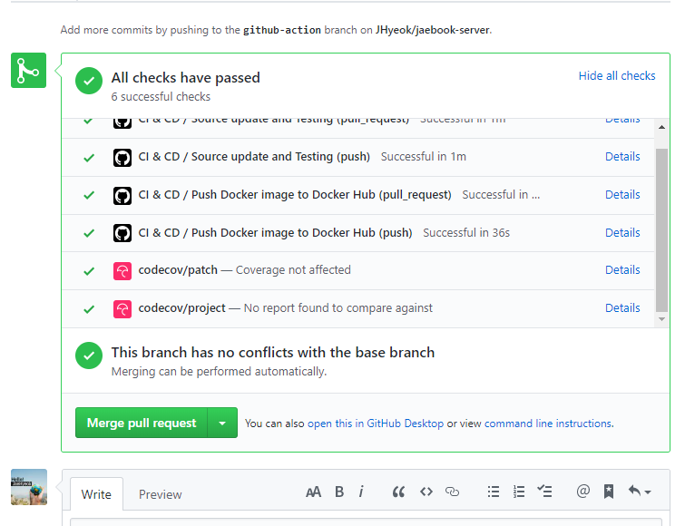
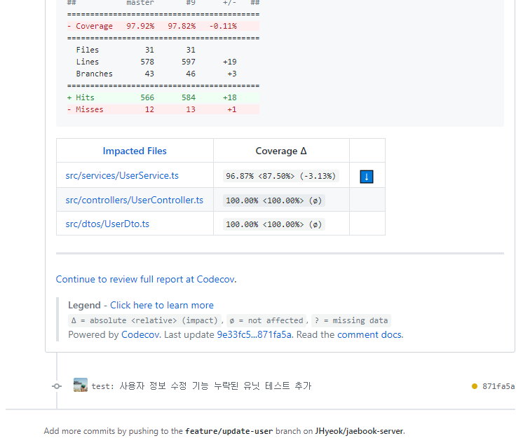

이 글은 사이드 프로젝트로 TypeScript와 Node.js 기반의 REST API 서버를 개발하면서 유용하게 사용한 기술들을 소개하고 정리하는 글입니다.

사이드 프로젝트의 코드는 [여기](https://github.com/JHyeok/jaebook-server)에서 확인할 수 있습니다.

### 명확한 계층 구조

Node.js 프로젝트들은 보통 라우터와 컨트롤러를 구분하여서 코드를 나누어서 구조를 만드는 모습을 볼 수 있는데 이 방법 이외에도 [routing-controllers](https://github.com/typestack/routing-controllers)를 사용하면 클래스 기반의 컨트롤러를 만들 수 있게 도와준다.

ORM으로는 TypeScript와 JavaScript(ES5, ES6, ES7)를 함께 사용할 수 있는 [TypeORM](https://github.com/typeorm/typeorm)을 사용했고 의존성 주입을 위해서 [TypeDI](https://github.com/typestack/typedi)를 사용했다. TypeORM, TypeDI와 routing-controllers를 활용해서 아래와 같은 구조를 만들 수 있다.

```
controllers
├─ PostController.ts
dtos
├─ PostDto.ts
entities
├─ Post.ts
services
├─ PostService.ts
repositories
├─ PostRepository.ts
middlewares
├─ AuthMiddleware.ts
utils
├─ ... 생략
```

이 구조는 기존의 `Spring`과 `.NET Core`를 사용하는 개발자분들에게는 익숙한 구조이다. 사이드 프로젝트를 진행 초기에 routing-controllers, TypeDI에 대해서 알게 되었고 명확한 계층 구조를 만들 수 있을 것 같았다.

게시글을 작성하는 기능은 아래의 구조와 코드로 구현되었다.

`PostController.ts`

```typescript
import { PostService } from "../services/PostService";
import {
  JsonController,
  Get,
  Param,
  Body,
  Post,
  Put,
  UseBefore,
  Res,
  Delete,
  HttpCode,
  QueryParams,
} from "routing-controllers";
// JWT 인증을 위한 미들웨어를 선언한다.
import { checkAccessToken } from "../middlewares/AuthMiddleware";
import { Response } from "express";
// routing-controllers에서 SwaggerUI를 사용하는 방법이다.
import { OpenAPI, ResponseSchema } from "routing-controllers-openapi";
import { CreatePostDto, UpdatePostDto, PageablePostDto } from "../dtos/PostDto";

@JsonController("/posts")
export class PostController {
  // 생성자 주입을 사용해서 의존성 주입을 한다.
  constructor(private postService: PostService) {}

  @HttpCode(201)
  @Post()
  // OpenAPI를 정의해서 SwaggerUI를 정의할 수 있다.
  @OpenAPI({
    summary: "Post 작성",
    statusCode: "201",
    security: [{ bearerAuth: [] }],
  })
  // AccessToken의 유효성을 검증한다.
  @UseBefore(checkAccessToken)
  public async create(
    @Body() createPostDto: CreatePostDto,
    @Res() res: Response,
  ) {
    // AccessToken으로 userId를 추출한다.
    const { userId } = res.locals.jwtPayload;
    // userId와 요청된 Dto로 게시글을 생성한다.
    const newPost = await this.postService.createPost(createPostDto, userId);

    return newPost;
  }
}
```

생성자를 통해서 의존성 주입을 사용한다.

`PostService.ts`

```typescript
import { Service } from "typedi";
import { InjectRepository } from "typeorm-typedi-extensions";
import { Post } from "../entities/Post";
import { PostRepository } from "../repositories/PostRepository";
import { CreatePostDto, UpdatePostDto } from "../dtos/PostDto";

// PostService를 어느 곳에서나 주입할 수 있도록 해준다.
@Service()
export class PostService {
  // Repository를 생성자 주입에 사용하기 위해 typeorm-typedi-extensions를 사용한다.
  // https://github.com/typeorm/typeorm-typedi-extensions
  constructor(@InjectRepository() private postRepository: PostRepository) {}

  public async createPost(
    createPostDto: CreatePostDto,
    userId: string,
  ): Promise<Post> {
    const post = createPostDto.toEntity();
    post.userId = userId;
    post.previewContent = post.content.substring(0, 100);

    const newPost = await this.postRepository.save(post);
    return newPost;
  }
}
```

`PostRepository.ts`

```typescript
import { EntityRepository, Repository } from "typeorm";
import { Post } from "../entities/Post";

@EntityRepository(Post)
export class PostRepository extends Repository<Post> {
}
```

글에서는 명확한 계층 구조를 설명하기 위해서 Controller, Service, Repository만 보여주었지만 실제 코드를 본다면 routing-controller의 옵션을 정의하는 RoutingConfig.ts를 만들어주었고 app.ts에서는 RoutingConfig.ts를 사용해서 Express 앱에 routing-controller를 적용한다.

```typescript
import {
  useContainer as routingUseContainer,
  useExpressServer,
} from "routing-controllers";
import { routingControllerOptions } from "./utils/RoutingConfig";

export class App {
  public app: express.Application;

  constructor() {
    this.app = express();
    // ... 생략
  }

  // ... 생략

  public async createExpressServer(port: number) {
    try {
      // routing-controllers, TypeORM과 함께 TypeDI를 사용하는 방법이다. (routingUseContainer)
      routingUseContainer(Container);
      useExpressServer(this.app, routingControllerOptions);
      useSwagger(this.app);
      useSentry(this.app);

      this.app.listen(port, () => {
        logger.info(`Server is running on http://localhost:${port}`);
      });
    } catch (error) {
      logger.error(error);
    }
  }
}
```

### env.ts로 환경 변수를 관리

응용프로그램은 여러 가지 환경 설정이 필요하다. 개발 환경에서 사용한 데이터베이스를 운영 환경에서 그대로 사용할 수 없듯이 환경에 대한 분리가 필요하다. 테스트를 진행할 때는 테스트에 맞는 환경 설정이 필요하다.

이 환경에 따른 값들을 환경 변수라고 하는데 이 환경 변수들을 관리하지 않으면 개발 환경에서 운영 환경으로 전환할 때마다 직접 데이터베이스 연결 정보 또는 ORM에 대한 옵션 정보들을 환경을 변경할 때마다 수정해야 하는 불상사가 일어날 수 있다.

그래서 .env파일들과 env.ts를 사용해서 환경 변수들을 철저히 분리하였다.

```
config
├─ .env.test
├─ .env.development
├─ .env.production
```

각 환경에 따른 값들을 지니고 있는 .env파일들을 만들고 env.ts에서 NODE_ENV에 따른 .env파일을 로드하도록 하였다.

```typescript
/**
 * NODE_ENV에 따른 .env 파일 로드
 */
require("dotenv").config({
  path: `config/.env.${process.env.NODE_ENV || "development"}`,
});
```

그리고 아래처럼 로드된 .env파일의 값들을 담아줄 환경 변수들을 만들어준다.

```typescript
/**
 * 환경 변수
 */
export const env = {
  isDevelopment: process.env.NODE_ENV === "development",
  isProduction: process.env.NODE_ENV === "production",
  isTest: process.env.NODE_ENV === "test",
  app: {
    port: Number(process.env.PORT) || 3000,
    jwtAccessSecret: process.env.JWT_SECRET_ACCESS_KEY,
    jwtRefreshSecret: process.env.JWT_SECRET_REFRESH_KEY,
    // ... 생략
  },
  database: {
    host: process.env.DATABASE_HOST,
    // ... 생략
  },
  // ... 생략
};
```
환경 변수를 사용할 때는 env.ts에서 환경 변수들이 정의된 env를 사용하도록 하면 된다. TypeORM이 연결할 데이터베이스를 관리하는 database.ts에서 환경 변수들을 사용하는 방법이다.

```typescript
// env.ts에서 환경 변수들이 정의된 env를 가져온다.
import { env } from "./env";

export async function createDatabaseConnection() {
  try {
    const connectionOpts: ConnectionOptions = {
      type: "mysql",
      host: env.database.host,
      // ... 생략
    };

    // ... 생략
  } catch (error) {
    throw error;
  }
}
```

`config/.env.환경`의 파일들만 관리하면 여러 환경에 따른 환경 변수들을 관리할 수 있고 직접 환경 변수들을 수정하다가 잘못 적용되는 실수를 줄일 수 있다.

#### 마치며

Routing-Controller와 TypeDI를 사용하거나, 환경 변수를 관리하는 방법 이외에도 사이드 프로젝트를 진행하면서 Docker를 사용하기도 했고 단위 테스트와 E2E 테스트를 작성하기도 하였고 Github Action과 Github Template들 그리고 codecov와 같은 third party를 사용해보았다. 이와 관련된 내용들은 조금 더 공부하고 정리해서 블로그에 작성하려고 한다.





회사에서는 여건이 되지 않아서 사용해보지 못한 방법들과 기술들을 사이드 프로젝트로 경험을 할 수 있어서 좋았던 것 같다.