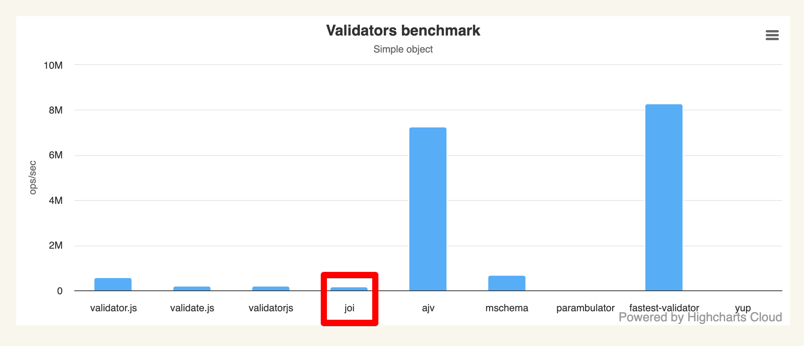
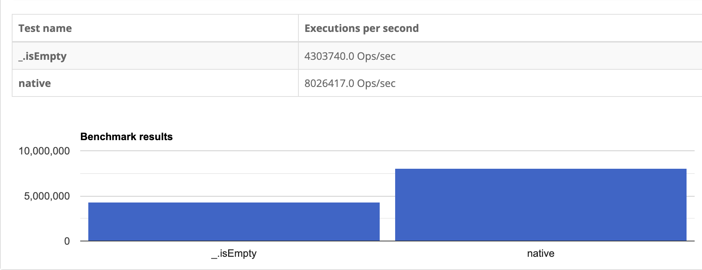
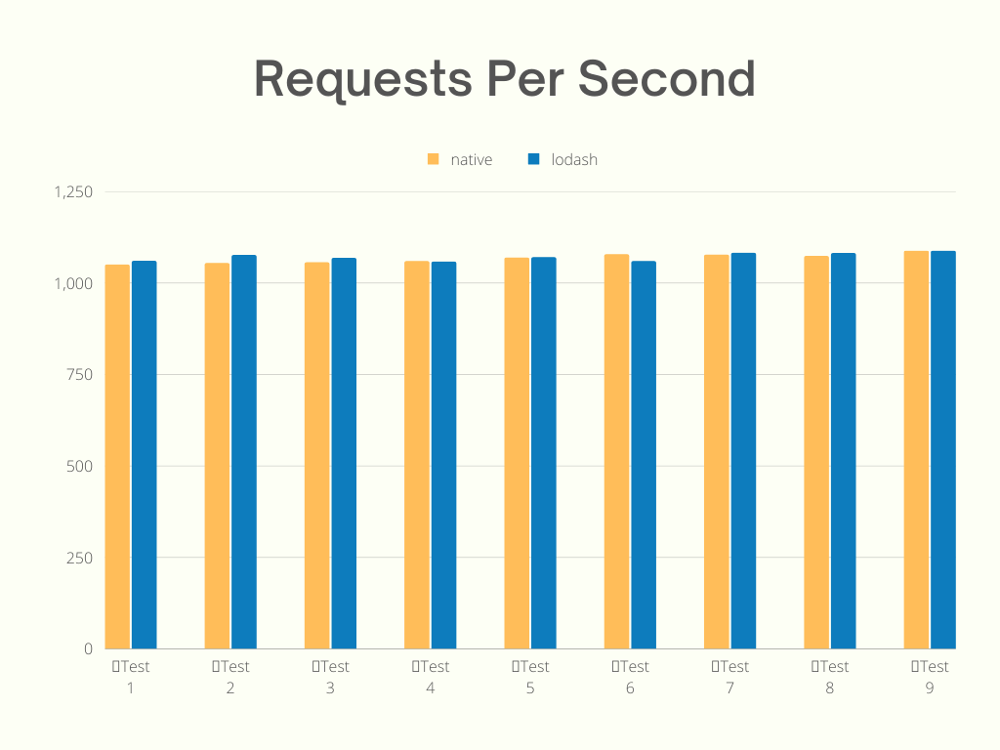
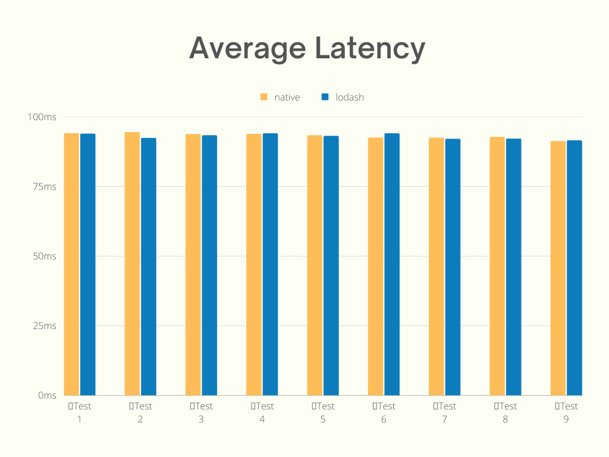
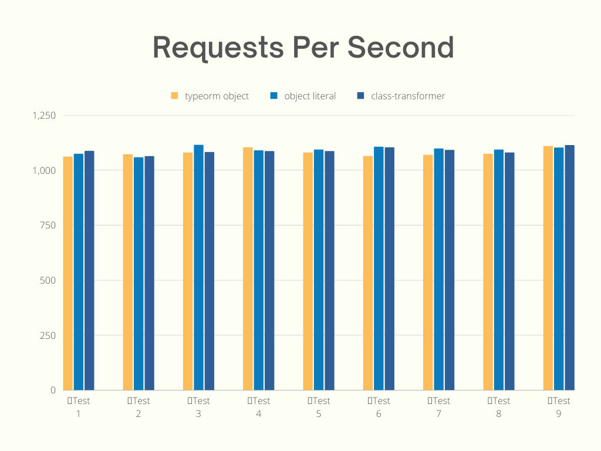
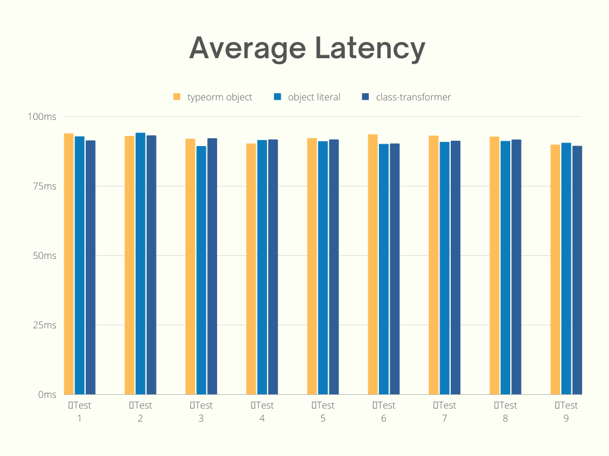
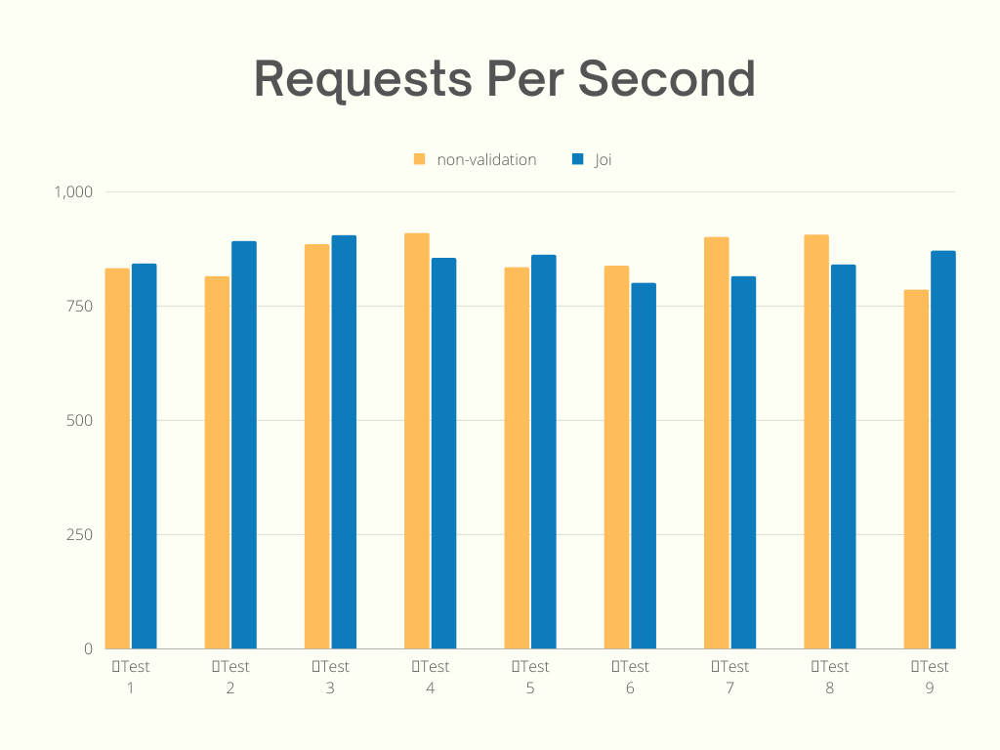
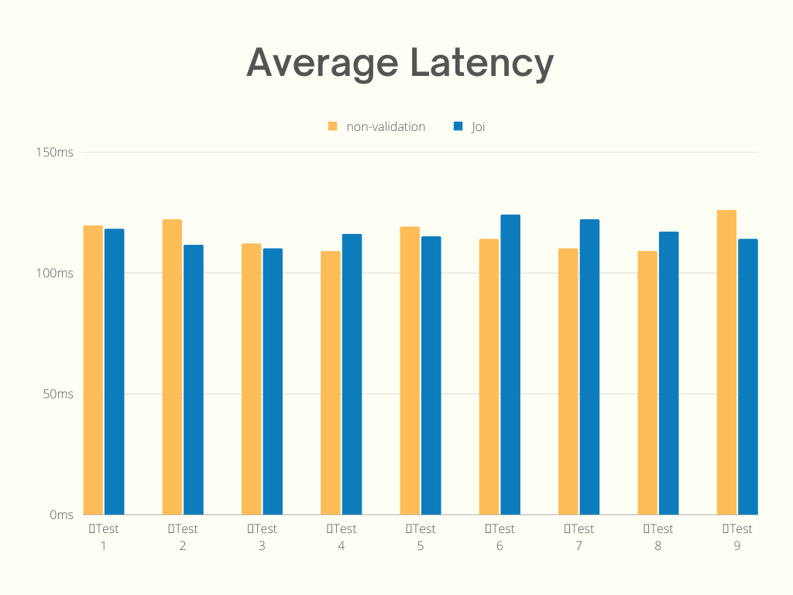

저는 NestJS를 사용하면 유효성 검사와 직렬화 라이브러리에 [class-validator](https://www.npmjs.com/package/class-validator)와 [class-transformer](https://www.npmjs.com/package/class-transformer)를 사용합니다. 반면에 Express를 사용하는 경우에는 [Joi](https://www.npmjs.com/package/joi)를 사용하고 있는데요. 하지만 Joi는 다른 라이브러리들에 비해서 굉장히 느린 편입니다.



그리고 마치 이 그래프를 보고 Joi를 다른 라이브러리로 교체하면 굉장히 속도가 올라갈 것만 같은 착각에 빠질 수 있습니다. 하지만 정말 그럴까요?

저는 개인적으로 유효성 검사와 같은 영역이 몇 백배 빠르다고 하더라도 그것이 일반적인 Node.js 백엔드 애플리케이션에서 유의미한 성능 차이를 보이지 않는다고 생각하고 있습니다. 물론 해당 작업은 이벤트 루프를 차단하기 때문에 성능에 영향이 아예 없는 것은 아니지만 마이크로초(microsecond, μs) 단위의 작업이기 때문입니다.

하지만 위의 의견은 저의 개인적인 추측이었고 성능 테스트를 통해서 검증이 필요했습니다. 유효성 검사 이외에도 class-transformer로 직렬화를 했을 때, Lodash를 사용할 때 성능에 영향이 있는지 평소에 예측으로만 생각했던 부분들도 같이 확인했습니다.

## 테스트 환경

k6으로 성능 테스트를 진행했으며 사용한 테스트 옵션은 다음과 같다.

```js
// 100의 가상 사용자(virtual users)로 10초 동안 요청을 한다.
export const options = {
  discardResponseBodies: true,
  vus: 100,
  duration: '10s',
};
```

실제 사례와 조금이라도 비슷한 환경을 위해서 테스트에 DB를 사용하고 조회 케이스에서는 MySQL, 입력 케이스에서는 MongoDB를 사용했다. DB를 조회하지 않고 객체만 만들고 비교를 한다거나 문자열만 반환하는 것은 의미가 없다고 생각한다.

```
MacBook Pro(14형, 2021년)
칩: Apple M1 Pro
메모리: 32GB
OS: ventura 13.0.1

Node.js v18.16.0
Express v4.18.2
Lodash v4.17.21
class-transformer v0.5.1
Joi v17.6.0
```

## native vs Lodash

JavaScript에서 인기 있는 라이브러리 중 하나인 Lodash의 성능에 대한 내용들은 쉽게 찾아볼 수 있다.

Lodash의 `isEmpty()` 함수와 native를 비교한 벤치마크를 살펴보자.



native가 더 빠르다. 백엔드 애플리케이션에서는 얼마나 차이가 날까?

UserRepository에서 가져온 유저 Entity를 체크하는 것을 native와 Lodash를 사용하는 케이스를 비교했다.

native 테스트에 사용된 코드는 다음과 같다.

```ts
async findById(userId: number): Promise<UserResponseDto> {
  const user = await this.userRepository.findOneByUserId(userId);
  
  if (user === null) {
    throw new NotFoundException(UserMessage.NOT_FOUND_USER);
  }

  return new UserResponseDto(user);
}
```

Lodash 테스트에 사용된 코드는 다음과 같다.

```ts
async findById(userId: number): Promise<UserResponseDto> {
  const user = await this.userRepository.findOneByUserId(userId);
  
  if (_.isEmpty(user) === true) {
    throw new NotFoundException(UserMessage.NOT_FOUND_USER);
  }

  return new UserResponseDto(user);
}
```





테스트 케이스마다 결과가 조금씩 다르지만 성능에 유의미한 차이를 보이지 않는다.

## object literal vs class-transformer

이번에는 TypeORM의 결과를 그대로 반환하는 경우와 class-transformer를 사용해서 직렬화를 해서 반환하거나, 객체 리터럴(object literal)로 반환하는 경우를 테스트한다.

TypeORM의 결과를 어떠한 가공 없이 반환을 하는 테스트에 사용된 코드는 다음과 같다.

```ts
async findById(userId: number): Promise<User> {
  const user = await this.findUserById(userId);
  
  return user;
}
```

class-transformer의 `instanceToPlain()` 함수를 사용해서 직렬화를 하는 테스트에 사용된 코드는 다음과 같다. (`classToPlain()` 함수와 같다.)

```ts
async findById(userId: number): Promise<UserResponseDto> {
  const user = await this.findUserById(userId);
  
  return new UserResponseDto(user);
  // 컨트롤러에서 res.status(HttpStatus.OK).json(instanceToPlain(responseDto));
}
```

객체 리터럴(object literal)로 바로 반환을 하는 테스트에 사용된 코드는 다음과 같다.

```ts
async findById(userId: number): Promise<{
  firstName: string;
  lastName: string;
}> {
  const user = await this.findUserById(userId);
  
  return {
    firstName: user.firstName,
    lastName: user.lastName,
  };
}
```





테스트 케이스마다 결과가 조금씩 다르지만 성능에 유의미한 차이를 보이지 않는다.

## non-validation vs Joi

데이터를 입력하는 경우에는 k6을 한 번 실행하고 결과를 확인한 후에 MongoDB에서 테스트 컬렉션을 깨끗하게 비우고 이어서 테스트를 진행했다.

만약 유효성 검사 라이브러리가 느린 것이 정말로 영향이 있다면 유효성 검사를 했을 때와 하지 않았을 때, API의 응답 속도는 유의미한 차이를 보일 것이다.

Joi로 유효성 검사를 하는 코드는 다음과 같다.

```ts
const validateCreateTodoBody = (body: TodoCreateDto) => {
  const validator = Joi.object({
    title: Joi.string().required().trim().min(1).max(30).label('title'),
    description: Joi.string().trim().min(1).allow('').label('description'),
    isShow: Joi.boolean().label('isShow'),
    isDeleted: Joi.boolean().label('isDeleted'),
  });
  const result = validator.validate(body);
  JoiResultProcessor.processResult(result, validateMessage);
};
```

위 코드에서 유효성 검사를 하고 오류가 있으면 오류 메시지를 반환한다.

```ts
const exec = async (body: TodoCreateDto): Promise<Boolean> => {
  validateCreateTodoBody(body);
  await createTodo(body);
  return true;
};
```

`non-validation` 테스트에 사용된 코드는 다음과 같다. 유효성 검사를 하는 부분을 제거했다.

```ts
const exec = async (body: TodoCreateDto): Promise<Boolean> => {
  await createTodo(body);
  return true;
};
```





테스트 케이스마다 결과가 조금씩 다른데 개인적인 예상으로는 테스트를 진행할 때 DB에 데이터를 입력하기 때문에 이 과정이 테스트 결과에 더 많은 영향을 끼치는 것 같다.

## 마치며

테스트를 진행하면서 대부분의 케이스들이 어떤 경우에는 A가 빠르거나 또 어떤 경우에는 B가 빠르고 해서 우열을 가리기 힘들었다. 그리고 해당 글에서는 초당 처리속도와 평균 응답속도만 비교를 하는 것처럼 보이지만 테스트를 진행할 때는 p90, max 등 여러 Metrics을 비교했다.

위의 테스트들은 단순히 DB 조회 및 입력 작업만을 다루었다. 하지만 실제 백엔드 애플리케이션은 여러 저장소나 다른 서비스를 사용하기도 하며, 다양한 비즈니스 로직이 코드 상에 존재할 것이다. 따라서 이러한 API에서 유효성 검사, Lodash 사용 및 직렬화는 API 한 번의 요청 타임라인에서 큰 비중을 차지하지는 않는다고 생각한다.

개인적인 경험이지만 성능에 문제가 있었던 사례들이 개발자의 실수로 이벤트 루프를 오랜 시간을 차단했다거나 Slow Query를 사용을 하거나, 네트워크 문제, 외부 리소스를 잘못 사용하거나 하는 경우들이 대부분이었다.

참고로 Fastify는 조금 다른 케이스이다.
- [Fastify가 다른 프레임워크보다 더 나은 성능을 보이는 이유](https://dev.to/vinamrasareen/how-fastify-performs-better-than-other-frameworks-116m)
- [Fastify Benchmark](https://fastify.dev/benchmarks/)

하지만 실제 DB를 포함한 테스트 시나리오에서는 단순히 `Hello world`를 반환하는 테스트처럼 Fastify가 5배 정도로 빠른 것처럼 차이가 많이 나는 성능을 보여주지 않는다. HTTP 구문 분석 요청, 직렬화 또는 그 이외의 부분들보다 DB에 쿼리를 호출하고 결과를 받는 시간이 API 응답 속도에 더 많은 영향을 끼치기 때문이다.
- [일반적인 사례에서 Fastify, Express 성능 비교](https://medium.com/deno-the-complete-reference/node-js-express-vs-fastify-performance-comparison-for-jwt-verify-and-mysql-query-3a9572712a7b)
- [DB Query를 포함한 Fastify, Express 성능 비교](https://facsiaginsa.com/nodejs/comparing-fastify-vs-express)

처음 개발 환경을 설정할 때, 애플리케이션에 사용할 라이브러리를 선택한다면 성능을 고려하는 것은 당연하다. 하지만 무조건 성능이 1순위는 아닐 것이다. 라이브러리마다 사용하는 방법이 다르기 때문에 사용성과 코드 작성 방법도 다르고, 지원하는 기능도 다르고, 생태계의 크기도 다르기 때문에 이런 여러 가지 복합적인 요인들을 고려해서 정하는 것이 좋다고 생각한다.

하지만 운영 중인 프로젝트에서 변경을 하는 것에 대해서는 부정적인 입장이다. 예를 들어 백엔드 애플리케이션 환경에서 팀에서 Lodash를 혼용해서 사용하고 있는데, Lodash와 native의 벤치마크 결과를 보여주면서 변경이 필요하다고 주장을 한다면 이미 사용 중인 코드에서 Lodash를 native로 변경하면서 얼마나 많은 성능적 이득을 볼 수 있을까? Lodash의 안정성을 버리고 native로 변경하는 것이 정말로 옳은가? 소모하는 시간과 노력에 대비해서 체감할 수 있는 성능 개선은 크지 않을 수 있다.

> Node.js 백엔드 애플리케이션 환경에 관점을 두고 작성한 글입니다. 그렇기 때문에 프론트엔드 상황과는 차이가 있을 수 있습니다.

### Reference

https://github.com/icebob/validator-benchmark

https://www.measurethat.net/Benchmarks/Show/18286/0/lodash-isempty-vs-native-for-empty-strings
