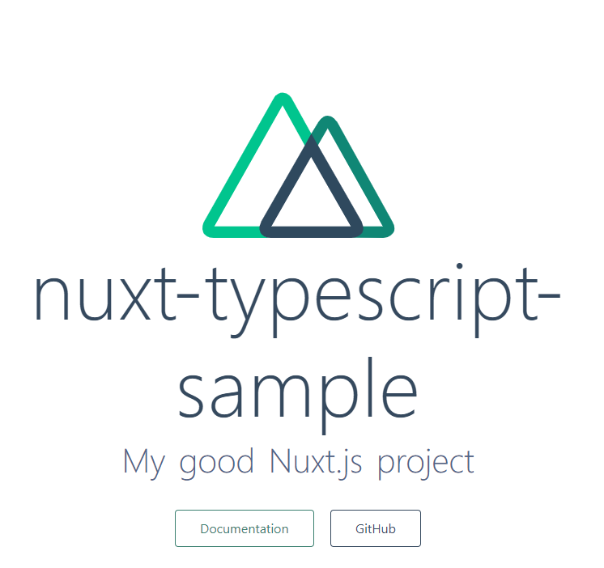
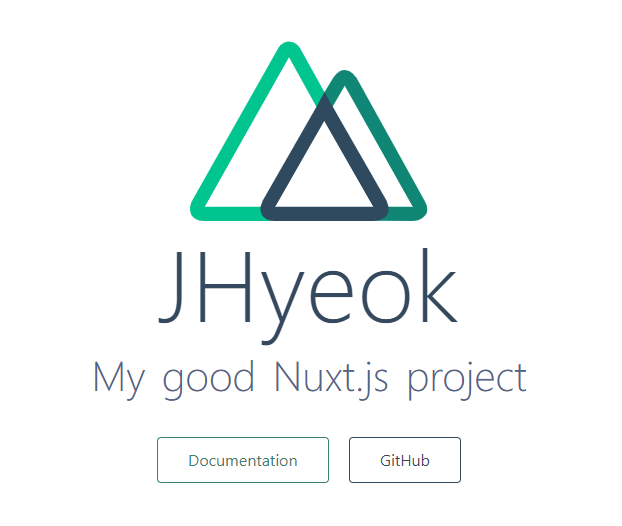

**TypeScript로 Nuxt 개발하기 시리즈**\
[TypeScript 환경으로 Nuxt 개발](https://jhyeok.com/nuxt-with-typescript/)\
[TypeScript Lint, Jest 환경 구성](https://jhyeok.com/nuxt-with-typescript-lint-jest/)

TypeScript로 Nuxt 개발하기 시리즈에 사용된 소스코드는 [여기](https://github.com/JHyeok/nuxt-typescript-sample)에서 확인할 수 있다.

### Nuxt 2.9 이후 부터 달라진 TypeScript 적용

Nuxt에서 TypeScript 지원은 전용 패키지로 외부화되었으며 Nuxt 2.9부터 코어에서 제거되었다. 이후의 프로젝트에서는 ts-node, @nuxt/typescript를 설치하지 않아도 된다.

@nuxt/typescript-build, @nuxt/typescript-runtime 이 두 가지 모듈만 있으면 Nuxt를 TypeScript 환경에서 개발할 수 있다.

Nuxt Community에서 [typescript-template](https://github.com/nuxt-community/typescript-template)를 사용하면 바로 템플릿을 이용해 만들 수 있지만 여러 기능이 부족하기 때문에 직접 추가해야 할 것들이 많다. [create-nuxt-app](https://github.com/nuxt/create-nuxt-app)을 통해서 만든 Nuxt를 TypeScript 환경에서 개발에 사용해보자.

먼저 create-nuxt-app을 통해서 아래와 같이 Nuxt 프로젝트를 만든다.

```
create-nuxt-app v2.12.0
✨  Generating Nuxt.js project in nuxt-typescript-sample
? Project name nuxt-typescript-sample
? Project description My good Nuxt.js project
? Author name JHyeok
? Choose the package manager Yarn
? Choose UI framework Bootstrap Vue
? Choose custom server framework None (Recommended)
? Choose Nuxt.js modules (Press <space> to select, <a> to toggle all, <i> to invert selection)
? Choose linting tools ESLint
? Choose test framework Jest
? Choose rendering mode Universal (SSR)
```

먼저 프로젝트의 위치로 가서 `yarn dev`로 프로젝트를 실행시킨다. (yarn을 사용했기 때문에 yarn으로 설명하도록 하겠습니다. 패키지 매니저는 선호하는 것으로 사용하시면 됩니다 😀.)



프로젝트가 정상적으로 만들어진 것을 확인했으면, 에디터를 열고 이제 TypeScript 환경을 적용해보도록 한다.

```
# Nuxt에 TypeScript 지원을 위한 라이브러리
yarn add -D @nuxt/typescript-build
```

위 라이브러리를 설치한 이후에 `nuxt.config.js`를 `nuxt.config.ts`로 수정하고 `buildModules`을 수정한다.

```typescript
// nuxt.config.ts
export default {
  buildModules: ['@nuxt/typescript-build']
}
```

`tsconfig.json`파일을 만든다.

```json
// tsconfig.json
{
  "compilerOptions": {
    "target": "es2018",
    "module": "esnext",
    "moduleResolution": "node",
    "lib": [
      "esnext",
      "esnext.asynciterable",
      "dom"
    ],
    "esModuleInterop": true,
    "experimentalDecorators": true, // Decodecorator 문법을 사용한다면 꼭 넣어주세요!
    "allowJs": true,
    "sourceMap": true,
    "strict": true,
    "noEmit": true,
    "baseUrl": ".",
    "paths": {
      "~/*": [
        "./*"
      ],
      "@/*": [
        "./*"
      ]
    },
    "types": [
      "@types/node",
      "@nuxt/types"
    ]
  },
  "exclude": [
    "node_modules"
  ]
}
```

Decorator(@)를 활용한 타입스크립트 뷰컴포넌트 사용을 위해서 vue-class-component, vue-property-decorator, vuex 라이브러리를 기반으로 하는 nuxt-property-decorator를 추가한다.
vue-class-component를 전적으로 의존하는 라이브러리이다.

```
yarn add -D nuxt-property-decorator
```

`page/index.vue`에 TypeScript를 활용해서 뷰 컴포넌트 코드를 작성한다.

```typescript
<template>
  <div class="container">
    <div>
      <logo />
      <h1 class="title">{{ authorName }}</h1>
      // ... 생략
    </div>
  </div>
</template>
<script lang="ts">
import { Component, Vue } from "nuxt-property-decorator";
import Logo from "~/components/Logo.vue";

@Component({
  components: {
    Logo
  }
})
export default class extends Vue {
  authorName: string = "JHyeok";
}
</script>
```

`<script lang="ts">`를 추가함으로써 웹팩으로 빌드할 때 vue-loader가 타입스크립트 코드를 이해하고 해석할 수 있다.

TypeScript가 적용되었는지 확인해야 할 것은 Logo Component를 가져오는지와 authorName이 출력되는지를 확인하면 된다.

```
# TypeScript 런타임에 필요한 라이브러리
yarn add @nuxt/typescript-runtime
```

웹팩으로 컴파일되지 않은 파일(예: nuxt.config 파일, 로컬 모듈 및 serverMiddlewares)에는 TypeScript 런타임이 필요한데 Nuxt.js는 전용 패키지 아래에 TypeScript 런타임 래퍼 @nuxt/typescript-runtime를 만들었다.

@nuxt/typescript-runtime를 설치해준 이후에, `package.json` 파일을 수정하기만 하면 된다.

```json
"scripts": {
  "dev": "nuxt-ts",
  "build": "nuxt-ts build",
  "generate": "nuxt-ts generate",
  "start": "nuxt-ts start"
},
```

그리고 `yarn dev`로 프로젝트를 실행하면 정상적으로 실행이 될 것이다.

혹시 실행을 하였는데 아래와 같은 오류를 마주치게 된다면 당황하지 말자.

```
error  Parsing error: Using the export keyword between a decorator and a class is not allowed. Please use `export @dec class` instead.
```

`nuxt.config.ts`의 `buildModules`에 @nuxtjs/eslint-module이 남아있기 때문이다. @nuxtjs/eslint-module을 삭제하면 정상적으로 진행이 될 것이다.

```
$ nuxt-ts

   ╭─────────────────────────────────────────────╮
   │                                             │
   │   Nuxt.js v2.11.0                           │
   │   Running in development mode (universal)   │
   │                                             │
   │   Listening on: http://localhost:3000/      │
   │                                             │
   ╰─────────────────────────────────────────────╯

i Preparing project for development 
i Initial build may take a while
√ Builder initialized
√ Nuxt files generated
i Starting type checking service...
i Using 1 worker with 2048MB memory limit

√ Client
  Compiled successfully in 4.57s

√ Server
  Compiled successfully in 3.09s

i Type checking in progress...
i Waiting for file changes
i Memory usage: 293 MB (RSS: 371 MB)
i No type errors found
i Version: typescript 3.7.4
i Time: 5586ms
```

터미널에서 Type checking in progress를 진행하고, 사용하고 있는 TypeScript 버전이 보이는 것을 확인할 수 있다.



### 마치며

TypeScript 환경에서 Nuxt를 개발하는 환경을 구성해보았다. 다음 글에서는 코드 스타일을 검사하는 Lint와 테스트 라이브러리인 Jest를 TypeScript 환경에서 사용하는 방법에 대해 설명할 것이다.

---
### Reference

https://typescript.nuxtjs.org/guide/

https://medium.com/@Al_un/nuxt-vuex-jest-tested-powered-by-typescript-70441600ef39

https://ideveloper2.tistory.com/140

https://joshua1988.github.io/vue-camp/nuxt/intro.html#nuxt-%ED%8A%B9%EC%A7%95