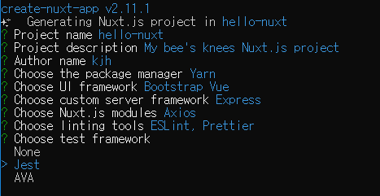
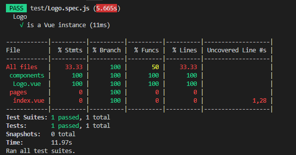
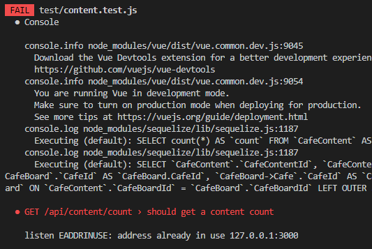
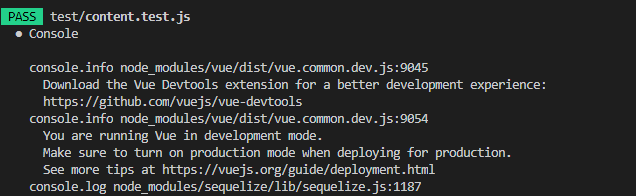
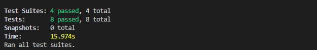

최근 사내에서 내부 직원들이 사용할 웹 애플리케이션을 만들게 되면서 테스트 케이스를 추가했다. **GDG DevFest Seoul 2019**에서 **이승민(뱅크샐러드)**님의 ***테스트 관점으로 아키텍처 완성하기*** 세션을 듣게 되었고, 간단한 테스트라도 시작을 하는 것이 중요하다는 내용을 듣고 실천에 옮겼다.

> 이상을 쫓는 것보다 당장의 할 수 있는 것부터 해야 한다. TDD는 너무 멀고, 일단은 테스트 케이스를 추가해서 개발을 해야 한다.

> 성공 케이스부터 테스트 케이스 개발을 하다 보면 실패 케이스도 자연스럽게 짜는 본인을 보실 수 있을 것이다.

프로젝트는 **Nuxt.js** 프레임워크를 이용해서 혼자 개발을 하고 있었고, 테스트 케이스를 추가하는데 동의가 필요하지 않았다. 내가 프로젝트의 주인인 만큼, 기간에 대한 책임은 당연히 있었지만 최대한 기능들을 빠르게 구현하고 테스트를 넣자고 다짐했다.

### 테스트 프레임워크 Jest



처음 프로젝트를 시작할 때, 혹시 몰라서 **Jest**라는 이름의 테스트 프레임워크를 선택했었다. **Jest**는 **Facebook**에서 개발 한 JavaScript 테스트 프레임 워크이다. 최소한의 구성으로 즉시 사용할 수 있다.

```javascript
import { mount } from '@vue/test-utils'
import Logo from '@/components/Logo.vue'

describe('Logo', () => {
  test('is a Vue instance', () => {
    const wrapper = mount(Logo)
    expect(wrapper.isVueInstance()).toBeTruthy()
  })
})
```

`create-nuxt-app`에서 자동으로 생성해주는 `@/components/Logo.vue`에 대한 테스트 케이스이다.



`npm run test`로 테스트를 해보면 위의 이미지처럼 테스트가 통과했다고 나온다.

### Nuxt.js에서 Express 서버 API 테스트

컴포넌트에 대한 테스트 케이스는 위의 코드를 보고 쉽게 따라 할 수 있지만, 필자는 `Nuxt.js` 프레임워크에서 서버 프레임워크를 `Express`로 선택해서 `Server` 코드를 같이 개발하고 있었기 때문에, `Express`에 대한 테스트도 필요했다.

`Nuxt.js`를 사용한 개발을 하면서 서버를 따로 분리하지 않았고 `Nuxt.js`에서 서버 프레임워크를 `Express`로 선택하였는데 `Express`로 구현한 API가 테스트가 필요할 때, 겪었던 경험들을 공유하려고 한다.

Express API에 대한 테스트를 하기 위해 필요한 것
- Jest 설치
- SuperTest 설치
- 테스트 데이터베이스
- NPM 스크립트 작성
- 테스트 코드 작성

데이터를 조회하고 삭제하는데 개발 중이거나 운영 중인 데이터베이스를 쓰면 좋지 않기 때문에 테스트 데이터 베이스가 필요하고, `node`실행 시 테스트 데이터베이스를 사용하도록 하는 NPM 스크립트가 필요하다. 데이터베이스를 먼저 설계한 이후에, `sequelize auto cli`를 이용해서 모델을 만들었기 때문에 테스트 데이터베이스의 경우 `SQLyog`라는 툴을 이용해서 쉽게 구조와 데이터를 복사해왔다.

1. 먼저 `npm`에서 `SuperTest`를 설치한다.

```
npm install supertest --save-dev
```

SuperTest는 **Node.js HTTP 서버**를 테스트하기 위한 라이브러리이다. SuperTest는 프로그래밍 방식으로 GET, POST, PATCH, PUT, DELETE와 같은 HTTP 요청을 HTTP 서버로 보내고 결과를 얻을 수 있도록 해준다.

2. `package.json`에 `Jest` 구성 추가

```javascript
"scripts": {
  // ...
  "test": "cross-env NODE_ENV=test jest",
},
"jest": {
    "testEnvironment": "node",
    "coveragePathIgnorePatterns": [
      "/node_modules/"
    ]
  },
```

`coveragePathIgnorePatterns`은 `Jest`가 무시하는 디렉토리 및 정규 표현식을 지정해 줄 수 있다. 이 경우는 `node_modules` 디렉토리를 무시한다. test 스크립트에 `cross-env NODE_ENV=test`를 추가한 이유는 이 환경변수를 이용해서 실제 테스트할 때에는 테스트 데이터베이스를 사용하기 위함이다.

3. 테스트 데이터베이스 설정

```javascript
{
  "production": {
    // ...
  },
  "development": {
    // ...
  },
  "test": {
    "username": "test",
    "password": "test_admin",
    "database": "Database_Test",
    "host": "0.0.0.0",
    "dialect": "mysql",
    "operatorAliases": false,
    "define": {
      "timestamps": false
    }
  } 
}
```

Database Config을 가져와서 사용한다면 환경 변수가 test일 때의 Database Config을 설정해서 테스트 데이터베이스를 사용하도록 하자.

4. 테스트 케이스 작성

`Jest`에서는 `Express` 서버를 `import` 하는데, `Nuxt.js`의 `Express`코드는 `Express` 단일 프레임워크와는 조금 생김새가 다르다. 참고로 필자는 작성일 기준 `Nuxt.js` 최신버전을 사용했다.

```javascript
const express = require('express')
const consola = require('consola')
const { Nuxt, Builder } = require('nuxt')
const app = express()

// Import and Set Nuxt.js options
const config = require('../nuxt.config.js')
config.dev = process.env.NODE_ENV !== 'production'

async function start() {
  // Init Nuxt.js
  const nuxt = new Nuxt(config)

  const { host, port } = nuxt.options.server

  // Build only in dev mode
  if (config.dev) {
    const builder = new Builder(nuxt)
    await builder.build()
  } else {
    await nuxt.ready()
  }

  // Give nuxt middleware to express
  app.use(nuxt.render)

  // Listen the server
  app.listen(port, host)
  consola.ready({
    message: `Server listening on http://${host}:${port}`,
    badge: true
  })
}
start()
```

`import`를 하려면 모듈을 `exports` 해야 하지만 `create-nuxt-app`으로 생성되는 서버 코드는 `express`를 `exports` 하지 않고 있다.

해결방법은 두 가지가 있는 것 같다.
- 테스트만을 위한 `server` 파일을 새로 만들어서 테스트 할 때만 `import`

```javascript
// demo-server.js를 만듦
const express = require('express')
const app = express()
// ... 중략
app.use(express.json())
app.use(express.urlencoded({ extended: false }))

app.listen(port, host)
// ... 라우터 세팅 생략
module.exports = app
```

- 환경변수를 이용해서 `test` 일때는 `express`를 `exports`

```javascript
if (process.env.NODE_ENV === 'test') {
  const testApp = express()
  testApp.use(express.json())
  testApp.use(express.urlencoded({ extended: false }))

  testApp.listen(port, host)
  // ... 라우터 세팅 생략
  module.exports = testApp
} else {
  start()
}
```

`express`를 `import`할 수 있게 되었으면 테스트 코드를 작성해본다. `Jest`에서는 `__test__` 파일 안의 `.js`, `.spec.js`, `.test.js`의 테스트 코드를 작성하면 테스트 코드로 인지하고 테스트 시작 시 해당 파일들을 실행한다.

`/test/memo.test.js 작성`

```javascript
import request from 'supertest'
import app from '../server'

describe('POST /api/memo', () => {
  it('should create a new memo', async () => {
    const res = await request(app)
      .post('/api/memo')
      .send({
        title: 'test',
        content: 'test'
        regId: 1,
      })
    expect(res.statusCode).toEqual(201)
  })
})
```

`describe`은 여러 관련 테스트를 그룹화하는 블록을 만드는 기능이다.
`it(name, fn, timeout)`는 describe 블록의 작은 단위 테스트이다. `test(name, fn, timeout)`와 같다.
첫 번째 인자 `name`은 테스트의 이름이며, 두 번째 인자는 테스트를 진행할 함수이다.

위 테스트 케이스를 실행하고 정상적인 API를 만들었다면 PASS를 할 것이다. 만약, 조회를 한다면 조회된 결과값이 일치하는지 또는 원하는 형식으로 리턴이 되었는지도 확인이 가능하다.

```javascript
const resJson = JSON.stringify(res)
expect(resJson).toContain('Name')
```

`toContain()` 특정 원소가 배열에 들어있는지를 테스트할 때 쓰인다. 자세한 문법은 [Jest 공식문서](https://jestjs.io/docs/en/expect)를 참고하기를 바란다.

### Jest에서 생긴 오류

하지만 Express API 엔드포인트가 한 군데만 있는 것이 아니고 여러 엔드포인트에 대한 테스트 케이스를 작성하기 위해서는 파일을 분리해야 했다.
파일을 분리해서 두 개의 엔드포인트에 대한 테스트 파일을 만들었고 테스트를 해보았다.

`/test/content.test.js 작성`

```javascript
import request from 'supertest'
import app from '../server'

describe('GET /api/content/count', () => {
  it('should get a content count', async () => {
    const res = await request(app).get('/api/content/count')
    expect(typeof res.text).toEqual('string')
    expect(res.statusCode).toEqual(200)
  })
})
```



무난히 PASS 할 줄 알았던 테스트에 FAIL이 발생했다.

```
  ● GET /api/content/count › should get a content count

    listen EADDRINUSE: address already in use 127.0.0.1:3000
```

위의 오류는 첫 번째 테스트 실행이 끝나면 서버는 여전히 포트(ex. 3000)에서 수신 대기한다.\
따라서 `import app from '../server'`가 두 번째 테스트 파일에 다시 들어가면 이전 테스트 파일 프로세스에서 포트를 계속 사용하고 있기 때문에 오류가 발생한다.

1. 수신 대기 하지않는다

테스트 환경에서는 `SuperTest`를 통해 서버를 실행할 때 앱이 네트워크 포트에서 수신 대기하지 않아도 된다. 그 결과 `app.listen(port, host)` 또는 `testApp.listen(port, host)` 코드를 지우고 테스트를 진행했는데 잘 되었다.

2. 병렬로 실행되는 Jest

`Jest`는 테스트를 실행하게 되면 테스트 케이스들이 병렬로 실행된다고 한다. 각각의 테스트가 독립적으로 돌아가기 때문에 매번 `express`를 `import`를 하면서 속도가 느린 것 같았다. 그래서 그 문제를 해결하기 위해서 `--runInBand` 옵션을 넣어주었다.

`--runInBand` 옵션을 이용해서 하나의 Worker로 돌아가는 것이 더 빠른 것을 확인했다. 테스트 시에 `import`를 할 때, 캐싱된 것을 쓰기 때문에 더 빠른 것 같다.\
또한 저 위의 포트 문제를 `--runInBand` 옵션으로 해결을 할 수도 있다고 한다. 하지만 필자는 해결이 되지 않아서 수신 대기 하지 않는 방법으로 해결했다.

```
"test": "cross-env NODE_ENV=test jest --forceExit --runInBand"
```

필자가 사용하는 [Jest Cli](https://jestjs.io/docs/en/cli) 옵션이다. `--forceExit`은 모든 테스트가 완료된 후 `Jest`를 강제 종료한다.





### 마치며

Express API 테스트를 주니어 개발자가 사수도 없이 구글링으로만 개발을 하다 보니 테스트에 익숙하신 분들에게는 부족한 점이 많을 것이다. 하지만, 이 글은 필자처럼 테스트 코드를 한 번도 작성해본 적 없는 사람도 어렵지 않게 테스트 코드를 작성할 수 있다는 것을 알리고 싶었다.

테스트는 기술적인 것보다 실천이 중요하다. `테스트 케이스를 추가하는데 시간이 없다`라고들 많이 하지만 필자도 이번에 시간이 촉박한 상황에서 테스트 케이스를 넣을 수 있는 기회는 혼자 개발하는 지금뿐이라고 생각하고 넣었다. API를 수정한 이후에 테스트 케이스를 돌리거나, 리팩토링 한 이후에 테스트 케이스를 돌린 이후 터미널창에 PASS가 뜨는 것을 보면 만족스럽다.

혹시 기존의 프로젝트는 너무 커서 테스트 케이스를 다 작성하기 어렵다면, 작은 부분부터 차근차근하는 것이 좋을 것 같다. 모든 부분에 대해서 테스트 케이스를 작성하는 것은 먼 미래의 일이다. 작은 부분부터 차근차근하는 것이 중요한 것 같다.

---
### Reference

https://jestjs.io/docs/en/expect

https://jestjs.io/docs/en/cli

https://zellwk.com/blog/endpoint-testing/

https://dev.to/nedsoft/testing-nodejs-express-api-with-jest-and-supertest-1km6

https://blog.campvanilla.com/jest-expressjs-and-the-eaddrinuse-error-bac39356c33a

https://libsora.so/posts/escape-from-jest-jest-is-slow/