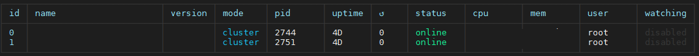
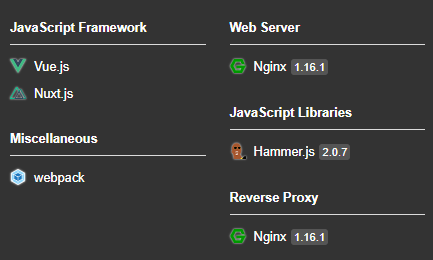

### PM2란?

PM2는 로드 밸런서가 내장 된 Node.js 애플리케이션의 프로덕션 프로세스 관리자이다. 응용 프로그램을 영구적으로 유지하고 다운 타임 없이 다시 로드하여 일반적인 시스템 관리 작업을 용이하게 한다. Python에서 사용하는 gunicorn과 비슷한 역할을 한다. 다운 타임 없이 애플리케이션을 리로드 할 수 있고, 클러스터 모드로 시작해서 로드 밸런싱도 한다. 터미널 기반 모니터링도 지원하며 Node.js 애플리케이션에서 오류처리로 인해서 애플리케이션이 죽었을 때의 처리도 해주며, 부팅 시에 자동 실행 등 여러 가지 잡다한 것들을 처리하고 관리해준다.

Nuxt.js로 만들어진 애플리케이션을 프로덕션 환경에서 운영하기 위해서 필자는 PM2와 nginx을 사용했다. CentOS7 환경에서 운영했으며 .env 파일을 사용해서 개발서버, 운영서버 환경 구분과 `ecosystem.config.js`를 사용한 PM2 관리를 공유하려고 한다.

### PM2 설치 및 간단 사용법

```
npm install pm2 -g
```

PM2를 전역으로 설치한다. 설치를 끝냄과 동시에 PM2를 사용할 준비를 끝냈다.

```
pm2 start app.js
```

위 코드 한 줄만으로도 PM2에 해당 프로세스가 등록돼서 관리가 된다.

```
pm2 list
```

실행한 프로세스의 목록을 확인할 수 있다.

```
// pm2 info 0
pm2 info [id]
```

목록에 나오는 id 값을 이용해서 자세한 정보를 확인할 수 있다.

```
pm2 monit
```

PM2로 관리되는 프로세스들을 실시간으로 확인할 수 있다.

### ecosystem.config.js 사용

PM2에는 여러 옵션들이 있고 이 옵션들을 커맨드 라인에 일일이 적어서 실행을 하기에는 비효율적이다. `ecosystem.config.js`를 만들고 이 config 파일을 이용해서 PM2를 실행할 수 있다.

```javascript
module.exports = {
  apps: [
    {
      name: 'sample-app',
      // package.json에 정의된 npm run start를 실행하게 해서 PM2로 관리하게 한다.
      script: 'npm',
      args: 'run start',
      instances: 2,
      autorestart: true,
      watch: false,
      max_memory_restart: '1G',
      // 개발 환경에서 적용될 설정
      // pm2 start ecosystem.config.js
      env: {
        HOST: '0.0.0.0',
        PORT: 5000,
        NODE_ENV: 'development'
      },
      // 배포 환경에서 적용될 설정
      // pm2 start ecosystem.config.js --env production
      env_production: {
        HOST: '0.0.0.0',
        PORT: 5000,
        NODE_ENV: 'production'
      },
      output: './logs/console.log',
      error: './logs/consoleError.log'
    }
  ],

  deploy: {
    production: {
      // sample
      user: 'node',
      host: '123.12.123.1',
      ref: 'origin/master',
      repo: 'git@github.com:repo.git',
      path: '/var/www/production',
      'post-deploy':
        'npm install && pm2 reload ecosystem.config.js --env production'
    }
  }
}
```

`ecosystem.config.js`를 만들었다. 이에 `pm2 start ecosystem.config.js --env production`를 해서 실행을 해보면 아래의 이미지처럼 클러스터링 모드로 2개의 인스턴스가 PM2에 등록이 되어서 실행이 될 것이다.



다음은 Nuxt.js 내에서나 소스 내에서 개발 환경에 따른 환경변수를 사용하기 위함이다. 우리는 보통 개발, 운영에 따라서 환경변수를 다르게 해서 운영하고 싶을 것이다. `ecosystem.config.js`에서 개발환경에 따라서 NODE_ENV를 넘겨주었으니 저 환경변수에 따라 Node.js 또는 Nuxt.js에서 사용하는 환경변수를 달리 할 수 있다.

필자는 Nuxt.js를 배포하고 있었으니 Nuxt.js에서 예를 들어서 설명하겠다.

### env로 환경변수 사용

먼저 config 폴더 경로에 `.env.development`, `.env.production`을 만든다.

```
REST_API=http://localhost:3000/api
```

개발, 운영환경에 다르게 적용하고 싶은 환경변수를 위의 예제처럼 넣는다.

```javascript
const envPath = `config/.env.${process.env.NODE_ENV || 'development'}`
require('dotenv').config({ path: envPath })

// 중략...
axios: {
  retry: true,
  baseURL: process.env.REST_API
},
```

개발, 운영환경에 따라서 axios에서의 `baseURL`을 다르게 해주었다. 위의 예시처럼 `process.env`로 환경 변수를 사용할 수 있다. config폴더는 예를 든 것이기 때문에 각자 원하는 폴더의 이름으로 해서 사용하면 된다.

```
WARN No .env file found in
```

위의 오류가 혹시라도 뜬다면, 프로젝트 경로에다가 빈 .env 파일을 만들어주면 해결이 된다.

### Nginx 사용하기

이제 CentOS7 환경에서 Nginx를 웹서버로 사용하여 Node.js 애플리케이션을 운용하는 방법에 대해서 설명하려 한다.

```
yum install nginx
```

CentOS7에서 Nginx를 설치한다. CentOS용 Nginx는 Ubuntu Linux의 사용자 정의와 같이 사용 가능하고 활성화된 사이트에 대한 폴더가 없다.

```
mkdir -p /etc/nginx/sites-enabled
mkdir -p /etc/nginx/sites-available
```

sites-enabled, sites-available 폴더를 직접 만들어준다. 이제 sites-enabled에서 설정할 내용을 Nginx에서 사용할 수 있도록 해야 한다.

```
vi /etc/nginx/nginx.conf
```

```
include /etc/nginx/conf.d/*.conf;
```

위 라인을 찾는다.

```
include /etc/nginx/sites-enabled/*;
server_names_hash_bucket_size 64;
```

이 두 라인을 넣는다. 이제 sites-enabled 경로에 있는 파일들은 Nginx의 설정에 사용한다.

```
vi /etc/nginx/sites-enabled/labeling-app
```

그리고 이제 Nginx가 Nuxt.js 애플리케이션으로 리디렉션 하도록 지시하는 파일을 만들 것이다.

```
upstream sample-app {
        server                  127.0.0.1:5000;
}
  
server {
        listen                  80;
        server_name             127.0.0.1;
        
        access_log  /var/log/nginx/access.log;
        error_log  /var/log/nginx/error.log;
    
        location / {
                proxy_set_header        Host                    $host;
                proxy_set_header        X-Real-IP               $remote_addr;
                proxy_set_header        X-Forwarded-For         $proxy_add_x_forwarded_for;
                proxy_set_header        X-Forwarded-Proto       $scheme;
  
                proxy_pass              http://sample-app;
        }
}
```

```
# 서버 부팅시 Nginx 서비스 시작하도록 설정
systemctl enable nginx

# Nginx 서비스 시작
systemctl start nginx
```

이제 Nginx를 웹서버로 사용해서 Node.js로 만든 애플리케이션을 운영할 수 있다. 여기서 Helmet을 사용해서 웹 취약성으로부터 앱을 보호할 수도 있다. 이 포스트에서는 PM2와 Nginx를 중점으로 설명하는 글이기 때문에 Helmet은 다음에 기회가 되면 설명하도록 하겠다.



---
### Reference

https://www.npmjs.com/package/pm2

https://massivcode.com/5

https://nansystem.com/nuxt-dotenv-module-pitfall/

https://valuefactory.tistory.com/165

https://lowendbox.com/blog/how-to-set-up-a-node-js-application-for-production-on-a-centos-7-vps/