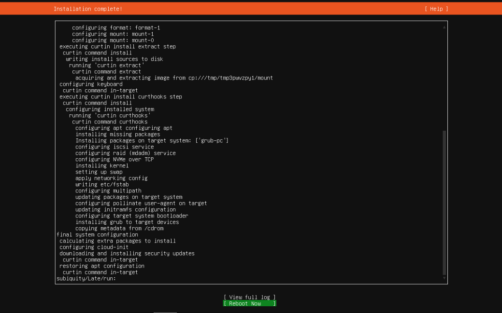

이 글은 Proxmox VE 8.4.1 버전을 기준으로 작성되었습니다.

Proxmox에서 VM을 생성하고, Ubuntu 24.04 LTS를 설치하는 과정을 단계별로 안내합니다.

설치가 완료된 후에는 Ubuntu의 메모리와 디스크 확인 및 OpenSSH 서버 설치 방법도 함께 소개합니다.

## Proxmox에 ISO 이미지 업로드

Ubuntu 24.04.2 LTS 버전을 설치할 예정이기 때문에 [카카오의 Ubuntu 미러 사이트](https://mirror.kakao.com/ubuntu-releases/)에서 해당 버전의 ISO 파일 링크를 찾아 복사합니다.


서버 용도로 사용할 계획이라면, GUI 없이 가볍게 설치할 수 있는 Server install image를 사용하는 것을 권장드립니다.
반면, 그래픽 기반의 데스크탑 환경이 필요한 경우라면, Desktop image를 선택해도 괜찮습니다.

Proxmox 왼쪽 메뉴에서 local 저장소를 클릭한 다음, 우측에 있는 ISO Images 탭으로 이동합니다.


상단에 있는 Download from URL 버튼을 누르고, 복사한 ISO 파일 링크를 붙여 넣습니다.

이후 Query URL 버튼을 눌러 링크를 확인한 뒤, Download 버튼을 클릭하면 ISO 파일 다운로드가 시작됩니다.


다운로드가 완료되면 확인할 수 있습니다.

## Proxmox Create VM

Proxmox 우측 상단에 Create VM 버튼을 누릅니다.


`General` 탭에서는 생성할 VM의 이름을 입력합니다.
아래 이미지에서는 예시로 `Blocky`라는 이름을 사용했지만, 본인의 목적에 맞게 자유롭게 설정하시면 됩니다.

또한, Advanced 항목을 펼쳐서 `Start at boot`를 체크해 주세요. 이 옵션은 Proxmox 부팅 시 VM이 자동으로 시작되도록 설정합니다.


`OS` 탭에서는 방금 업로드한 ISO 이미지를 선택합니다.
저는 Ubuntu 24.04.2 LTS ISO를 선택했습니다.


`System` 탭에서는 `Qemu Agent`를 체크합니다.

QEMU Guest Agent는 Proxmox가 가상 머신의 IP, 상태, 시간 등을 확인하고 일부 작업을 제어할 수 있게 해주는 도구입니다.


`Disks` 탭에서는 `Cache`를 `Write back`으로 선택합니다. 저는 디스크 용량이 많이 필요하지 않기 때문에 10GiB로 설정했습니다.


`CPU` 탭에서는 VM에 할당할 코어 수를 설정합니다. 저는 `Cores`에 `1`을 입력해, 1개 코어만 할당했습니다.


`Memory` 탭에서는 VM에 할당할 메모리를 설정합니다. 예시에서는 `2048MiB`로 설정했으며, 필요에 따라 조정하셔도 됩니다.


`Network` 탭에서는 기본값을 사용합니다.


`Confirm` 탭에서는 지금까지 설정한 내용들을 한눈에 확인할 수 있습니다.  
문제가 없다면 `Finish` 버튼을 클릭해 VM을 생성합니다.

또한, `Start after created` 옵션을 체크하면 생성이 완료된 후 VM이 자동으로 시작됩니다.  
저는 VM이 바로 실행되도록 이 옵션을 활성화했습니다.


# Ubuntu 24 설치 과정

Ubuntu 24.04 LTS 설치는 대부분 기본 설정으로 진행하면 됩니다.  
따라서 **별도의 설명이 없는 화면은 기본값 그대로 따라 넘어가시면 되고**, **설명이 붙은 화면만 주의 깊게 확인**하시면 됩니다.

또한, 설치 중 입력한 대부분의 설정은 나중에 변경할 수 있으니 중간에 실수하셔도 너무 걱정하지 않으셔도 됩니다.  
단, **비밀번호만큼은 꼭 기억해 주세요.**


네트워크 설정 화면입니다.

별도의 설정이 필요한 경우 수동으로 IP를 지정할 수 있지만, 일반 가정용 공유기(ipTIME 등)를 사용하는 환경이라면 자동으로 IP가 할당되므로 따로 설정하지 않으셔도 됩니다.


기본 미러 주소는 보통 `http://kr.archive.ubuntu.com/ubuntu/` 로 설정되어 있습니다. 저는 조금 더 빠른 다운로드 속도를 위해 `http://mirror.kakao.com/ubuntu/` 로 변경했습니다.


Ubuntu에 접속할 사용자 계정과 비밀번호를 설정합니다.  
이 정보는 추후 SSH 접속이나 sudo 명령 실행 시 사용되므로 **절대 잊어버리면 안 됩니다.**


OpenSSH는 우분투 설치 후 직접 설치할 예정이기 때문에 이 단계에서는 체크하지 않았습니다. 기본적으로도 선택되어 있지 않으므로 그대로 넘어가시면 됩니다.


원하는 서비스들은 직접 설치하기 위해서 별도로 선택하지 않고 다음 단계로 넘어갔습니다.




설치가 완료되면 `Reboot Now`를 선택해 시스템을 재시작합니다.  
재부팅 후에는 아래와 같은 로그인 화면이 나타납니다.

이때, 앞서 생성한 사용자 이름과 비밀번호를 입력해 Ubuntu에 로그인하시면 됩니다.  
이제 Ubuntu 설치가 완료되었습니다.


# 설치 후 점검 및 설정

접속 후, 아래 명령어로 시스템이 정상적으로 설치되었는지 간단히 확인합니다.

```shell
# 메모리 확인
free -h

# 디스크 사용량 확인
df -h
```

만약 디스크 사용량이 비정상적으로 적게 표시된다면, 논리 볼륨(LVM)이 디스크 전체를 사용하지 않고 있을 수 있습니다.

아래 명령어를 통해 남은 공간을 모두 확장할 수 있습니다:
```shell
# 디스크 정보 갱신
sudo partprobe

# 현재 LVM 물리 볼륨 확인 (여기서 /dev/sda3 같은 경로 확인)
sudo pvs

# 물리 볼륨 크기 반영
sudo pvresize /dev/sda3

# 논리 볼륨 확인
sudo lvs

# 논리 볼륨 확장
sudo lvextend -l +100%FREE /dev/ubuntu-vg/ubuntu-lv

# 파일시스템 확장
sudo resize2fs /dev/ubuntu-vg/ubuntu-lv
```

이후 다른 PC나 노트북에서 원격 접속이 가능하도록 OpenSSH 서버를 설치합니다.

```shell
# 1. 패키지 목록 갱신 및 보안 패치 적용
sudo apt update && sudo apt upgrade -y

# 2. OpenSSH 서버 설치
sudo apt install -y openssh-server

# 3. 방화벽 설정
sudo ufw allow ssh

# 4. 현재 IP 주소 확인
# `ip a` 명령어를 실행하면 여러 IP가 표시됩니다.  
# 이 중 `inet`으로 시작하는 `192.168.x.x` 또는 `10.x.x.x` 형식의 IP가  
# 실제 접속 가능한 내부 주소입니다.
# 같은 네트워크에 연결된 다른 PC나 노트북에서 이 IP로 SSH 접속이 가능합니다.
ip a
# 또는 간결하게 보기 위한 명령
ip -brief address show
```

### Reference

https://svrforum.com/svr/588092

https://blog.ny64.kr/posts/creating-proxmox-vm/
