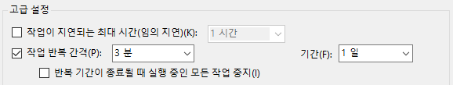
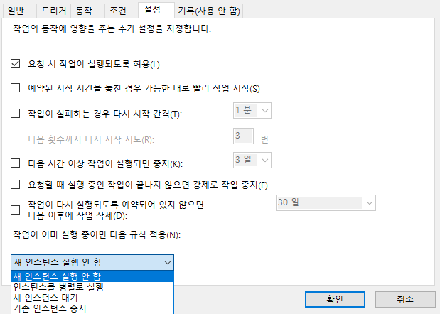

Windows에서 Selenium을 이용해서 Chrome으로 웹 스크래핑(크롤링)을 개발하고 몇 개월 간 운영하면서 겪은 문제들과 고려해야 할 점을 설명하려고 한다. 이 글에서는 실제로 도움이 될 만한 것들을 위주로 설명하고 Selenium 사용법과 기초적인 부분들을 생략한다.

## Browser Driver와 Browser 버전

Selenium을 사용해서 개발을 하면 FireFox와 Chrome 중에서 선택을 하게 된다. 그리고 선택을 하게 되면 해당 브라우저와 브라우저를 제어하는 드라이버를 다운로드하여서 만들어야 한다.
드라이버 버전이 맞지 않으면 실행이 되지 않거나 오류가 발생하기 때문에 드라이버 버전을 브라우저 버전에 맞추어야 한다.

ChromeDriver와 Chrome은 동일한 버전 번호 체계를 사용한다. 각 버전의 ChromeDriver는 주 버전, 부 버전 및 빌드 버전 번호가 일치하는 Chrome을 지원한다.

[특정 크롬 버전에 맞는 ChromeDriver 버전을 선택하기 위한 가이드](https://sites.google.com/a/chromium.org/chromedriver/downloads/version-selection)

Chrome을 사용했을 때, Chrome은 브라우저에 자동 업데이트가 활성화되어 있다. Chrome의 버전이 자동으로 최신 버전을 다운로드하게 되는데 이 부분을 비활성화해야 한다. 운영환경에서 갑자기 Chrome의 버전이 올라가서 작동이 되지 않는 불상사를 피할 수 있다.

`C:\Program Files (x86)\Google\Update`에 `GoogleUpdate.exe`라는 실행파일이 보이는데 이 파일의 이름을 변경해주면 Chrome은 업데이트 실행파일을 찾지 못하고 버전을 올리지 못한다.

그리고 Chrome의 버전이 올라가면서 문제점들이 생긴다면 이전 버전의 Chrome과 Chrome Driver를 사용하는 것도 하나의 방법이다.

[Chrome 과거 버전 설치하기](https://www.slimjet.com/chrome/google-chrome-old-version.php)

[Chrome Driver 설치하기](https://chromedriver.chromium.org/downloads)

드라이버를 설치하는 페이지에 가보면 드라이버 버전 별로 오류 픽스 내용이 적혀있다.

Selenium을 사용한 프로그래밍에서는 Browser Driver와 Browser가 정말 중요하다.

## Sentry로 로깅

모든 프로그램에서 로깅과 모니터링은 항상 중요하며 Selenium을 사용한 브라우저 자동화에서도 마찬가지이다. 오류가 발생하면 보통 프로그램이 종료되고 그러면 자동화는 멈추게된다. 페이지를 수집을 하는 역할을 하고 있었다면 수집이 멈추는 불상사가 발생하게 된다. 오류를 수집하고 해당 오류를 고치면서 더 완성도있게 해야 한다. 그래서 필자는 Sentry를 이용해서 로깅을 하였다.

Flask에서는 Sentry 적용이 간단했다.
닷넷과 마찬가지로 Init만 해주면 알아서 처리를 해주었는데 별다른 프레임워크를 사용하지 않는 Python 프로그래밍에서는 Sentry를 사용할 때, Init 이후에 오류 메시지를 보내는 처리를 또 해야한다.

```python
import sentry_sdk

# Sentry 세팅
sentry_sdk.init(
    dsn=config.SENTRY['dsn'],
    environment=config.SENTRY['environment'],
)

try:
    # ...
except Exception as ex:
    sentry_sdk.capture_message(str(ex))
```

위의 코드처럼 처리를 하면 Sentry에 정상적으로 오류 메시지를 확인하였다.
여담으로 Flask에서는 아래처럼 Sentry를 사용하겠다고 선언만 해주면 `try - except`를 해주지 않더라도 오류가 다 핸들링되었다.

```python
sentry_sdk.init(
    dsn=app.config["SENTRY_DSN_KEY"],
    integrations=[FlaskIntegration()],
    environment=app.config["SENTRY_DSN_ENV"],
)
```

## Slack으로 알림 받기

중요한 오류로 크롤러가 완전히 종료되고 그 이후에 수집을 못하게 되는 상황이 올 수 있다. 그러면 중요한 오류가 왔는지 개발자가 알 수 있어야 하는데 Slack을 이용해서 알 수 있다.

먼저 Slack에서 Bot을 만들고 추가해주어야 한다.

01. https://api.slack.com/ 에서 Start Building 버튼을 클릭한다.
02. App Name을 추가하고 해당 봇의 정보를 설정한다.
03. App 메뉴에서 Bot Users를 선택하고 Bot을 추가해준다.
04. OAuth & Permissions에서 Install App to Team를 클릭하고 설정해준다.
05. 생성된 Token(Bot User OAuth Access Token)을 확인하고 복사한다.

Slack의 채널에 들어가서 Bot을 추가해준다. 추가하는 방법은 추가를 원하는 채널에서 Add App 버튼을 클릭해서 아까 추가한 App Name을 찾아서 추가해준다.

이제 Slack에 Bot이 추가되었으며 Python에서 Slack을 연동하기 위해서는 [slacker](https://github.com/os/slacker/)를 사용한다.

```
$ pip install slacker
```

slacker를 설치한다. 사용법은 Slack에 접근할 수 있는 token과 메시지 내용과 채널만 알고 있으면 된다.

```python
from slacker import Slacker

slack = Slacker(config.SLACK['token'])

try:
    # ...
except Exception as ex:
    slack.chat.post_message(config.SLACK['channel'], str(ex))
```

attachments 인자를 이용해서 Bot의 메시지를 꾸며줄 수도 있다.


## 윈도우 작업 스케줄러

Windwos 환경에서 Selenium을 사용해서 만든 크롤러를 운영하였는데 윈도우 작업 스케줄러에 크롤러를 등록해서 사용하였다. 처음 인수인계를 받았을 때는 프로그램이 오류로 종료되었을 때에 대한 조치가 부족했다.

이 부분은 작업 스케줄러의 `트리거`를 이용하면 깔끔하게 해결할 수 있다. 예를 들어서 아래처럼 설정을 한다고 가정하고 설명한다.





위 설정을 말로 풀이하면 크롤러가 실행되고 있는데 `3분` 간격으로 크롤러를 실행하도록 요청한다. 크롤러가 실행 중이라면 새 요청으로 인한 프로그램 실행을 하지 않도록 한다.

이렇게 하면 크롤러는 `3분` 간격으로 계속해서 작업 요청을 받게 되고 크롤러가 실행 중이라면 이 작업 요청을 무시하지만 크롤러가 예기치 못한 상황으로 종료되었다면 이 작업 요청을 받고 다시 실행된다.

이 기능을 잘 이용하고 오류 처리를 시나리오를 만들어서 잘 커버한다면 무중단으로 크롤러를 운영할 수 있는 것이다.

## 마치며

자잘한 팁으로는 Selenium으로 웹 페이지를 호출하고 예기치 못한 상황으로 페이지의 로딩이 느릴 때 로딩을 기다리고 CSS를 선택하거나, 웹 드라이버를 종료할 때는 `.close()`보다는 `.quit()`을 사용해서 안전하게 종료를 하거나, Windows에서 `Chorme Headless`옵션은 예측할 수 없는 CPU 및 메모리 소비가 있기 때문에 사용을 자제하거나 하는 방법들이 있다.

예기치 못한 상황에서 크롤러가 종료되었을 때 어떻게 대처를 해야 하는지와 Chrome이 갑자기 업데이트되어서 기존의 ChromeDriver와 호환성이 맞지 않아서 실행이 되지 않는 상황에 대비하거나 잘못된 Selenium 사용으로 인해서 메모리가 누수되지 않도록 해야 한다.

Selenium으로 프로그래밍을 해서 결과물을 만드는 것은 쉽지만 이 만들어진 프로그램이 완성도 있게 무중단으로 계속해서 운영하기 위해서는 여러가지를 고민하고 여러 시나리오에 대응하는 자세로 프로그래밍을 해야 한다.

### Reference
https://sites.google.com/a/chromium.org/chromedriver/downloads/version-selection  
https://docs.sentry.io/platforms/python/  
https://www.fullstackpython.com/blog/build-first-slack-bot-python.html