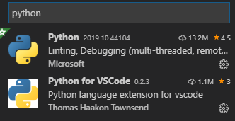
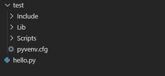
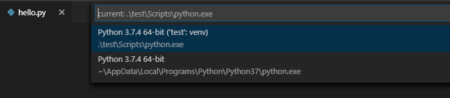
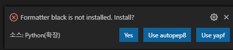
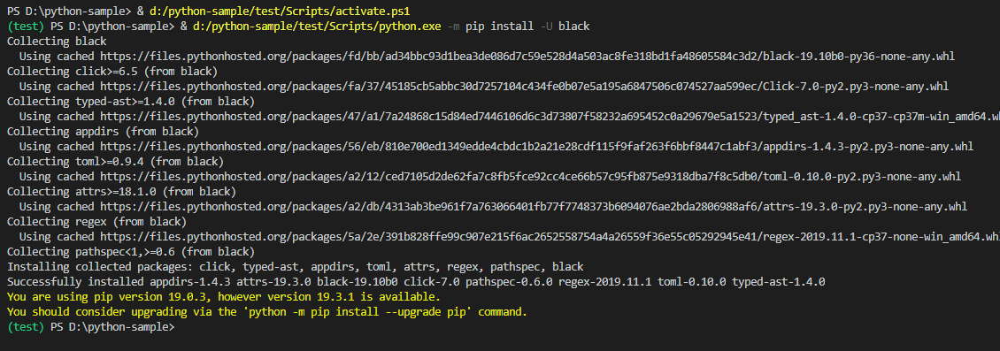
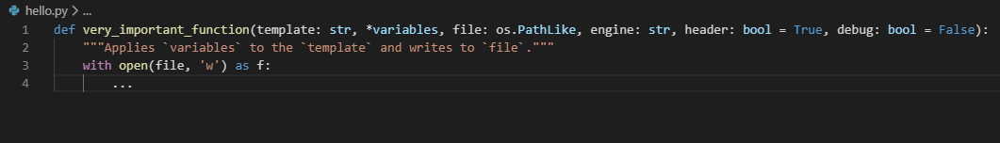
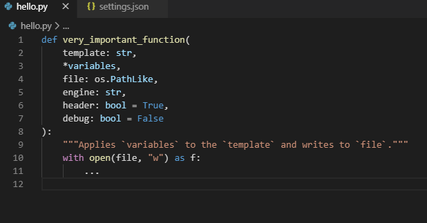
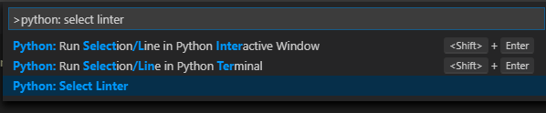
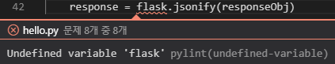

Python을 시작하는데 대부분의 사람들이 Pycharm을 사용하는 것 같다. 필자는 Visual Studio Code에서 Python을 이용해서 개발을 하는데 파이썬 가상 환경 venv, Python 스타일 가이드 Pylint, Black이라는 Python 코드포매터를 Visual Studio Code에서 어떻게 세팅을 하고 사용하는지 공유하려고 한다.

가장 먼저 Visual Studio Code의 Extensions에서 python을 검색해서 Python, Python for VSCode를 설치한다.



### 가상 환경 구성

Python 3.3버전 이후 기본 모듈에 포함된 venv를 이용해서 독립된 가상 환경을 만든다. 가상 환경을 만드는 이유는 파이썬에서는 하나의 라이브러리에 대해서 하나의 버전만 설치가 가능한데, 여러 개의 프로젝트를 진행하다 보면 이는 문제가 되고, 작업을 바꿀 때마다 재설치를 할 수도 있다. 이런 문제를 해결하기 위해서 독립된 가상 환경을 제공한다.

필자는 Flask로 프로젝트를 진행하여서 가상 환경의 이름을 Flask로 했다. 이 글에서는 가상 환경의 이름을 `test`로 해서 진행을 한다.

```
python -m venv test
```



프로젝트에 `test`라는 이름의 폴더가 추가되었다.



Visual Studio Code에서 왼쪽 아래에 Python을 클릭하면 test라는 이름의 Python 가상 환경이 설치돼있는 것을 확인할 수 있다. 가상 환경 터미널을 Visual Studio Code에서 사용하려면 단축키 ``` Ctrl + Shift + ` ```를 이용하면 된다.

### Black (or autopep8, yapf)

코드 컨벤션을 위한 Python의 black이라는 도구와 Pylint를 이용한 환경을 구성해보도록 한다. 필자는 프로젝트를 진행할 때 코드 컨벤션은 여러 명이 협업을 하는데 필수라고 생각하기 때문에 혼자 진행하는 프로젝트더라도 인수인계를 받을 뒷사람을 위해서 정하고 작업을 시작하는 편이다.

Nuxt.js로 프로젝트를 진행 당시 자동으로 코드포매터 및 오류 검사를 해주었기 때문에(create-nuxt-app이 참 편하긴 했다😁) Python에서도 이와 비슷한 도구가 있을 것이라고 생각해서 black을 찾게 되었다. 그리고 빌드나 컴파일 시 에러 외에 추가로 자잘한 오류 검사를 할 수 있는 도구를 Lint라고 하는데 필자는 Pylint를 사용하기로 했다.

자세한 내용은 city7310님이 작성한 [파이썬 코드 스타일 이야기 - (1) Style Checker, Formatter들 구경하기](https://velog.io/@city7310/%ED%8C%8C%EC%9D%B4%EC%8D%AC-%EC%BD%94%EB%93%9C-%ED%8F%AC%EB%A7%A4%ED%84%B0-%EC%9D%B4%EC%95%BC%EA%B8%B0-5wjxdei9iv)를 읽어보면 될 듯 하다.

필자는 Star수가 가장 많은 Black을 선택했다!

단축키 `Ctrl + P`를 이용해서 `settings.json`을 열어준다.

```json
{
    "python.pythonPath": "test\\Scripts\\python.exe"
}
```

처음 들어가면 이 옵션이 1개만 있을 것이다. 아래의 옵션들을 추가로 작성해준다.

```json
{
    "python.pythonPath": "test\\Scripts\\python.exe",
    "python.formatting.provider": "black",
    "python.formatting.blackArgs": [
        "--line-length",
        "100"
    ],
    "editor.formatOnSave": true
}
```

`python.formatting.provider`를 black으로 지정해주는 것이 중요하다. `autopep8`, `yapf`를 사용하고 싶다면 저기에 적어주면 적어준 공급자에 맞게 Visual Studio Code는 설치 및 활성화를 도와준다!

`formatOnSave`는 저장시에 자동으로 `format`을 적용한다는 옵션이다. 그리고 코드를 수정한 이후에 저장을 해주면 아래와 같은 알림이 나온다.



black이 설치가 되어 있지 않으니 설치하시겠습니까? 라고 묻는다. Yes를 선택해주면 Visual Studio Code가 친절하게 설치를 해준다.



이제 black이 잘 적용이 되었는지 확인하기 위해서 [psf/black](https://github.com/psf/black)에 있는 테스트 코드를 가지고 와서 직접 테스트를 해보았다. 아래 사진처럼 정리가 되지 않은 코드를 작성한다.

```python
def very_important_function(template: str, *variables, file: os.PathLike, engine: str, header: bool = True, debug: bool = False):
    """Applies `variables` to the `template` and writes to `file`."""
    with open(file, 'w') as f:
        ...
```



그리고 저장을 누르는 동시에 자동으로 아래처럼 코드가 이쁘게 정리된다.

```python
def very_important_function(
    template: str,
    *variables,
    file: os.PathLike,
    engine: str,
    header: bool = True,
    debug: bool = False,
):
    """Applies `variables` to the `template` and writes to `file`."""
    with open(file, "w") as f:
        ...
```



black이 적용되었다는 것을 확인할 수 있다. [psf/black](https://github.com/psf/black)에서 그 외 자세한 옵션들을 확인하실 수 있다.

### Pylint

먼저 Python 가상 환경에서 `pip install pylint`로 Pylint 설치한다. 그리고 `Ctrl + Shift + P`로 커맨드 명령 프롬프트을 연 이후에 `Python: Select Linter` 타이핑하거나 선택한다.



Pylint의 경우 아래의 옵션들이 `settings.json`에 자동으로 생성된다.

```json
"python.linting.pylintEnabled": true,
"python.linting.enabled": true
```

`lintOnSave` 옵션을 이용해서 저장 시에 자동으로 검사하도록 설정할 수 있다.
Visual Studio Code의 linting setting을 확인하니 `lintOnSave`의 default 값은 `true`라고 한다.

```json
"python.linting.lintOnSave": true,
```

필자는 테스트를 위해서 일부러 오류가 나는 코드를 타이핑한 이후에 저장을 해보았다. 아래와 같이 Pylint가 경고를 표시해준다.



### 마치며

Visual Studio Code를 이용하지 않는다고 하더라도 방법은 다르지만 Pycharm에서도 적용 가능하다. 이런 도구들은 처음 설치가 귀찮지만 이후에 엄청나게 편하고 도움이 된다는 사실을 알고 있다.

일관된 코드 스타일을 유지해주고 자잘한 오류들을 자동으로 검사해주기 때문에 팀이 협업을 하는데 원활하고 팀의 생산성이 올라가는데 도움을 주기 때문이다.

이 글에서는 가상 환경을 만드는데 venv, black과 Pylint를 사용하였지만 각자 원하는 환경을 이용해서 본인에 맞는 또는 팀에 맞는 개발환경을 구축하면 될 것 같다.

---
### Reference

https://suwoni-codelab.com/python%20%EA%B8%B0%EB%B3%B8/2018/03/21/Python-Basic-Virtual-Environment/

https://velog.io/@city7310/%ED%8C%8C%EC%9D%B4%EC%8D%AC-%EC%BD%94%EB%93%9C-%ED%8F%AC%EB%A7%A4%ED%84%B0-%EC%9D%B4%EC%95%BC%EA%B8%B0-5wjxdei9iv

https://code.visualstudio.com/docs/python/editing

https://code.visualstudio.com/docs/python/linting