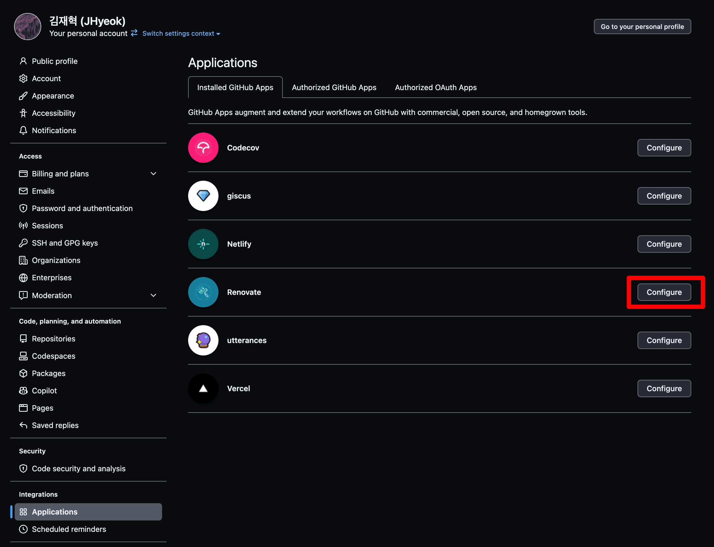
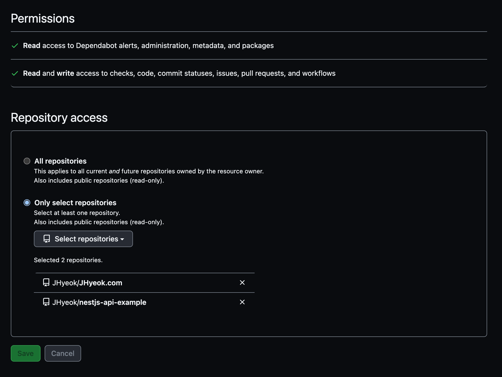
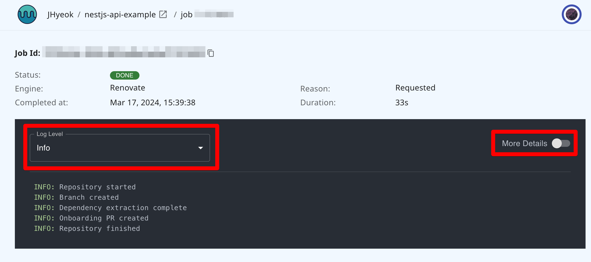
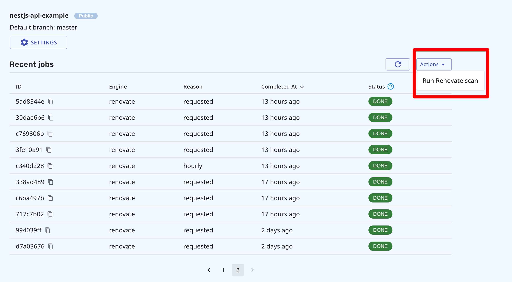
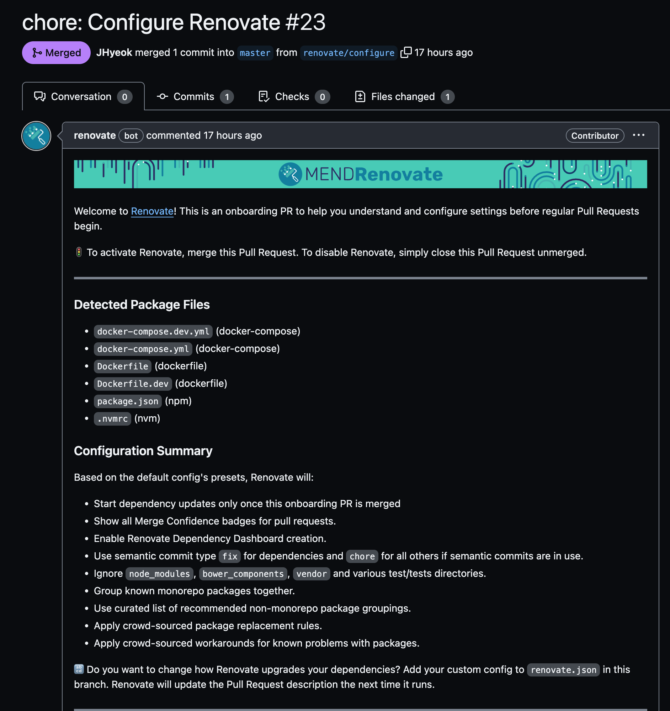
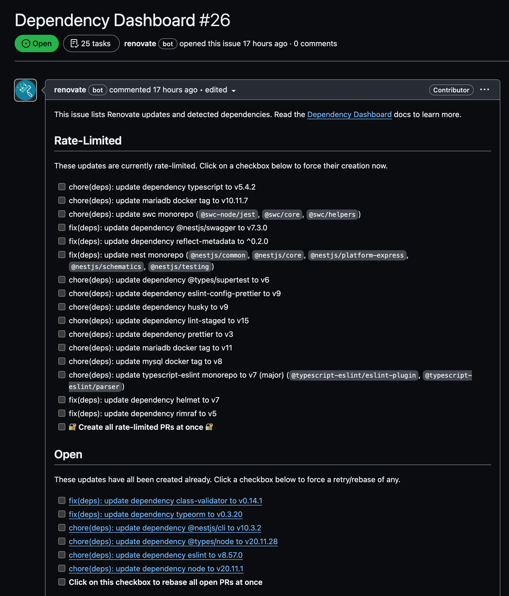
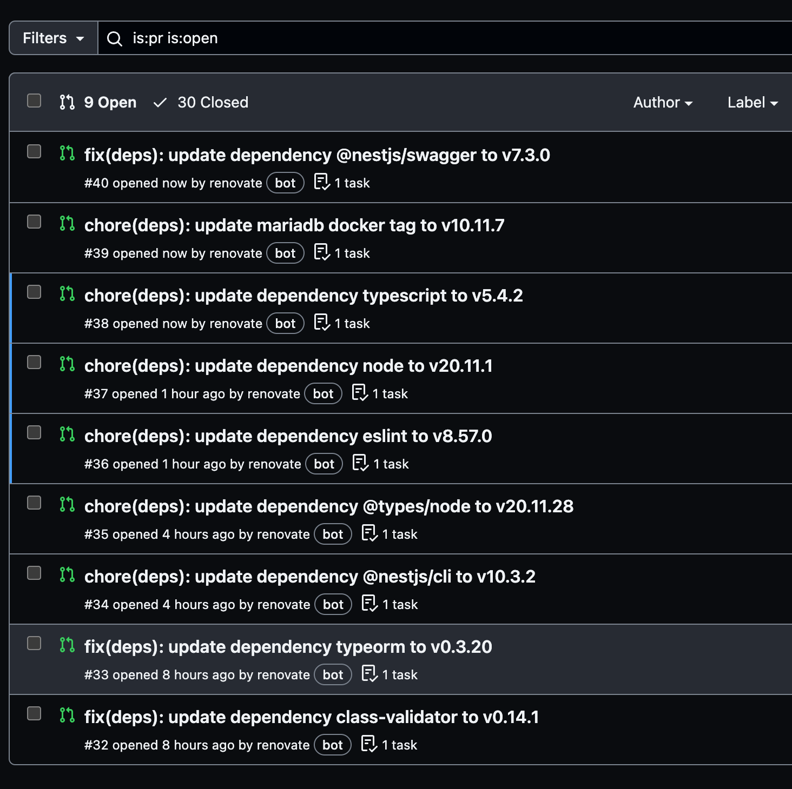

Renovate이 만든 업데이트 PR은 [여기](https://github.com/JHyeok/nestjs-api-example/pulls?q=renovate)에서 확인할 수 있습니다.

## Renovate

Renovate는 프로젝트의 의존성을 자동으로 업데이트해 주는 도구이다.

설치하고 사용하는 방법은 간단하다. Renovate에서 제공하는 [튜토리얼](https://github.com/renovatebot/tutorial)이 따로 있기 때문에 해당 페이지를 보고 따라 하면 된다.

[Renovate 앱 설치](https://github.com/apps/renovate)의 설치 과정에서 Repository에 액세스를 구성할 수 있는데, 처음 설치하는 과정에서 설정할 수도 있지만, 잘못 설정했거나 설치 이후에 새로운 Repository를 추가하고 싶을 수 있다.

그런 경우에는 GitHub에 설치된 Apps를 관리하는 [페이지](https://github.com/settings/installations)로 가서 액세스를 구성할 수 있다.

처음에 설치를 할 때, `All repositories`를 선택했는데 다음과 같이 다시 구성을 하거나, 새로운 Repository를 추가할 수 있다.

그리고 [https://developer.mend.io](https://developer.mend.io/)에서 Renovate 옵션을 설정하거나, Renovate 로그를 확인할 수 있다. Job 로그는 로그 레벨을 Info, Debug로 설정해서 볼 수 있고, 자세한 정보 또는 간단한 정보로 설정해서 로그를 볼 수 있다. 다음 로그는 수동으로 온보딩 PR을 만든 Job 로그이다.

Renovate를 설치하면 Repository에 `Configure Renovate`라는 이름의 온보딩 PR이 자동으로 만들어져야 하는데 나의 경우에는 만들어지지 않았다. 만약 온보딩 PR이 만들어지지 않는다면 `Actions`의 `Run Renovate Scan`을 사용해서 수동으로 시작할 수 있다.

스캔을 시작한 이후에는 다음과 같은 온보딩 PR이 만들어진다.

온보딩 PR에서는 `renovate.json` 파일을 생성한다.
- Repository의 의존성 상태를 보여주는 대시보드를 생성할 수 있다.
- PR은 시간당 2개씩 생성된다.
- 동시에 열려있는 Renovate PR은 10개로 제한된다.

다음은 기본 구성의 일부이며, `renovate.json` 파일을 수정해서 구성을 변경할 수 있다.

자세한 내용은 [Renovate Docs - Configuration Options](https://docs.renovatebot.com/configuration-options/)를 참고하면 된다.

## Dependency Dashboard

의존성 대시보드는 Repository의 General의 Features에서 Issues가 활성화되어 있으면 사용할 수 있다.

Rate-Limited는 속도 제한 설정에 의해 차단된 PR들이다. 체크박스를 체크하면 강제로 생성할 수 있다.

Open은 열려있는 PR들이다. 해당 PR을 재시도하거나 리베이스 하려면 체크박스를 체크하면 되고, 열려 있는 모든 PR을 한 번에 리베이스 할 수도 있다.

시간당 2개씩의 제한이 있지만, Rate-Limited에서 `fix(deps): update dependency @nestjs/swagger to v7.3.0`을 체크하고 강제로 PR을 생성한 모습이다.

## 마치며

의존성을 업데이트하는 PR들이 Renovate에 의해서 만들어지면서, 개발자는 업데이트된 내용을 확인하고, PR을 머지하거나 닫을 수 있다.

PR이 만들어지면 빌드와 테스트가 실행되도록 하면 더 효율적으로 사용할 수 있다.

### Reference

[renovatebot/tutorial](https://github.com/renovatebot/tutorial)

