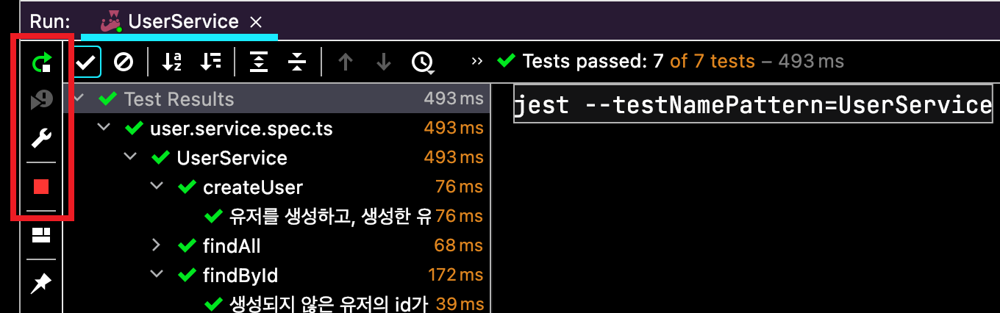
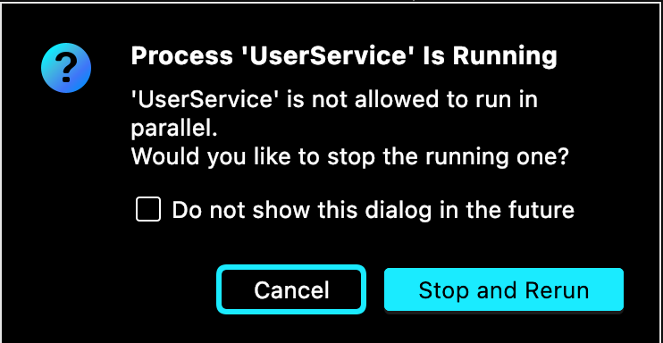
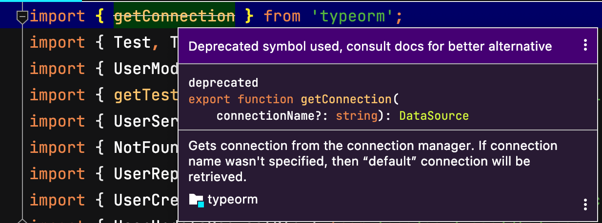
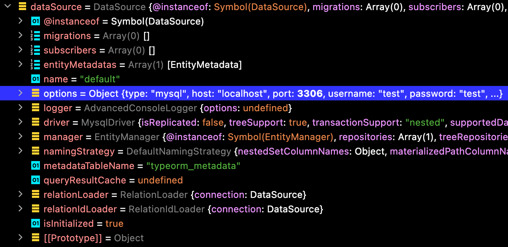
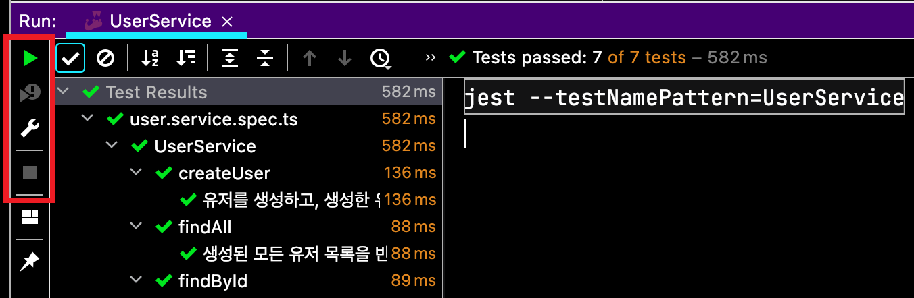

이 글에서는 TypeORM의 Patch 버전을 생략합니다.

코드는 [Github](https://github.com/JHyeok/nestjs-api-example/blob/master/test/unit/service/user.service.unit.spec.ts)에 있습니다.

## TypeORM 0.3에서의 변화

TypeORM의 버전이 0.2에서 0.3으로 올라가면서 많은 변경사항들이 있었다. [여기](https://github.com/typeorm/typeorm/releases/tag/0.3.0)에서 주요 변경사항들을 확인할 수 있다. 특히 NestJS를 사용했다면 TypeORM 버전을 업그레이드했을 때 많은 오류를 만났을 것 같다.

NestJS에서 TypeORM을 사용할 때 Repository 클래스를 확장해서 Custom Repository를 사용했다면 `@EntityRepository` 데코레이터를 많이 사용했을 것이다. 그런데 이번에 TypeORM 0.3부터는 해당 데코레이터가 deprecated 되었다.

[How to workraound this TypeORM error, "EntityRepository is deprecated , use Repository.extend function instead"?](https://stackoverflow.com/questions/71557301/how-to-workraound-this-typeorm-error-entityrepository-is-deprecated-use-repo)

그래서 직접 커스텀 데코레이터를 만들어서 해결하거나 DataSource와 Repository를 `@Injectable()`을 사용하여 문제를 해결하는 것 같다.

이 글에서는 NestJS에서 데이터베이스를 사용해서 테스트 코드를 작성하는 경우에 데이터베이스 연결을 닫고 테스트를 종료하던 방식이 TypeORM 0.3 이후로 Connection이 DataSource로 변경되면서 사용을 못하게 되었기 때문에 다른 방법을 소개한다.

## 테스트에서 데이터베이스 연결을 닫지 않으면 무엇이 문제일까?

WebStrom에서는 데이터베이스 연결을 닫지 못하고 테스트를 정상적으로 종료하지 못하면 아래의 문제가 발생한다.





다시 테스트를 실행하려고 하면 프로세스가 실행 중이고 이 프로세스는 병렬로 실행할 수 없으니 기존 프로세스를 종료해달라고 한다.

그래서 기존에는 `afterAll`에서 테스트 케이스가 모두 끝나면 `await getConnection().close()`로 데이터베이스의 연결을 닫아서 테스트를 정상적으로 끝냈다.

## TypeORM 0.2

```typescript{17,18,19}
describe('UserService', () => {
  let sut: UserService;
  let userRepository: UserRepository;

  beforeAll(async () => {
    const module: TestingModule = await Test.createTestingModule({
      imports: [UserModule, getTestMysqlModule()],
      providers: [UserService, UserRepository],
    }).compile();

    sut = module.get<UserService>(UserService);
    userRepository = module.get<UserRepository>(UserRepository);
  });

  // ... 생략

  afterAll(async () => {
    await getConnection().close();
  });

  // ... 생략
});
```



하지만 `getConnection()`이 0.3 이후부터는 deprecated가 되었고 Connection을 가지고 와서 데이터베이스 연결을 종료할 수가 없다.

```
getConnection() is deprecated. To have a globally accessible connection, simply export your data source and use it in places you need it
```

NestJS에서 TypeORM 0.3을 사용한다면 아래의 방법으로 DataSource를 내보내고 사용할 수 있다.

## TypeORM 0.3

```typescript{19,20,21,22}
describe('UserService', () => {
  let sut: UserService;
  let dataSource: DataSource; /* 추가된 코드 */
  let userRepository: UserRepository;

  beforeAll(async () => {
    const module: TestingModule = await Test.createTestingModule({
      imports: [UserModule, getTestMysqlModule()],
      providers: [UserService, UserRepository],
    }).compile();

    sut = module.get<UserService>(UserService);
    dataSource = module.get<DataSource>(DataSource); /* 추가된 코드 */
    userRepository = module.get<UserRepository>(UserRepository);
  });

  // ... 생략

  afterAll(async () => {
    // await getConnection().close(); /* deprecated */
    await dataSource.destroy(); /* 추가된 코드 */
  });

  // ... 생략
});
```

모듈이 컴파일되면 `get()` 메서드를 사용해서 정적 인스턴스를 찾아서 가져올 수 있다.

그래서 TestingModule에서 `.get<DataSource>(DataSource);`로 DataSource를 사용할 수 있다.



DataSource를 확인해보면 테스트 용도로 만든 인스턴스가 맞는 것을 확인할 수 있다.

가져온 DataSource에서 destroy() 메서드를 사용해서 데이터베이스 연결을 종료할 수 있다.
아래에 정상적으로 테스트가 종료되는 모습이다.



> E2E 테스트에서는 NestApplication이 close() 메서드를 지원한다.

### Reference

[Testing | NestJS](https://docs.nestjs.com/fundamentals/testing)

[How to workraound this TypeORM error, "EntityRepository is deprecated , use Repository.extend function instead"?](https://stackoverflow.com/questions/71557301/how-to-workraound-this-typeorm-error-entityrepository-is-deprecated-use-repo)
