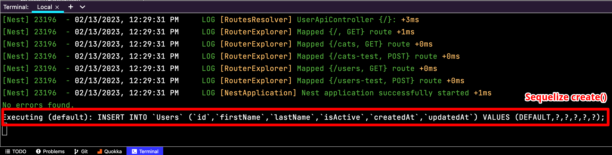
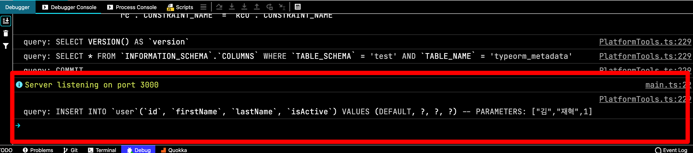

주로 Sequelize만 사용하다가 우연히 TypeORM에서 데이터베이스에 실행하는 쿼리들을 확인하고 SaveOptions으로 테스트를 했습니다.

아래의 테스트에 사용된 Sequelize의 버전은 6.28.0(@nestjs/sequelize v9.0.0), TypeORM의 버전은 0.3.10(@nestjs/typeorm v9.0.1)입니다.

## Sequelize의 create(), save()

Sequelize에서는 인스턴스를 데이터베이스에 실제로 저장하는데 주로 사용하는 메서드는 `create` 메서드와 `save` 메서드가 있다.

```ts{9}
@Injectable()
export class UserRepository {
  constructor(
    @InjectModel(User)
    private readonly user: typeof User,
  ) {}

  async create(): Promise<User> {
    const userRecord = this.user.build({ firstName: 'test', lastName: 'test', isActive: true }) // (1)
    return await userRecord.save();
  }
}
```

(1) `build` 메서드는 실제로 데이터베이스와 통신하지 않고 데이터베이스에 매핑할 수 있는 객체만 생성한다.

```ts{9,10,11,12,13}
@Injectable()
export class UserRepository {
  constructor(
    @InjectModel(User)
    private readonly user: typeof User,
  ) {}

  async create(): Promise<User> {
    return await this.user.create({
      firstName: 'test',
      lastName: 'test',
      isActive: true,
    });
  }
}
```

Sequelize에서 이 두 개의 코드는 쿼리도 같고 결과도 동일하다. `build` 메서드와 `save` 메서드를 결합하는 단일 메서드로 제공하는 것이 `create` 메서드이기 때문이다. 이런 이유로 개인적으로는 create 메서드를 주로 사용한다.




```json
{
  "id": 1,
  "firstName": "test",
  "lastName": "test",
  "isActive": true,
  "updatedAt": "2023-02-10T03:26:45.396Z",
  "createdAt": "2023-02-10T03:26:45.396Z"
}
```

## TypeORM의 save()

TypeORM도 마찬가지로 데이터를 저장하는데 `save` 메서드와 `insert` 메서드를 사용할 수 있다.

```ts
async createUser(requestDto: UserCreateRequestDto): Promise<User> {
  return await this.userRepository.save(requestDto.toEntity());
}
```

`save` 메서드는 엔터티가 저장되면 새로 생성된 id를 받게 된다고 한다. `save` 메서드는 전달한 동일한 개체의 인스턴스를 반환하며 개체의 새 복사본이 아니라 `id`를 수정하고 반환한다고 한다.


TypeORM의 `save` 메서드를 실행하고 로그를 살펴보면 트랜잭션을 사용하고 있다.

Sequelize에서는 default로 트랜잭션을 사용하지 않았기 때문에 TypeORM의 `save` 메서드에서도 트랜잭션을 사용하지 않도록 할 수 있다.

TypeORM의 SaveOptions을 사용하면 된다.


transaction을 `false`로 전달하면 된다.

```ts
async createUser(requestDto: UserCreateRequestDto): Promise<User> {
  return await this.userRepository.save(requestDto.toEntity(), { transaction: false });
}
```

사진처럼 트랜잭션을 사용하지 않는다.


하지만 CREATE 쿼리만 있는 것이 아니라 SELECT 쿼리도 있는데 SaveOptions의 reload를 사용해서 CREATE 쿼리만 사용하도록 할 수 있다.

```ts
async createUser(requestDto: UserCreateRequestDto): Promise<User> {
  return await this.userRepository.save(requestDto.toEntity(), { transaction: false, reload: false });
}
```



reload가 `true`, `false`에 따라서 반환되는 객체가 다르다.

```json
// reload가 true인 경우 (default)
{
  "firstName": "김",
  "lastName": "재혁",
  "isActive": true,
  "id": 1
}
```

reload 옵션이 `true`인 경우에는 엔티티가 저장되고 SELECT를 했기 때문에 id를 가져올 수 있는 반면에 reload 옵션이 `false`인 경우에는 SELECT를 하지 않으면 id를 가져올 수 없다.

```json
// reload가 false인 경우
{
  "firstName": "김",
  "lastName": "재혁",
  "isActive": true
}
```

기본적으로 reload 옵션은 활성화되어 있다.

## TypeORM의 insert()

이제 TypeORM의 `save` 메서드 대신에 `insert` 메서드를 사용해서 차이점을 알아보자. 아래에서 다루는 내용과 별개로 `save` 메서드는 엔티티를 변경해서 변경 사항을 저장하는데도 사용할 수 있다.

```ts
async createUser(requestDto: UserCreateRequestDto): Promise<InsertResult> {
  return await this.userRepository.insert(requestDto.toEntity());
}
```

기본적으로 `insert` 메서드는 트랜잭션을 사용하지 않는다. 하지만 `save` 메서드와 동일하게 SELECT 쿼리는 사용하고 있다.


반환값이 `save` 메서드와 다르게 InsertResult 타입을 반환하고 있는데 `save` 메서드를 사용할 때처럼 엔티티를 그대로 반환하거나 가공하려고 했다면 문제가 있을 수 있다.

```json
{
  "identifiers": [
    {
      "id": 5
    }
  ],
  "generatedMaps": [
    {
      "id": 5,
      "isActive": true
    }
  ],
  "raw": {
    "fieldCount": 0,
    "affectedRows": 1,
    "insertId": 5,
    "serverStatus": 2,
    "warningCount": 0,
    "message": "",
    "protocol41": true,
    "changedRows": 0
  }
}
```

## TypeORM의 Query Builder

SELECT 쿼리를 사용하지 않으려면 `save` 메서드에서 reload를 `false`로 전달해서 사용하는 방법 말고도 `createQueryBuilder`를 사용해서 해결할 수 있다.

```ts
async createUser(requestDto: UserCreateRequestDto): Promise<InsertResult> {
  return await this.userRepository
    .createQueryBuilder()
    .insert()
    .into(User)
    .values(requestDto.toEntity())
    .updateEntity(false)
    .execute();
}
```

INSERT 쿼리만 사용한다.


반환값은 `insert` 메서드를 사용한 것처럼 `identifiers`, `generatedMaps`, `raw` 구조로 동일하다.

```json
{
  "identifiers": [],
  "generatedMaps": [],
  "raw": {
    "fieldCount": 0,
    "affectedRows": 1,
    "insertId": 7,
    "serverStatus": 2,
    "warningCount": 0,
    "message": "",
    "protocol41": true,
    "changedRows": 0
  }
}
```

## 마치며

TypeORM의 `save` 메서드는 SaveOptions을 사용해서 여러 목적으로 사용할 수 있다.

### Reference

https://sequelize.org/docs/v6/core-concepts/model-instances/

https://typeorm.io/#creating-and-inserting-a-photo-into-the-database
