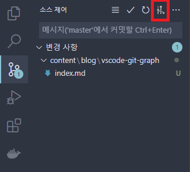

이 글에서는 Visual Studio Code를 VS Code로 부르겠습니다.

## VS Code Git 생각 정리

개인적으로 IDE에 내장된 Git 기능을 사용하는 것을 선호한다. 보통 Git을 사용할 때 Sourcetree나 GitKraken 등의 다른 GUI 도구를 사용하지 않고 IDE에 내장되어 있는 Git 기능을 사용한다.

VS Code를 개인적으로 사용하면서 항상 아쉽다고 느껴지는 점이 기본으로 내장되어 있는 Git 기능이다. 익숙함의 차이일 수 있지만 VS Code를 사용할 때는 커밋 히스토리를 `git log`를 사용해서 봤다. VS Code를 개인적으로 사용하면서 Git은 명령어로만 작업했다.

회사에서 WebStorm이나 VS를 사용할 때는 내장되어 있는 Git 기능을 사용한다. 하지만 VS Code를 사용할 때는 Git 명령어를 사용했는데 지금 생각해보면 VS Code가 기본적으로 제공하는 Git 기능이 직관적이지 않았다고 생각한다.

아마도 VS Code는 에디터의 성향이 강하고 사용자가 어떤 플러그인으로 어떻게 사용하느냐에 따라서 달라지기 때문인 것 같다.

VS Code를 사용하면서 다른 GUI 도구를 사용하는 것을 싫어해서 구글링을 해보니 이미 능력자분이 만들어 놓은 확장 프로그램을 찾을 수 있었다.

## Git Graph

[Git Graph](https://marketplace.visualstudio.com/items?itemName=mhutchie.git-graph)는 VS Code에서 GUI 기반의 다른 Git 도구들과 유사한 경험을 제공한다. VS Code의 마켓플레이스에서 `git graph`라고 검색해서 설치할 수 있다.

위의 사진처럼 설치 이후에는 VS Code의 소스 제어 창에서 `View Git Graph`를 클릭하거나 VS Code 하단의 상태바에서 Git Graph를 클릭해서 진입할 수 있다.

단순히 그래프만 보기 편한 것이 아니라 번거로운 Git 명령어들도 GUI로 편하게 사용할 수 있다.

커밋 히스토리에서 원하는 내역에 우클릭을 하면 Reset, Revert, Cherry Pick 등의 Git 명령어들을 GUI로 쉽게 이용할 수 있다.

만들어진 Stash에서 어떤 소스를 변경했는지 확인하기 쉽고 우클릭으로 해당 Stash를 Pop을 하거나 Drop 등의 명령을 할 수 있다.

## 마치며

Git Graph를 설치해서 사용을 해보니 VS Code에 내장되어 있는 소스 제어 기능의 아쉬운 점들을 해소한다. VS Code의 기본 소스 제어 기능이 아쉽다면 한 번쯤은 사용해보는 것을 추천한다.

