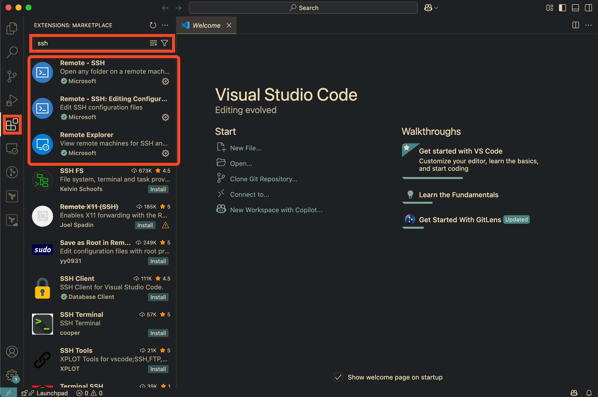
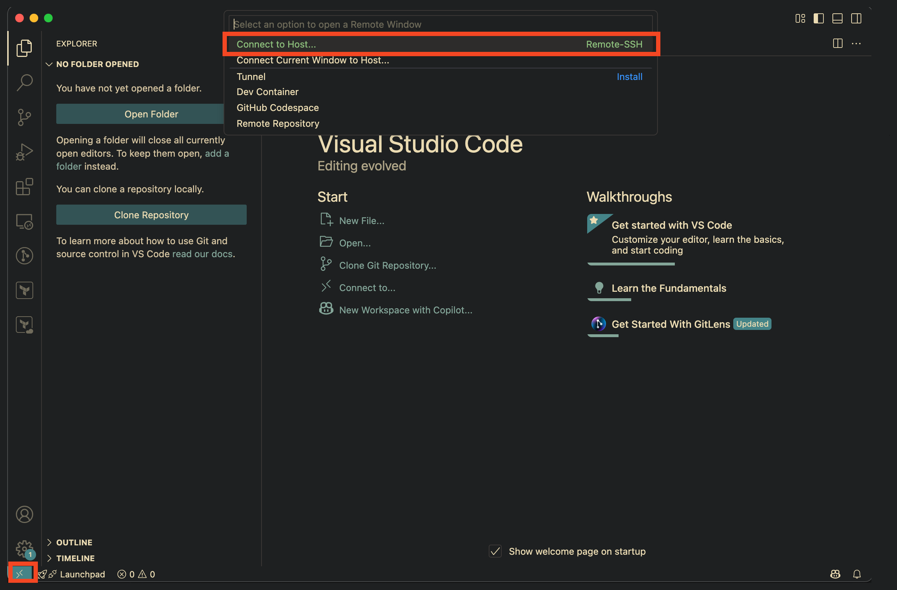
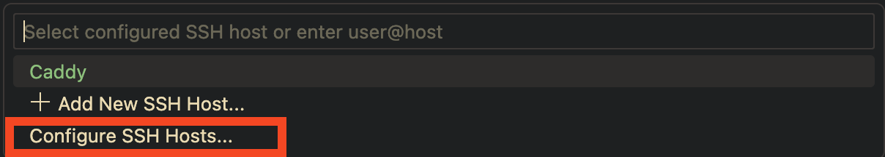
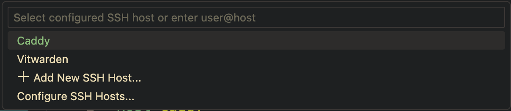
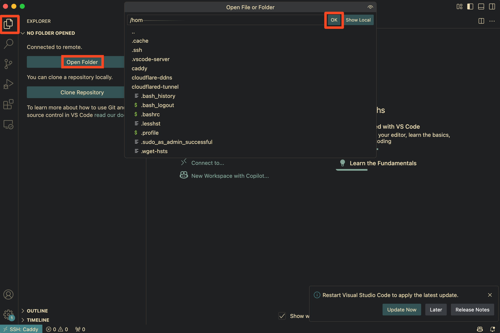
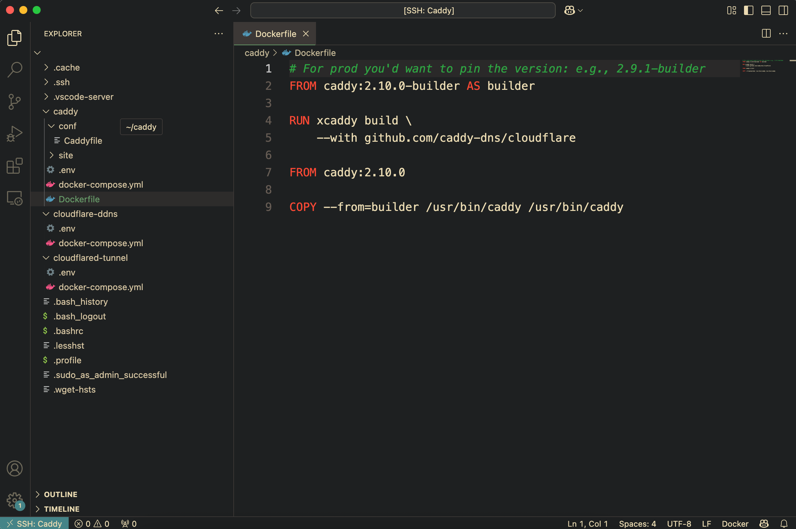
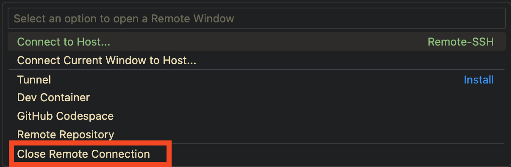

Visual Studio Code는 다양한 확장 프로그램을 통해 로컬뿐 아니라 원격 서버에서도 손쉽게 개발할 수 있는 환경을 제공합니다.  

특히 [Remote - SSH](https://marketplace.visualstudio.com/items?itemName=ms-vscode-remote.remote-ssh) 확장을 사용하면, 원격 Linux 서버에 마치 로컬처럼 접속해 코드 작성, 파일 편집, 터미널 실행 등 다양한 작업을 수행할 수 있습니다.

이 글에서는 VS Code에서 **Remote - SSH** 확장을 활용해 Ubuntu 등의 원격 서버에 접속하고, 실제 개발 환경을 구성하는 과정을 단계별로 소개합니다.

## 사전 준비

원격 서버에 SSH 접속이 가능해야 합니다. 기본적으로 다음과 같은 정보가 필요합니다.

- 서버의 IP 주소 또는 도메인
- SSH 사용자명
- 포트 (기본은 22)
- 공개 키 인증 또는 비밀번호

## VS Code에서 Remote - SSH 확장 설치

1. VS Code 좌측 Extensions(확장) 탭 클릭
2. `ssh` 검색 후 설치



3. 설치가 완료되면 좌측 하단의 `><` 아이콘을 통해 SSH 연결 메뉴를 사용할 수 있습니다.



## SSH 구성 파일 설정

VS Code는 SSH 연결을 위해 내부적으로 `~/.ssh/config` 파일을 사용합니다.



`Configure SSH Hosts...`를 클릭해 수정할 config 파일을 선택하고, 아래와 같이 설정을 추가할 수 있습니다. 아래는 예시입니다.

```bash
# Read more about SSH config files: https://linux.die.net/man/5/ssh_config
Host Caddy
    HostName 192.168.1.33
    User ubuntu
    Port 22
    IdentityFile ~/.ssh/id_rsa
    
Host Vitwarden
    HostName 192.168.1.34
    User ubuntu
    Port 22
    IdentityFile ~/.ssh/id_rsa
```

여기서 Host는 VS Code에서 표시될 이름이며, 원하는 이름으로 지정할 수 있습니다.

이후 VS Code에서 `Remote-SSH: Connect to Host...`를 실행하고 원하는 서버를 선택하면 연결이 진행됩니다.



## 연결 후 서버에서 작업하기

접속이 완료되면 `Open Folder`를 선택합니다.



폴더를 열면 터미널에서 보던 폴더나 파일들을 VS Code에서 그대로 확인할 수 있습니다.

로컬에서 작업하듯이 폴더를 자유롭게 탐색하고, 파일을 복사하거나 새로 만들고, 코드를 VS Code 에디터에서 바로 작성할 수 있습니다.



터미널을 열려면 상단 메뉴의 Terminal → New Terminal을 선택하거나, 단축키를 사용할 수 있습니다.
Windows에서는 `Ctrl + ₩`, macOS에서는 `⌃ + ⇧ + ₩` 키를 누르면 SSH 연결 상태에서 바로 터미널을 열 수 있습니다.

연결을 종료하려면 좌측 하단의 `><` 아이콘을 클릭하고 Close Remote Connection을 선택하면 됩니다.



## 마치며

**Remote - SSH** 확장은 로컬과 거의 동일한 경험을 원격 서버에서도 가능하게 해줍니다.
특히 Docker 기반의 셀프호스팅이나 DevOps 환경에서 유용하며, 파일 탐색, 터미널 조작, 코드 작성 등 거의 모든 개발 작업을 VS Code에서 처리할 수 있습니다.

터미널만으로 작업할 때보다 훨씬 직관적으로 폴더 구조를 탐색하고 코드를 관리할 수 있기 때문에, 원격 서버를 자주 다루는 사용자라면 반드시 추천하는 워크플로입니다.
