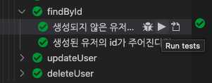

### VS Code의 테스트 실행

WebStorm에서는 테스트 코드를 작성하고 특정 테스트 케이스만 실행을 할 수 있고, 중단점을 걸어서 디버그도 할 수 있다.


하지만 VS Code에서는 아무런 설정 없이는 특정 테스트 케이스만 실행을 하거나 디버그를 할 수 없어서 Extensions의 도움을 받아야 한다.

다른 방법으로 아래와 같이 launch.json을 구성해서 특정 파일의 테스트 코드를 실행하거나 디버깅을 할 수 있긴 했지만 사용성도 좋지 않았고 불편했다.

```
{
    "version": "0.2.0",
    "configurations": [
        {
            "type": "node",
            "request": "launch",
            "name": "Mocha All",
            "program": "${workspaceFolder}/node_modules/mocha/bin/_mocha",
            "args": [
                "--require",
                "ts-node/register",
                "'${workspaceFolder}/test/**/*.spec.ts'"
            ],
            "console": "integratedTerminal",
            "internalConsoleOptions": "neverOpen",
            "skipFiles": [
                "<node_internals>/**"
            ]
        },
        {
            "type": "node",
            "request": "launch",
            "name": "Mocha Current File",
            "program": "${workspaceFolder}/node_modules/mocha/bin/_mocha",
            "args": [
                "--require",
                "ts-node/register",
                "${file}"
            ],
            "console": "integratedTerminal",
            "internalConsoleOptions": "neverOpen",
            "skipFiles": [
                "<node_internals>/**"
            ]
        },
        {
            // ... 생략
        }
    ]
}
```

### Test Explorer UI

[Test Explorer UI](https://marketplace.visualstudio.com/items?itemName=hbenl.vscode-test-explorer)라는 Extensions를 설치하고 본인이 사용하려는 테스트 프레임워크에 해당하는
테스트 어댑터를 설치하면 된다.


[Mocha Test Explorer](https://marketplace.visualstudio.com/items?itemName=hbenl.vscode-mocha-test-adapter)와 [Jest Test Explorer](https://marketplace.visualstudio.com/items?itemName=kavod-io.vscode-jest-test-adapter)를 설치해서 Mocha와 Jest를 사용하는 프로젝트에서 테스트를 진행했다.

아래는 Jest 환경에서 테스트를 해본 것인데 WebStorm에서 경험했던 편리함과 비슷했다.


Run을 누르면 테스트를 실행하고, 코드의 원하는 지점에 중단점을 걸고 Debug를 누르면 디버깅을 할 수 있다.

기본 사이드바에서 테스트를 클릭하면 프로젝트에 작성된 모든 테스트 케이스들을 확인할 수 있고 전체 테스트를 돌리는 것도 가능하다.




테스트가 실행될 때는 파란색으로 아이콘 색깔이 변경되고 테스트를 통과하면 초록색으로 변한다. 테스트를 실패했을 경우에는 아래의 사진처럼 빨간색으로 변한다.


### Mocah Test Explorer가 활성화가 되지 않을 때

Mocha를 사용하는 프로젝트에서는 Mocha Test Explorer가 활성화되지 않았다. 원인으로는 테스트 파일을 인식하지 못하는 거였는데 `.vscode/settings.json`에  mochaExplorer 설정을 추가해서 해결할 수 있다.

`Command`+`p`로 settings.json을 입력해서 열면 해당 파일을 수정할 수 있다. (Windows는 `Ctrl`+`p`)

```json
    "mochaExplorer.files": "test/**/*.spec.ts",
    "mochaExplorer.require": [
        "ts-node/register",
    ],
```

mochaExplorer 설정은 테스트 파일의 경로에 따라서 프로젝트마다 다르기 때문에 테스트 파일의 경로를 확인하고 설정해야 한다.

## 마치며

WebStorm을 주로 사용하지만 가끔은 VS Code를 사용할 때도 있다. 그럴 때 가장 아쉬웠던 게 테스트 코드를 실행하는 부분이었는데 Test Explorer UI를 사용하니 디버깅도 사용할 수 있고 특정 테스트 파일이나 테스트 케이스를 바로바로 실행할 수 있어서 좋았다.

### Reference

[How can I add testing, to an existing Typescript project, and get it to show up in Test Explorer?](https://stackoverflow.com/questions/60745530/how-can-i-add-testing-to-an-existing-typescript-project-and-get-it-to-show-up)