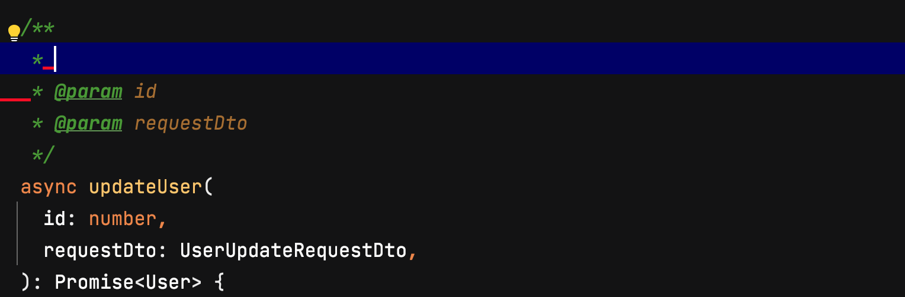
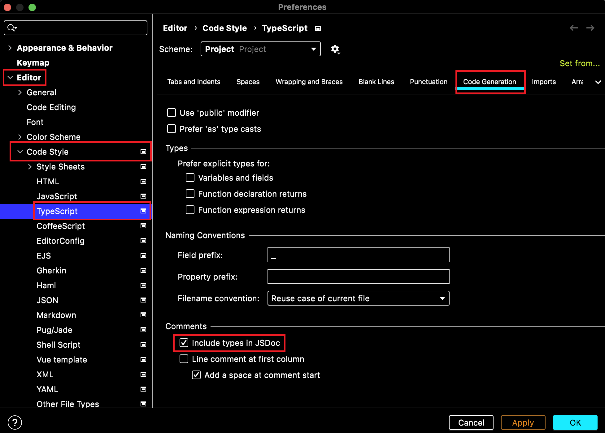
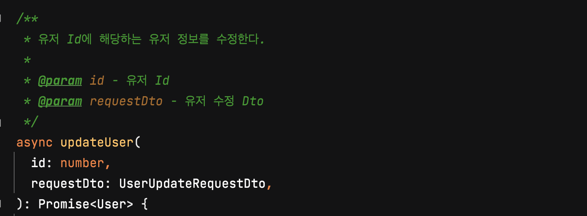
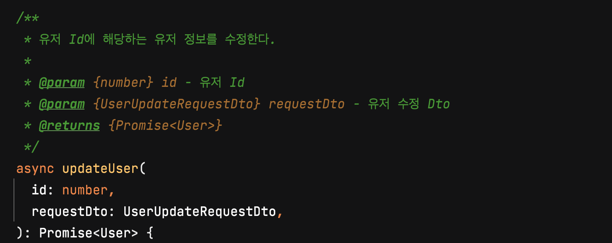

JSDoc의 목적은 JavaScript 애플리케이션 또는 라이브러리의 API를 문서화하는 것이다. 모듈, 네임스페이스, 클래스, 메서드, 메서드 매개변수 등과 같은 것을 문서화하려고 한다.

JSDoc 주석은 일반적으로 문서화되는 코드 직전에 위치해야 하며 `/**`로 시작해야 한다.

WebStorm에서 `/**` + `Enter` 를 사용하면 아래와 같이 JSDoc이 자동으로 작성된다.

하지만 작성된 JSDoc의 정보에는 타입이 포함되어 있지 않고 반환 값도 명시되어 있지 않은 빈약한 정보이다. WebStorm에서 위의 사진처럼 JSDoc이 작성이 된다면 아래 옵션을 설정해서 타입과 `@returns`태그를 추가할 수 있다.

- `Preferences` -> `Editor` -> `Code Style` -> `TypeScript` -> `Code Generation` -> `Comments` -> `Include types in JSDoc`

`Include types in JSDoc`을 체크한 상태와 체크하지 않은 상태의 템플릿을 사용해서 만들어진 JSDoc을 비교해보도록 한다.

- `Include types in JSDoc` - OFF

- `Include types in JSDoc` - ON

---
## Reference

https://jsdoc.app/about-getting-started.html
