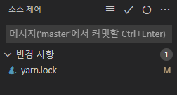
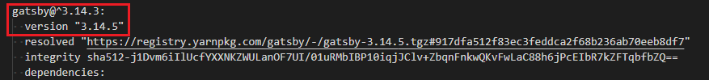
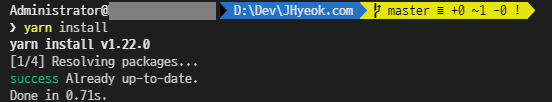
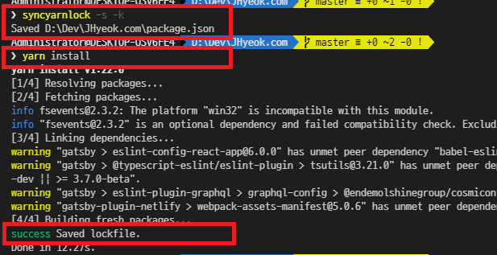
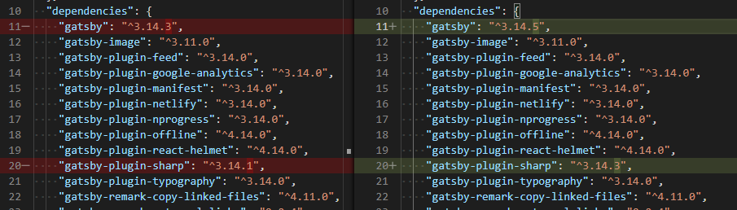
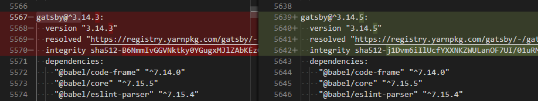

Gatsby를 기반으로 만들어진 이 블로그는 Yarn으로 프로젝트의 의존성을 관리하고 있다. 하지만 `yarn upgrade`로 블로그의 의존성을 관리할 때 `package.json` 파일이 동기화되지 않는 것을 확인했다. 

## 문제 살펴보기

이 문제와 관련해서 Yarn Github 저장소에서 2개의 Issue를 찾을 수 있었다.

- [`yarn upgrade` does not update package.json](https://github.com/yarnpkg/yarn/issues/2042)
- [Yarn Upgrade Doesn't Update Package.json](https://github.com/yarnpkg/yarn/issues/3266)
 
Issue에서는 `yarn upgrade`로 전체 패키지를 업데이트하면 `packge.json`파일이 업데이트되지 않는다는 내용이었다. 적은 수의 패키지를 업데이트해야 하는 경우 패키지의 이름과 버전을 지정해서 하면 되지만 만약 10개 이상의 패키지를 업데이트해야 한다면 어려움이 있었다. NPM에서는 `npm update`를 하면 `package.json` 파일과 `package-lock.json` 파일이 동기화가 되고 있는데 Yarn에서는 왜 안되는지에 대한 내용도 있었다. 다행히 모든 패키지를 업데이트하고 `package.json`과 `yarn.lock`파일을 동기화하는 방법을 위의 Issue에서 찾을 수 있었다.

```bash
$ yarn upgrade gatsby@^3.14.5
```

패키지를 지정해서 업데이트를 하면 `package.json` 파일과 `yarn.lock` 파일은 일치한다. 만약 패키지를 10개 이상을 업데이트를 해야 한다면 시간을 낭비할 수 있다. 그래서 `package.json` 파일에 지정된 버전 범위를 기반으로 모든 종속성을 업데이트하는 `yarn upgrade`를 사용했다.

```bash
$ yarn upgrade
```

하지만 이 명령으로 모든 의존 패키지를 업데이트를 하면 `yarn.lock` 파일은 변경이 되었지만 `package.json` 파일은 아무 변경이 없다. `yarn.lock` 파일과 `package.json` 파일이 일치하지 않는 문제가 발생한다.





`yarn.lock`은 변경되었지만 `package.json`은 변경이 없다. 그리고 `yarn.lock`의 변경도 올바르지 않은 것 같다.



다시 `yarn install`로 `package.json` 파일과 `yarn.lock` 파일의 버전을 맞추어보려고 했지만 이미 업데이트가 되었다는 안내만 나온다.

## syncyarnlock 사용

이런 경우 [syncyarnlock](https://www.npmjs.com/package/syncyarnlock)를 사용해서 해결할 수 있다.

```bash
# syncyarnlock 설치
$ yarn global add syncyarnlock

# yarn.lock에서 설치된 버전으로 package.json을 업데이트합니다.
$ syncyarnlock -s -k

# package.json의 현재 버전 제약 조건으로 yarn.lock을 업데이트합니다.
$ yarn install
```



`package.json` 파일과 `yarn.lock` 파일을 확인하면 정상적으로 고쳐진 것을 확인할 수 있다.





## --latest 사용

```bash
$ yarn upgrade --latest
```

최신 안정 버전이 더 이상 현재 범위와 일치하지 않을 때 실행하면 `package.json` 파일이 업데이트된다. 단점으로는 `package.json`에 지정된 버전의 범위를 무시하기 때문에 의도치 않게 Major 업데이트가 될 수 있다.

### Reference
https://github.com/yarnpkg/yarn/issues/2042  
https://github.com/yarnpkg/yarn/issues/3266